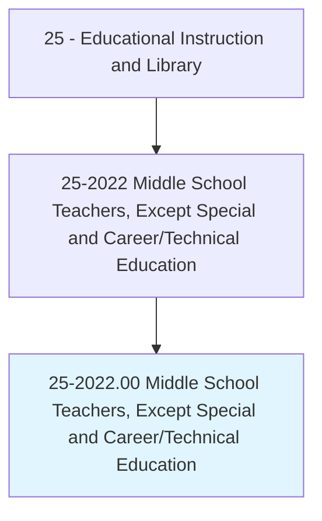
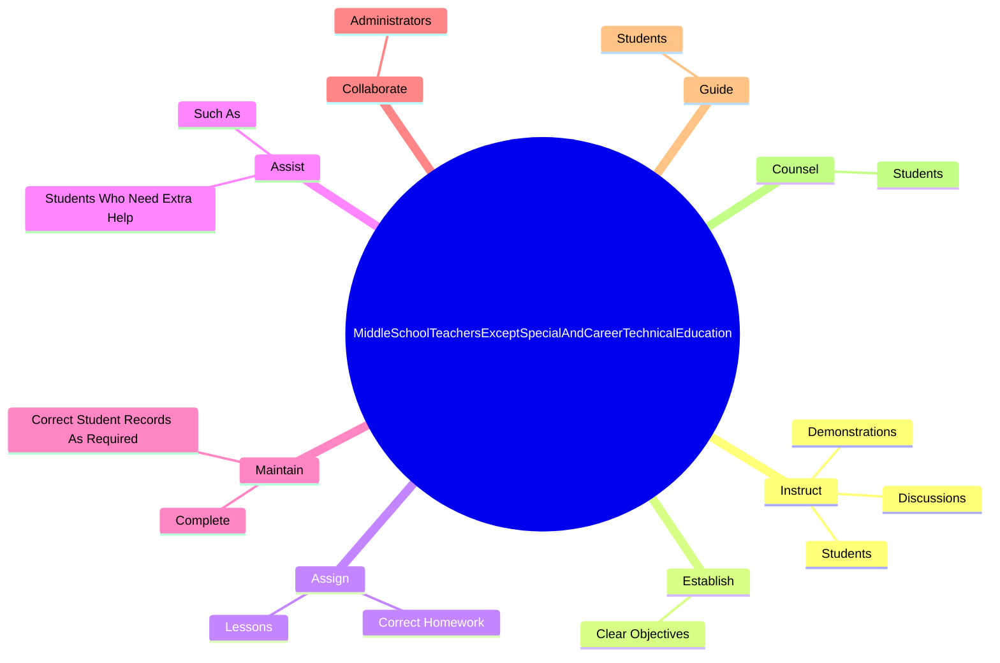
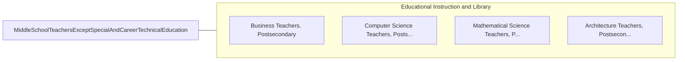

# Middle School Teachers, Except Special and Career/Technical Education

> Teach one or more subjects to students at the middle, intermediate, or junior high school level.

## Overview

Middle School Teachers, Except Special and Career/Technical Education is classified under Educational Instruction and Library (SOC 25). Teach one or more subjects to students at the middle, intermediate, or junior high school level.

## Classification Hierarchy

## Key Statistics

| Metric | Value |
|--------|-------|
| SOC Code | 25-2022.00 |
| Category | [Educational Instruction and Library](/occupations/Education/index) |
| Task Count | 73 |
| Source | O*NET |

## Core Tasks

### instruct.Discussions

Middle School Teachers, Except Special and Career/Technical Education instruct discussions as part of their core responsibilities.

**Actions:**
- `instruct.Discussions.in.OneSubjects`
- `instruct.Discussions.in.Subjects`
- `instruct.Discussions.in.English`
- `instruct.Discussions.in.Mathematics`

### establish.ClearObjectives

Middle School Teachers, Except Special and Career/Technical Education establish clear objectives as part of their core responsibilities.

**Actions:**
- `establish.ClearObjectives.for.Projects`

### assign.Lessons

Middle School Teachers, Except Special and Career/Technical Education assign lessons as part of their core responsibilities.

**Actions:**
- `assign.Lessons`
- `assign.CorrectHomework`

## Skills & Competencies

### Technical Skills
- **Curriculum Development** - Advanced
- **Instructional Design** - Advanced
- **Assessment** - Advanced

### Soft Skills
- **Communication** - Essential
- **Problem Solving** - Essential
- **Critical Thinking** - Important
- **Teamwork** - Important
- **Adaptability** - Important

## Related Occupations

## Industries

This occupation is found across multiple industries. See [Industries](/industries) for sector-specific employment data.

## Career Progression

---

*Source: O*NET 25-2022.00 - ONETOccupation*
