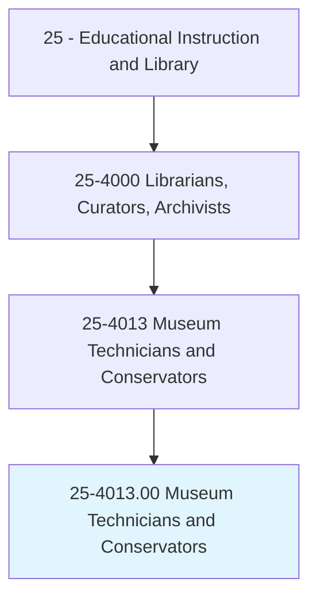
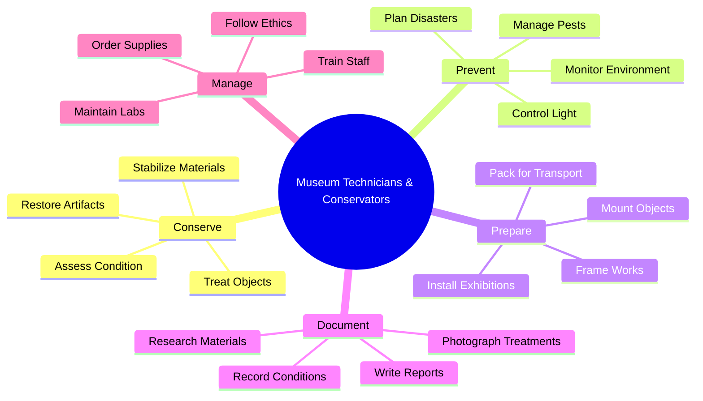
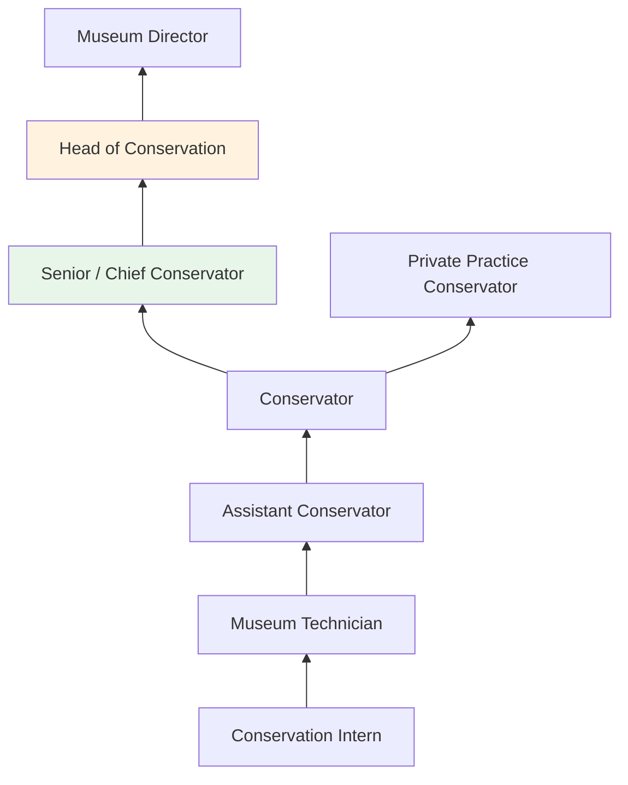
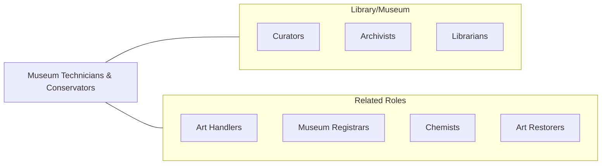

# Museum Technicians and Conservators

> Restore, maintain, or prepare objects in museum collections for storage, research, or exhibit. May work with textiles, documents, metals, ceramics, glass, or other materials.

## Overview

Museum Technicians and Conservators are responsible for the physical care, preservation, and restoration of objects in museum, gallery, archive, and library collections. Conservators specialize in the scientific analysis, treatment, and preventive care of cultural artifacts and artworks, using chemistry, materials science, and art historical knowledge to stabilize and restore deteriorated objects. Museum technicians handle the practical aspects of collection care including mounting, framing, packing, transporting, and installing objects for exhibition and storage.

Conservators work across specializations including paintings, paper, textiles, objects (sculpture, ceramics, metals), photographs, and time-based media. They conduct condition assessments, perform treatments such as cleaning, consolidation, inpainting, and structural repair, and document all interventions according to professional ethical standards. Preventive conservation encompasses environmental monitoring, integrated pest management, disaster preparedness, and proper storage and handling protocols.

The field increasingly incorporates advanced scientific techniques including X-ray fluorescence, infrared reflectography, cross-section microscopy, and multispectral imaging to analyze materials and inform treatment decisions. Conservators balance the imperative to preserve original materials with the need to make objects stable and accessible for display and research.

## Classification Hierarchy

## Key Statistics

| Metric | Value |
|--------|-------|
| SOC Code | 25-4013.00 |
| Job Zone | 4 (Considerable Preparation) |
| Category | [Educational Instruction and Library](/occupations/Education/index) |
| Median Salary | $48,000 - $65,000 |
| Employment | ~13,000 |
| Projected Growth | 9-13% (Faster than average) |
| Source | O*NET |

## Core Tasks

### conserve.CulturalArtifacts

Conservators treat and stabilize collection objects.

**Actions:**
- `assess.Condition.of.CollectionObjects` - Examine objects for deterioration, damage, and stability
- `treat.Artifacts.using.ConservationMethods` - Clean, consolidate, repair, and restore materials
- `document.Treatments.for.PermanentRecords` - Photograph and record all conservation interventions

### prepare.ObjectsForExhibition

Museum technicians handle the physical preparation and installation of objects.

**Actions:**
- `mount.Objects.for.ExhibitionDisplay` - Create custom supports, mounts, and frames
- `pack.Objects.for.SafeTransport` - Design protective packaging for loans and travel
- `install.Exhibitions.in.GallerySpaces` - Position and secure objects according to design plans

## Skills & Competencies

### Technical Skills
- **Conservation Science** - Expert (materials analysis, chemistry, deterioration mechanisms)
- **Treatment Skills** - Expert (cleaning, consolidation, inpainting, structural repair)
- **Preventive Conservation** - Advanced (environmental monitoring, IPM, disaster planning)
- **Analytical Techniques** - Advanced (XRF, FTIR, microscopy, imaging)
- **Art Handling** - Advanced (mounting, packing, installation, transport)
- **Documentation** - Advanced (condition reporting, photography, treatment records)

### Soft Skills
- **Manual Dexterity** - Critical (precise hand skills for delicate treatments)
- **Attention to Detail** - Critical (observing subtle deterioration and changes)
- **Patience** - Essential (meticulous, time-intensive treatments)
- **Ethical Judgment** - Essential (balancing intervention with preservation)
- **Problem-Solving** - Essential (each object presents unique challenges)
- **Communication** - Important (reporting to curators and stakeholders)

## Education & Certifications

| Requirement | Details |
|-------------|---------|
| Typical Education | M.A. or M.S. in Conservation (3-4 year graduate programs) for conservators; B.A. + training for technicians |
| Prerequisites | Chemistry, art history, studio art coursework |
| Work Experience | Pre-program internships required for graduate conservation programs |
| On-the-Job Training | Extensive; post-graduate fellowships common for conservators |
| Common Certifications | AIC Professional Associate (PA) or Fellow; specialized workshop certificates |

## Career Progression

## Setting Variations

### Major Museums
Full conservation labs with specialized departments (paintings, objects, paper, textiles). Well-resourced programs.

### Regional and Small Museums
Generalist conservators covering multiple material types. Limited lab facilities.

### Private Practice
Independent conservators serving multiple clients. Specialization in particular materials or object types.

### Libraries and Archives
Conservation of books, manuscripts, photographs, and paper-based collections. Mass treatment programs.

### Archaeological Conservation
Field conservation and treatment of excavated materials. Often in academic or government settings.

## Technology & Tools

| Category | Tools |
|----------|-------|
| Analytical | XRF, FTIR, UV/IR imaging, microscopy, multispectral imaging |
| Treatment | Vacuum hot tables, suction tables, ultrasonic tools, laser cleaning |
| Documentation | DSLR cameras, raking/UV/IR photography, condition report templates |
| Environmental | Data loggers, HVAC systems, light meters, RH monitors |
| Software | Adobe Photoshop, TMS, collection databases |
| Materials | Archival adhesives, consolidants, solvents, Japanese tissue |

## Related Occupations

## Industries

- Arts, Entertainment, and Recreation - Museums and Galleries
- [Educational Services](/industries/Education/index) - University Museums and Libraries
- [Government](/industries/PublicAdministration) - National Museums, Archives
- [Professional Services](/industries/Scientific) - Private Conservation Practice

## Departments

This occupation typically works in:
- Conservation Laboratory
- Collections Management
- Exhibitions and Installation

---

*Source: O*NET 25-4013.00 - ONETOccupation*
