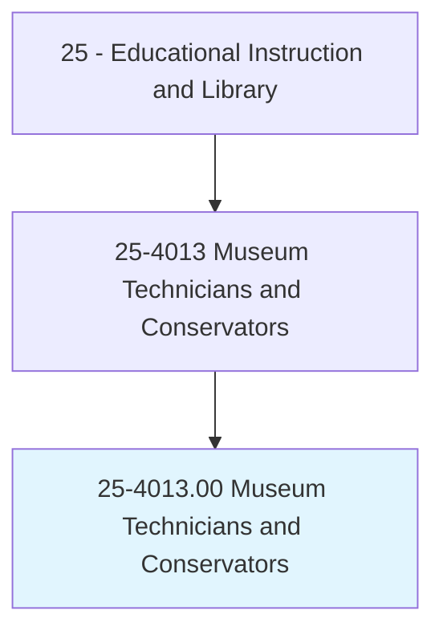
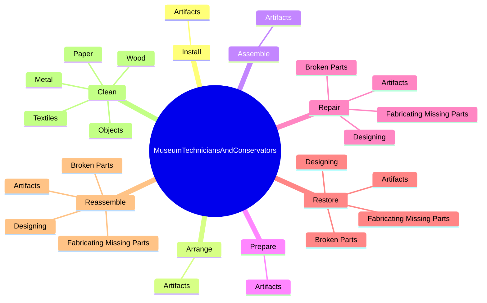
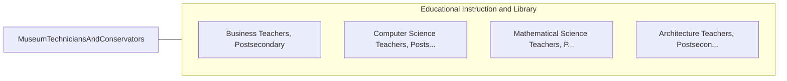

# Museum Technicians and Conservators

> Restore, maintain, or prepare objects in museum collections for storage, research, or exhibit. May work with specimens such as fossils, skeletal parts, or botanicals; or artifacts, textiles, or art. May identify and record objects or install and arrange them in exhibits. Includes book or document conservators.

## Overview

Museum Technicians and Conservators is an occupation within the Educational Instruction and Library category. Restore, maintain, or prepare objects in museum collections for storage, research, or exhibit. May work with specimens such as fossils, skeletal parts, or botanicals; or artifacts, textiles, or art.

## Classification Hierarchy

## Key Statistics

| Metric | Value |
|--------|-------|
| SOC Code | 25-4013.00 |
| Category | [Educational Instruction and Library](/occupations/Education/index) |
| Task Count | 205 |
| Source | O*NET |

## Core Tasks

### install.Artifacts

Museum Technicians and Conservators install artifacts as part of their core responsibilities.

**Actions:**
- `install.Artifacts.for.Exhibition`
- `install.Artifacts.for.EnsuringArtifactsSafety`
- `install.Artifacts.for.ReportingStatus`
- `install.Artifacts.for.Condition`

### arrange.Artifacts

Museum Technicians and Conservators arrange artifacts as part of their core responsibilities.

**Actions:**
- `arrange.Artifacts.for.Exhibition`
- `arrange.Artifacts.for.EnsuringArtifactsSafety`
- `arrange.Artifacts.for.ReportingStatus`
- `arrange.Artifacts.for.Condition`

### assemble.Artifacts

Museum Technicians and Conservators assemble artifacts as part of their core responsibilities.

**Actions:**
- `assemble.Artifacts.for.Exhibition`
- `assemble.Artifacts.for.EnsuringArtifactsSafety`
- `assemble.Artifacts.for.ReportingStatus`
- `assemble.Artifacts.for.Condition`

## Skills & Competencies

### Technical Skills
- **Curriculum Development** - Advanced
- **Instructional Design** - Advanced
- **Assessment** - Advanced

### Soft Skills
- **Communication** - Essential
- **Problem Solving** - Essential
- **Critical Thinking** - Important
- **Teamwork** - Important
- **Adaptability** - Important

## Related Occupations

## Industries

This occupation is found across multiple industries. See [Industries](/industries) for sector-specific employment data.

## Career Progression

---

*Source: O*NET 25-4013.00 - ONETOccupation*
