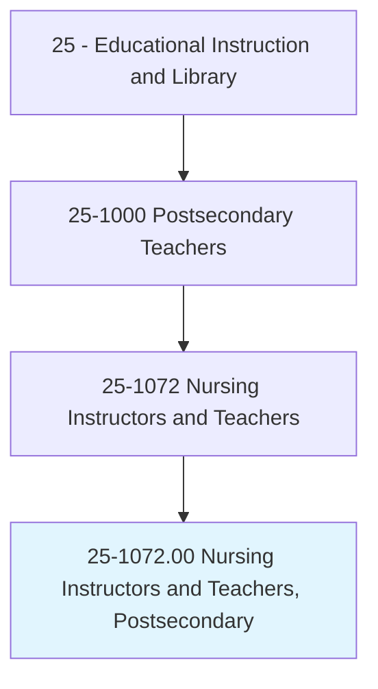
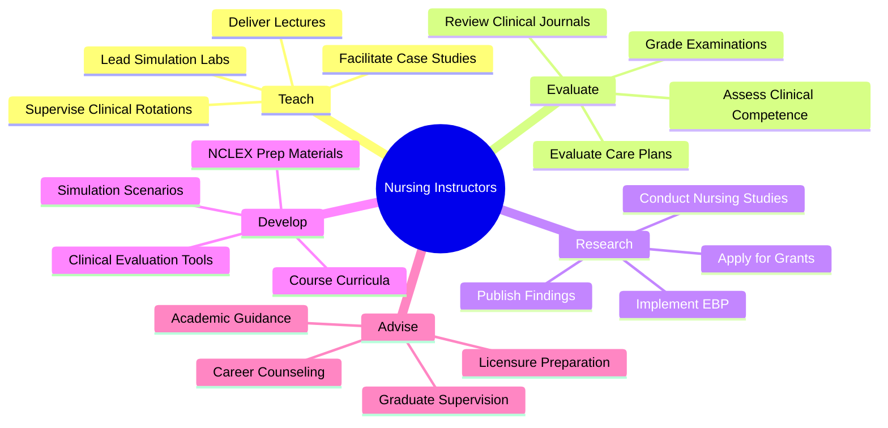
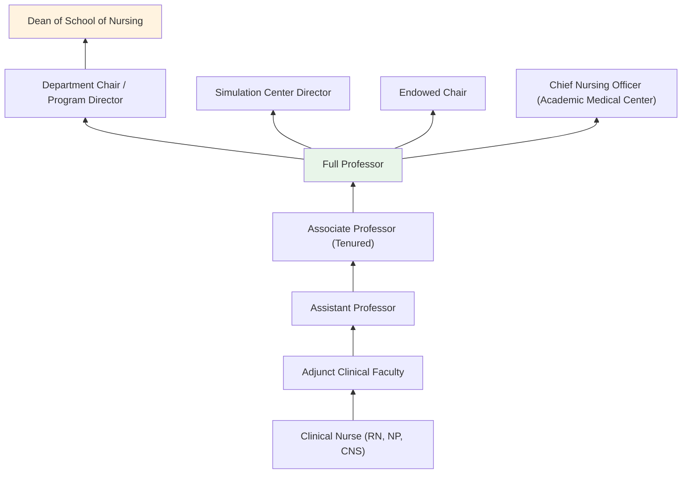
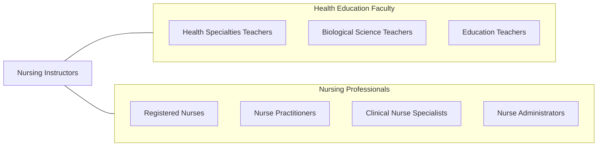

# Nursing Instructors and Teachers, Postsecondary

> Demonstrate and teach patient care in classroom and clinical units to nursing students. Includes both teachers primarily engaged in teaching and those who do a combination of teaching and research.

## Overview

Nursing Instructors and Teachers in postsecondary education prepare the next generation of nurses by teaching clinical skills, nursing theory, patient care procedures, and evidence-based practice. They instruct students in programs ranging from Licensed Practical Nursing (LPN) and Associate Degree in Nursing (ADN) to Bachelor of Science in Nursing (BSN), Master of Science in Nursing (MSN), and Doctor of Nursing Practice (DNP) programs. These educators combine classroom didactic instruction with hands-on clinical supervision in hospitals, clinics, and simulation laboratories.

The clinical teaching component is central to nursing education. Faculty accompany students to healthcare facilities where they supervise direct patient care, model professional nursing behaviors, facilitate clinical reasoning, and evaluate student competence in real-world healthcare settings. They must maintain current clinical expertise and active nursing licensure while staying abreast of evolving healthcare practices, technologies, and regulatory requirements.

Nursing faculty face a national shortage that constrains the number of students nursing programs can admit, directly impacting the healthcare workforce pipeline. The demand for qualified nursing educators continues to grow as healthcare systems expand and the nursing workforce ages. Faculty positions require the rare combination of advanced clinical expertise, scholarly capability, and teaching skill.

## Classification Hierarchy

## Key Statistics

| Metric | Value |
|--------|-------|
| SOC Code | 25-1072.00 |
| Job Zone | 5 (Extensive Preparation) |
| Category | [Educational Instruction and Library](/occupations/Education/index) |
| Median Salary | $77,000 - $95,000 |
| Employment | ~70,000 |
| Projected Growth | 15-20% (Much faster than average) |
| Source | O*NET |

## Core Tasks

### teach.NursingPractice

Nursing Instructors deliver clinical and didactic nursing education.

**Actions:**
- `deliver.Lectures.on.NursingFundamentals` - Teach patient assessment, medication administration, and care planning
- `supervise.ClinicalRotations.in.Hospitals` - Oversee student nurses providing direct patient care
- `lead.SimulationLabs.for.ClinicalSkills` - Facilitate high-fidelity simulation experiences

### evaluate.ClinicalCompetence

Nursing Instructors assess student readiness for professional practice.

**Actions:**
- `evaluate.ClinicalPerformance.of.NursingStudents` - Assess patient care skills, safety, and professionalism
- `assess.CriticalThinking.through.CareStudies` - Evaluate clinical reasoning and judgment
- `prepare.Students.for.NCLEXExamination` - Guide licensure examination preparation

## Skills & Competencies

### Technical Skills
- **Clinical Nursing** - Expert (patient care, assessment, interventions across specialties)
- **Simulation Pedagogy** - Advanced (high-fidelity simulation, standardized patients, debriefing)
- **Curriculum Design** - Advanced (AACN Essentials, CCNE/ACEN accreditation standards)
- **Assessment** - Advanced (clinical evaluation, NCLEX-style test writing)
- **Research Methods** - Advanced (evidence-based practice, clinical research)
- **Educational Technology** - Advanced (virtual simulation, EHR training)

### Soft Skills
- **Communication** - Critical (clinical teaching, patient interaction modeling)
- **Clinical Judgment** - Critical (modeling nursing reasoning)
- **Mentorship** - Essential (developing professional nurses)
- **Patience** - Essential (guiding novice clinicians)
- **Empathy** - Essential (modeling compassionate care)
- **Leadership** - Important (program development, clinical coordination)

## Education & Certifications

| Requirement | Details |
|-------------|---------|
| Typical Education | MSN minimum; DNP or Ph.D. preferred for tenure-track positions |
| Nursing License | Active RN license required; advanced practice certification valued |
| Clinical Experience | Minimum 2-5 years clinical nursing experience |
| On-the-Job Training | Clinical teaching development; simulation training |
| Common Certifications | CNE (Certified Nurse Educator); clinical specialty certification (CCRN, CEN, etc.); BLS/ACLS Instructor |

## Career Progression

## Setting Variations

### University Schools of Nursing
BSN, MSN, and doctoral programs with comprehensive clinical and research missions. CCNE or ACEN accredited.

### Community Colleges
ADN programs preparing students for RN licensure. Higher clinical teaching loads. Strong hospital partnerships.

### Hospital-Based Programs
Diploma nursing programs operated by healthcare systems. Intensive clinical focus.

### Online Programs
Distance nursing education with local clinical placement arrangements. Growing enrollment in RN-to-BSN and MSN programs.

### Simulation Centers
Dedicated facilities for clinical skill development. High-fidelity mannequins, standardized patients, and virtual reality.

## Technology & Tools

| Category | Tools |
|----------|-------|
| Clinical Simulation | SimMan, Lucina, CAE Juno, vSim |
| Learning Management Systems | Canvas, Blackboard, ATI |
| Assessment | ExamSoft, HESI, ATI TEAS, NCLEX prep platforms |
| Clinical Documentation | Epic/Cerner training environments, EHR academic modules |
| Video & Communication | GoReact, Zoom, Panopto |
| Skills Training | IV arms, catheter trainers, suture pads |

## Related Occupations

## Industries

- [Educational Services - Schools of Nursing](/industries/Education/index) - Primary Employment
- [Healthcare - Hospitals](/industries/Healthcare) - Academic Medical Centers
- [Government](/industries/Government) - VA Medical Centers, Public Health Nursing
- [Social Assistance](/industries/SocialAssistance) - Community Health Education

## Departments

This occupation typically works in:
- [School of Nursing](/departments/Nursing)
- [Department of Nursing](/departments/Nursing)
- [College of Health Sciences](/departments/HealthSciences)
- [Simulation Center](/departments/SimulationCenter)

---

*Source: O*NET 25-1072.00 - ONETOccupation*
