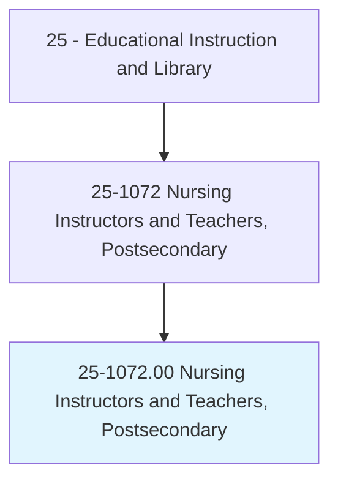
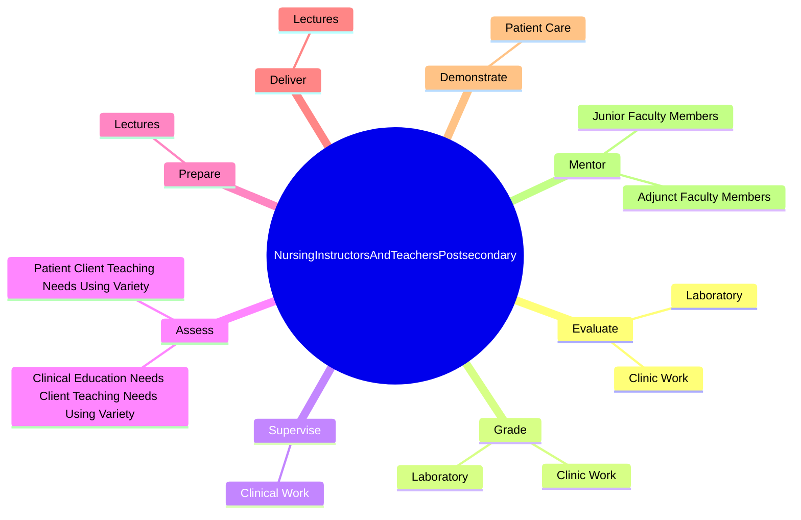

# Nursing Instructors and Teachers, Postsecondary

> Demonstrate and teach patient care in classroom and clinical units to nursing students. Includes both teachers primarily engaged in teaching and those who do a combination of teaching and research.

## Overview

Nursing Instructors and Teachers, Postsecondary is an occupation within the Educational Instruction and Library category. Demonstrate and teach patient care in classroom and clinical units to nursing students. 

## Classification Hierarchy

## Key Statistics

| Metric | Value |
|--------|-------|
| SOC Code | 25-1072.00 |
| Category | [Educational Instruction and Library](/occupations/Education) |
| Task Count | 22 |
| Source | O*NET |

## Core Tasks

### evaluate.Laboratory

Nursing Instructors and Teachers, Postsecondary evaluate laboratory as part of their core responsibilities.

**Actions:**
- `evaluate.Laboratory`
- `evaluate.ClinicWork`

### grade.Laboratory

Nursing Instructors and Teachers, Postsecondary grade laboratory as part of their core responsibilities.

**Actions:**
- `grade.Laboratory`
- `grade.ClinicWork`

### supervise.ClinicalWork

Nursing Instructors and Teachers, Postsecondary supervise clinical work as part of their core responsibilities.

**Actions:**
- `supervise.ClinicalWork`

## Skills & Competencies

### Technical Skills
- **Curriculum Development** - Advanced
- **Instructional Design** - Advanced
- **Assessment** - Advanced

### Soft Skills
- **Communication** - Essential
- **Problem Solving** - Essential
- **Critical Thinking** - Important
- **Teamwork** - Important
- **Adaptability** - Important

## Related Occupations

## Industries

This occupation is found across multiple industries. See [Industries](/industries) for sector-specific employment data.

## Career Progression

---

*Source: O*NET 25-1072.00 - ONETOccupation*
