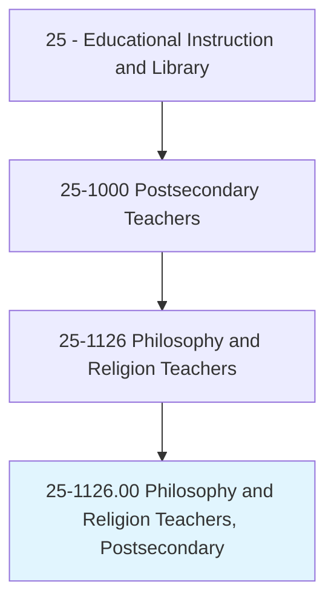
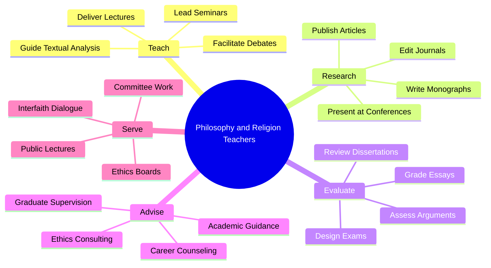
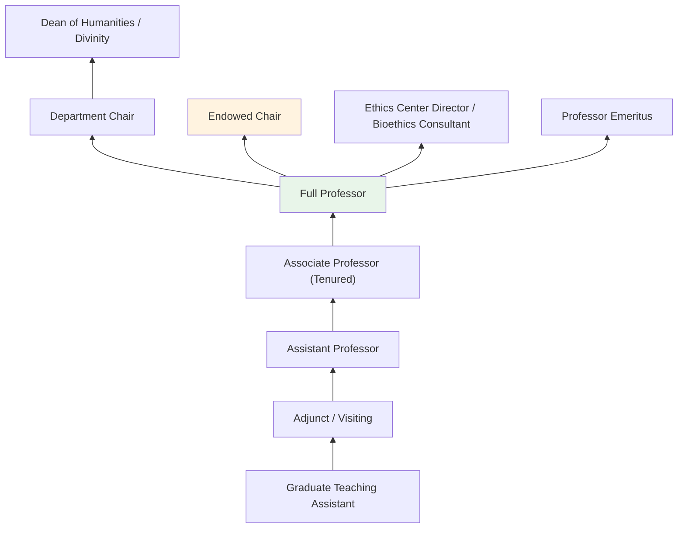
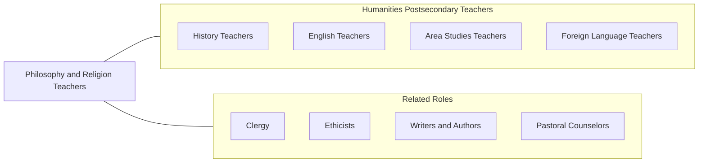

# Philosophy and Religion Teachers, Postsecondary

> Teach courses in philosophy, religion, and theology. Includes both teachers primarily engaged in teaching and those who do a combination of teaching and research.

## Overview

Philosophy and Religion Teachers in postsecondary education instruct students in the fundamental questions of human existence, ethics, logic, metaphysics, epistemology, and the world's religious traditions. They teach courses covering Western and Eastern philosophy, ethics and moral reasoning, logic, philosophy of mind, political philosophy, comparative religion, theology, biblical studies, and the philosophy of science. These educators cultivate students' capacities for rigorous argumentation, critical analysis, and reflective thinking about values, meaning, and knowledge.

Many philosophy and religion professors are active scholars who publish monographs, peer-reviewed articles, and edited volumes contributing to ongoing philosophical and theological debates. Their research addresses topics ranging from bioethics and artificial intelligence ethics to religious pluralism, secularism, and the nature of consciousness. Philosophy faculty increasingly engage with applied questions in technology ethics, environmental ethics, healthcare ethics, and business ethics, making their expertise relevant across professional domains.

These educators serve a vital role in liberal arts education, providing the analytical foundations that enhance learning across all disciplines. Philosophy graduates consistently perform among the highest on graduate admissions exams (LSAT, GRE, GMAT), reflecting the rigorous thinking skills developed through philosophical study.

## Classification Hierarchy

## Key Statistics

| Metric | Value |
|--------|-------|
| SOC Code | 25-1126.00 |
| Job Zone | 5 (Extensive Preparation) |
| Category | [Educational Instruction and Library](/occupations/Education/index) |
| Median Salary | $72,000 - $90,000 |
| Employment | ~22,000 |
| Projected Growth | 3-5% (Slower than average) |
| Source | O*NET |

## Core Tasks

### teach.PhilosophyAndReligion

Faculty deliver instruction in philosophical and religious disciplines.

**Actions:**
- `deliver.Lectures.on.EthicsAndMoralPhilosophy` - Teach normative ethics, applied ethics, and metaethics
- `deliver.Lectures.on.ComparativeReligion` - Instruct on world religious traditions and theological systems
- `facilitate.SocraticDialogue.on.PhilosophicalQuestions` - Lead discussion-based inquiry into fundamental questions

### conduct.PhilosophicalResearch

Faculty pursue original scholarship in philosophy and religious studies.

**Actions:**
- `write.Monographs.on.PhilosophicalTopics` - Produce book-length philosophical arguments and analyses
- `publish.Articles.in.PhilosophyJournals` - Contribute to journals such as Nous, Mind, and Ethics
- `present.Papers.at.AcademicConferences` - Share research at APA, AAR, and SBL meetings

## Skills & Competencies

### Technical Skills
- **Philosophical Analysis** - Expert (argumentation, logic, conceptual analysis)
- **Textual Interpretation** - Expert (hermeneutics, close reading, exegesis)
- **Academic Writing** - Expert (scholarly argumentation, monograph composition)
- **Logic** - Advanced (formal and informal logic, critical reasoning)
- **Research Methods** - Advanced (historical, textual, and conceptual analysis)
- **Curriculum Design** - Advanced (philosophy and religion pedagogy)

### Soft Skills
- **Critical Thinking** - Critical (rigorous argumentation and analysis)
- **Communication** - Critical (clear exposition of abstract ideas)
- **Intellectual Openness** - Essential (engaging with diverse viewpoints)
- **Mentorship** - Essential (guiding philosophical development)
- **Writing** - Critical (scholarly and public philosophical writing)
- **Patience** - Important (nurturing philosophical reasoning in students)

## Education & Certifications

| Requirement | Details |
|-------------|---------|
| Typical Education | Ph.D. in Philosophy, Religious Studies, Theology, or related field |
| Alternative Entry | Master's degree for community college or adjunct positions; M.Div. for seminary teaching |
| Work Experience | Teaching and research experience required |
| On-the-Job Training | Faculty development; pedagogical training |
| Common Certifications | APA membership; AAR membership; ethics committee credentials |

## Career Progression

## Setting Variations

### Research Universities
Emphasis on original philosophical scholarship. Doctoral program supervision and specialized seminar teaching.

### Liberal Arts Colleges
Focus on undergraduate philosophy education. Core curriculum role teaching ethics, logic, and introductory philosophy.

### Seminaries and Divinity Schools
Theological education for ministerial preparation. Emphasis on biblical studies, systematics, and pastoral theology.

### Community Colleges
Introduction to Philosophy and Ethics courses for general education. Higher teaching loads.

### Applied Ethics Centers
Interdisciplinary ethics teaching in medical schools, business schools, and technology programs.

## Technology & Tools

| Category | Tools |
|----------|-------|
| Learning Management Systems | Canvas, Blackboard, Moodle |
| Research Databases | PhilPapers, JSTOR, ATLA Religion Database |
| Presentation | PowerPoint, Prezi, chalkboard/whiteboard |
| Logic Software | Carnap.io, Logic 2010, Tarski's World |
| Reference Management | Zotero, EndNote, BibTeX |
| Communication | Zoom, Microsoft Teams |

## Related Occupations

## Industries

- [Educational Services - Colleges and Universities](/industries/Education/index) - Primary Employment
- [Religious Organizations](/industries/ReligiousOrganizations) - Seminaries and Divinity Schools
- [Healthcare](/industries/Healthcare) - Bioethics Committees
- [Professional Services](/industries/Scientific) - Ethics Consulting

## Departments

This occupation typically works in:
- Department of Philosophy
- Department of Religious Studies
- School of Divinity / Theology
- Ethics Center

---

*Source: O*NET 25-1126.00 - ONETOccupation*
