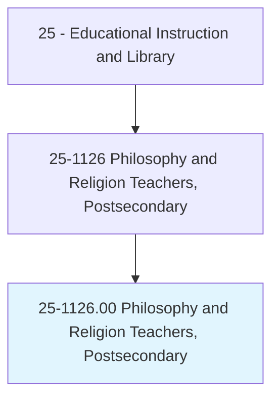
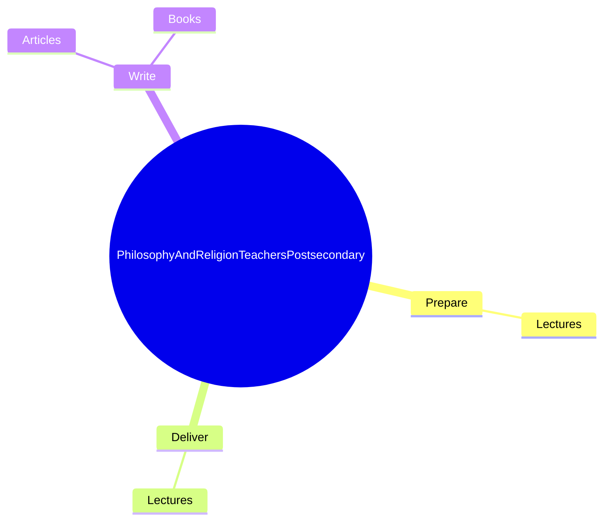
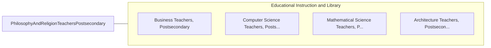

# Philosophy and Religion Teachers, Postsecondary

> Teach courses in philosophy, religion, and theology. Includes both teachers primarily engaged in teaching and those who do a combination of teaching and research.

## Overview

Philosophy and Religion Teachers, Postsecondary is an occupation within the Educational Instruction and Library category. Teach courses in philosophy, religion, and theology. 

## Classification Hierarchy

## Key Statistics

| Metric | Value |
|--------|-------|
| SOC Code | 25-1126.00 |
| Category | [Educational Instruction and Library](/occupations/Education/index) |
| Task Count | 12 |
| Source | O*NET |

## Core Tasks

### prepare.Lectures

Philosophy and Religion Teachers, Postsecondary prepare lectures as part of their core responsibilities.

**Actions:**
- `prepare.Lectures.to.undergraduate.StudentsCommunityOnTopics`
- `prepare.Lectures.to.graduate.StudentsCommunityOnTopics`
- `prepare.Lectures.to.Ethics`
- `prepare.Lectures.to.Logic`

### deliver.Lectures

Philosophy and Religion Teachers, Postsecondary deliver lectures as part of their core responsibilities.

**Actions:**
- `deliver.Lectures.to.undergraduate.StudentsCommunityOnTopics`
- `deliver.Lectures.to.graduate.StudentsCommunityOnTopics`
- `deliver.Lectures.to.Ethics`
- `deliver.Lectures.to.Logic`

### write.Articles

Philosophy and Religion Teachers, Postsecondary write articles as part of their core responsibilities.

**Actions:**
- `write.Articles`
- `write.Books`

## Skills & Competencies

### Technical Skills
- **Curriculum Development** - Advanced
- **Instructional Design** - Advanced
- **Assessment** - Advanced

### Soft Skills
- **Communication** - Essential
- **Problem Solving** - Essential
- **Critical Thinking** - Important
- **Teamwork** - Important
- **Adaptability** - Important

## Related Occupations

## Industries

This occupation is found across multiple industries. See [Industries](/industries) for sector-specific employment data.

## Career Progression

---

*Source: O*NET 25-1126.00 - ONETOccupation*
