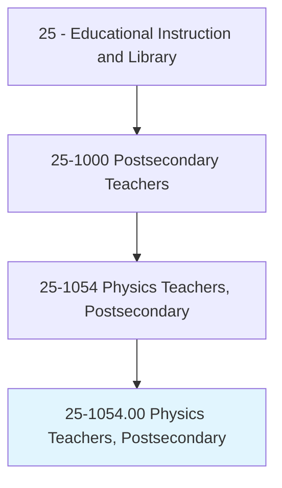
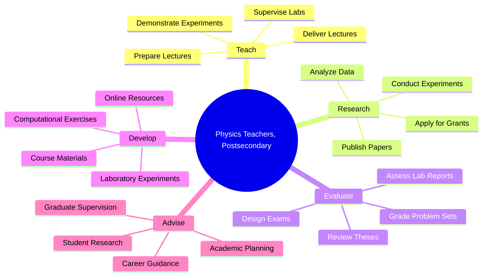
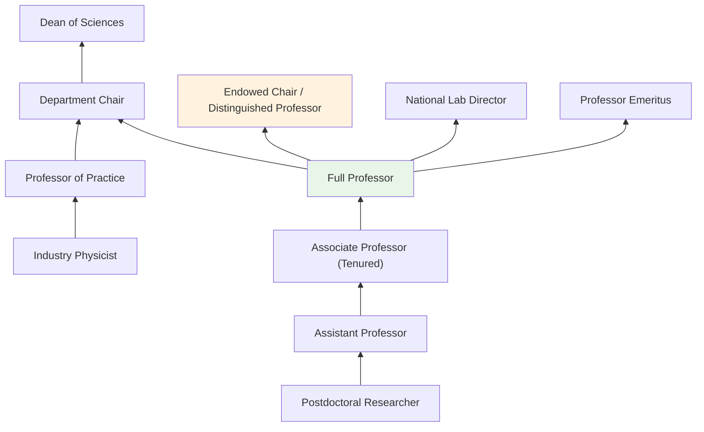
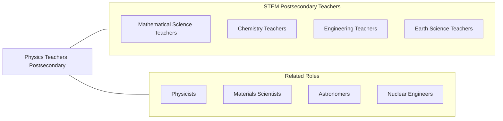

# Physics Teachers, Postsecondary

> Teach courses pertaining to the laws of matter and energy. Includes both teachers primarily engaged in teaching and those who do a combination of teaching and research.

## Overview

Physics Teachers in postsecondary education instruct students in the fundamental laws governing matter, energy, space, and time. They teach courses spanning classical mechanics, electromagnetism, thermodynamics, quantum mechanics, optics, nuclear physics, astrophysics, and condensed matter physics. These educators combine rigorous mathematical instruction with laboratory demonstrations and computational methods, helping students develop both theoretical understanding and experimental skills.

Many physics professors conduct cutting-edge research in areas such as particle physics, quantum computing, plasma physics, materials science, and cosmology. They secure funding from agencies like the National Science Foundation and Department of Energy, supervise graduate student research, and publish in journals such as Physical Review Letters and Nature Physics. Their research activities often involve collaboration with national laboratories, international research centers, and interdisciplinary teams.

Physics faculty play a foundational role in STEM education, providing essential coursework for students in physics, engineering, chemistry, astronomy, and mathematics. They develop laboratory curricula, integrate computational physics tools, and adapt pedagogical approaches to improve student learning outcomes in a discipline often perceived as challenging.

## Classification Hierarchy

## Key Statistics

| Metric | Value |
|--------|-------|
| SOC Code | 25-1054.00 |
| Job Zone | 5 (Extensive Preparation) |
| Category | [Educational Instruction and Library](/occupations/Education/index) |
| Median Salary | $85,000 - $115,000 |
| Employment | ~14,000 |
| Projected Growth | 5-8% (Average) |
| Source | O*NET |

## Core Tasks

### prepare.Lectures

Physics Teachers develop instructional content in physics disciplines.

**Actions:**
- `prepare.Lectures.on.ClassicalMechanics` - Create content on Newtonian mechanics, Lagrangian and Hamiltonian formulations
- `prepare.Lectures.on.QuantumMechanics` - Develop materials on wave mechanics, operators, and quantum phenomena
- `prepare.Lectures.on.Electromagnetism` - Design content on Maxwell's equations, optics, and electromagnetic theory

### deliver.Lectures

Physics Teachers present physics concepts through lectures, demonstrations, and problem-solving sessions.

**Actions:**
- `deliver.Lectures.on.TheoreticalPhysics` - Teach abstract physical concepts and mathematical frameworks
- `deliver.Lectures.on.ExperimentalPhysics` - Instruct on laboratory methods, measurement, and data analysis
- `supervise.LaboratoryExperiments.for.Students` - Oversee hands-on experimentation and data collection

### direct.Research

Physics Teachers conduct and supervise original research in physics.

**Actions:**
- `direct.Research.in.ExperimentalPhysics` - Lead laboratory investigations and data analysis
- `direct.Research.of.GraduateStudents` - Supervise doctoral and master's thesis research
- `publish.Findings.in.PhysicsJournals` - Contribute original research to peer-reviewed publications

## Skills & Competencies

### Technical Skills
- **Physics** - Expert (classical, quantum, statistical, and modern physics)
- **Mathematics** - Expert (differential equations, linear algebra, complex analysis)
- **Computational Physics** - Advanced (Python, MATLAB, Mathematica, C++/Fortran)
- **Laboratory Methods** - Advanced (experimental design, instrumentation, data acquisition)
- **Research Methods** - Advanced (experimental and theoretical techniques)
- **Curriculum Design** - Advanced (physics education research)

### Soft Skills
- **Analytical Thinking** - Critical (problem-solving, mathematical reasoning)
- **Communication** - Critical (explaining abstract concepts accessibly)
- **Patience** - Essential (guiding students through difficult material)
- **Mentorship** - Essential (research supervision)
- **Collaboration** - Essential (research teams, interdisciplinary projects)
- **Creativity** - Important (innovative demonstrations and experiments)

## Education & Certifications

| Requirement | Details |
|-------------|---------|
| Typical Education | Ph.D. in Physics, Applied Physics, or closely related field |
| Alternative Entry | Master's degree for community college or adjunct positions |
| Work Experience | Postdoctoral research experience common for research university positions |
| On-the-Job Training | Faculty development; physics education research workshops |
| Common Certifications | APS membership; specialized research facility certifications |

## Career Progression

## Setting Variations

### Research Universities
Heavy emphasis on externally funded research, doctoral student supervision, and publication in top-tier journals. Lighter teaching loads with access to major research facilities.

### Liberal Arts Colleges
Focus on undergraduate teaching with emphasis on conceptual understanding and laboratory skills. Student-faculty research collaborations.

### Community Colleges
Introductory physics courses for STEM transfer students. Higher teaching loads with diverse student preparation levels.

### Online Programs
Asynchronous physics instruction with virtual labs and simulations. Growing use of PhET and other interactive tools.

### National Laboratories
Affiliated research positions combining basic research with mentorship of visiting students and postdocs.

## Technology & Tools

| Category | Tools |
|----------|-------|
| Computational | Python, MATLAB, Mathematica, C++, Fortran, Julia |
| Simulation | COMSOL, ANSYS, Geant4, LabVIEW |
| Data Analysis | ROOT, Origin, Igor Pro, Jupyter Notebooks |
| Learning Management Systems | Canvas, Blackboard, Moodle |
| Teaching Tools | PhET Simulations, Vernier sensors, oscilloscopes |
| Research Databases | arXiv, Physical Review, AIP journals |

## Related Occupations

## Industries

- [Educational Services - Colleges and Universities](/industries/Education/index) - Primary Employment
- [Government](/industries/PublicAdministration) - National Laboratories, DOE, NASA
- [Professional, Scientific, and Technical Services](/industries/Scientific) - Research Organizations
- [Manufacturing](/industries/Manufacturing) - Semiconductor and Materials Research

## Departments

This occupation typically works in:
- Department of Physics
- Department of Physics and Astronomy
- School of Sciences
- Applied Physics Program

---

*Source: O*NET 25-1054.00 - ONETOccupation*
