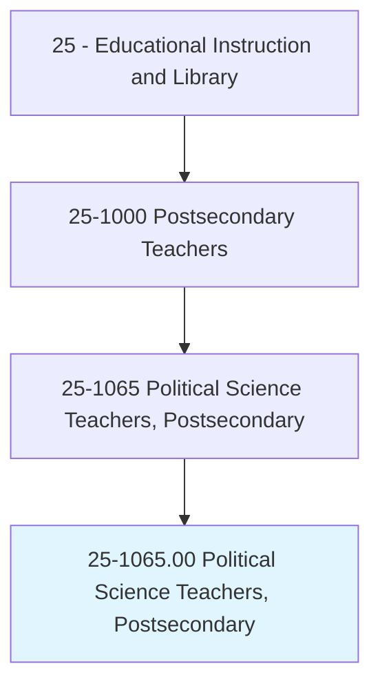
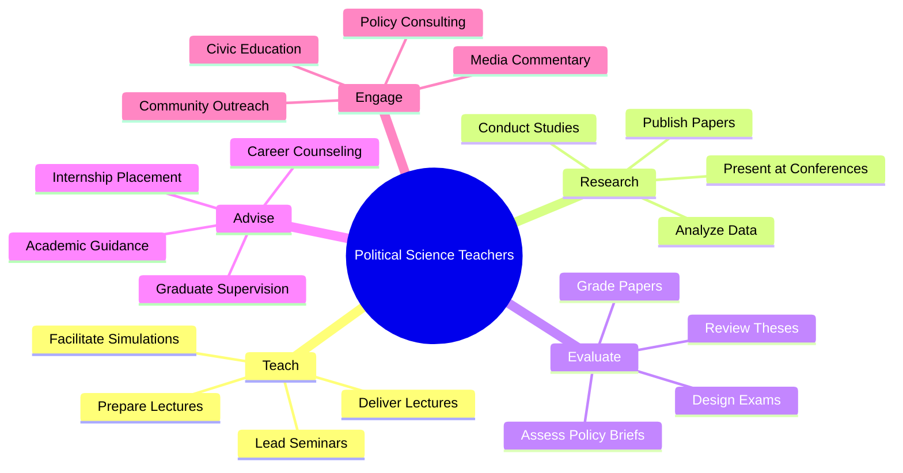
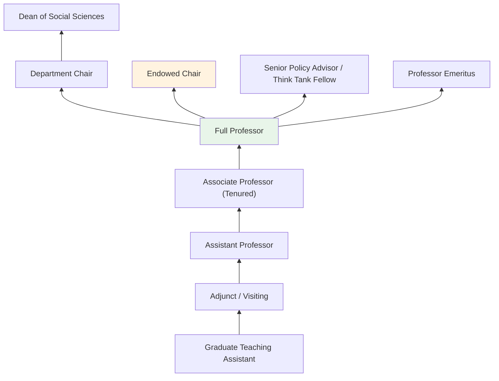
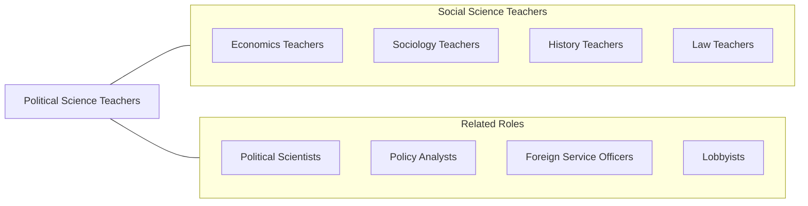

# Political Science Teachers, Postsecondary

> Teach courses in political science, international affairs, and international relations. Includes both teachers primarily engaged in teaching and those who do a combination of teaching and research.

## Overview

Political Science Teachers in postsecondary education instruct students in the study of government, political behavior, public policy, international relations, and comparative politics. They teach courses covering American government, political theory, constitutional law, public administration, electoral politics, legislative processes, and global governance. These educators train students to analyze political systems, evaluate policy alternatives, and understand the dynamics of power and decision-making in domestic and international contexts.

Many political science professors maintain active research programs focused on topics such as voting behavior, democratic institutions, foreign policy, political economy, identity politics, and conflict resolution. They publish in journals like the American Political Science Review and International Organization, secure funding from foundations and government agencies, and engage in public commentary on political events and policy debates.

Political science faculty prepare students for careers in government, law, diplomacy, journalism, campaign management, public policy analysis, and nonprofit advocacy. They also train graduate students for academic careers and provide expertise to policymakers, media organizations, and international institutions.

## Classification Hierarchy

## Key Statistics

| Metric | Value |
|--------|-------|
| SOC Code | 25-1065.00 |
| Job Zone | 5 (Extensive Preparation) |
| Category | [Educational Instruction and Library](/occupations/Education/index) |
| Median Salary | $80,000 - $105,000 |
| Employment | ~16,000 |
| Projected Growth | 4-6% (Average) |
| Source | O*NET |

## Core Tasks

### prepare.Lectures

Political Science Teachers develop instructional content across political science subfields.

**Actions:**
- `prepare.Lectures.on.AmericanGovernment` - Create content on constitutional structure, political institutions, and elections
- `prepare.Lectures.on.InternationalRelations` - Develop materials on global politics, security, and diplomacy
- `prepare.Lectures.on.PoliticalTheory` - Design content on normative and empirical political philosophy

### deliver.Lectures

Political Science Teachers present course material through varied pedagogical methods.

**Actions:**
- `deliver.Lectures.on.ComparativePolitics` - Teach analysis of political systems across countries
- `deliver.Lectures.on.PublicPolicy` - Instruct on policy analysis, implementation, and evaluation
- `facilitate.Simulations.of.PoliticalProcesses` - Lead Model UN, legislative simulations, and policy exercises

### conduct.Research

Political Science Teachers pursue original political science scholarship.

**Actions:**
- `conduct.Research.on.ElectoralBehavior` - Analyze voting patterns, campaigns, and public opinion
- `conduct.Research.on.InternationalConflict` - Study interstate relations, war, and peace processes
- `publish.Findings.in.PoliticalScienceJournals` - Contribute to peer-reviewed scholarly literature

## Skills & Competencies

### Technical Skills
- **Political Analysis** - Expert (institutional, behavioral, and policy analysis)
- **Research Methods** - Expert (quantitative, qualitative, formal modeling)
- **Statistical Analysis** - Advanced (Stata, R, SPSS, game theory)
- **Academic Writing** - Expert (scholarly publication, policy analysis)
- **Curriculum Design** - Advanced (political science pedagogy)
- **Data Analysis** - Advanced (survey data, comparative datasets)

### Soft Skills
- **Critical Thinking** - Critical (evaluating political claims and evidence)
- **Communication** - Critical (public speaking, media engagement)
- **Cultural Competency** - Essential (comparative and international perspectives)
- **Mentorship** - Essential (guiding student careers in politics and policy)
- **Public Engagement** - Important (civic education, media commentary)
- **Collaboration** - Important (interdisciplinary research, policy teams)

## Education & Certifications

| Requirement | Details |
|-------------|---------|
| Typical Education | Ph.D. in Political Science, Government, or International Relations |
| Alternative Entry | Master's degree for community college or adjunct positions |
| Work Experience | Research and teaching experience required; government or policy experience valued |
| On-the-Job Training | Faculty development; pedagogical training |
| Common Certifications | APSA membership; Fulbright Scholar programs; area studies certifications |

## Career Progression

## Setting Variations

### Research Universities
Emphasis on original research, doctoral student supervision, and publication. Lighter teaching loads with expectation of significant scholarly output.

### Liberal Arts Colleges
Focus on undergraduate teaching excellence. Broad course coverage including American politics, comparative politics, and political theory.

### Community Colleges
American Government and Introduction to Political Science courses. Higher teaching loads with diverse student populations.

### Policy Schools
Political science taught within MPP/MPA programs. Applied focus on policy analysis and public administration.

### Online Programs
Asynchronous political science courses with emphasis on current events analysis and policy discussion.

## Technology & Tools

| Category | Tools |
|----------|-------|
| Statistical Software | Stata, R, SPSS, Python |
| Data Sources | ANES, World Values Survey, Polity IV, ICPSR |
| Learning Management Systems | Canvas, Blackboard, Moodle |
| Simulation Tools | Model UN platforms, legislative simulations |
| Research Databases | JSTOR, EBSCO, ProQuest, Google Scholar |
| Reference Management | Zotero, Mendeley, EndNote |

## Related Occupations

## Industries

- [Educational Services - Colleges and Universities](/industries/Education/index) - Primary Employment
- [Government](/industries/PublicAdministration) - Public Policy Research, Congressional Staff
- [Professional Services](/industries/Scientific) - Think Tanks and Policy Organizations
- [Other Services](/industries/OtherServices) - Advocacy and Civic Organizations

## Departments

This occupation typically works in:
- Department of Political Science
- School of Public Affairs
- International Relations Program
- School of Government

---

*Source: O*NET 25-1065.00 - ONETOccupation*
