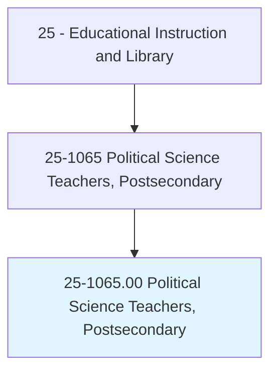
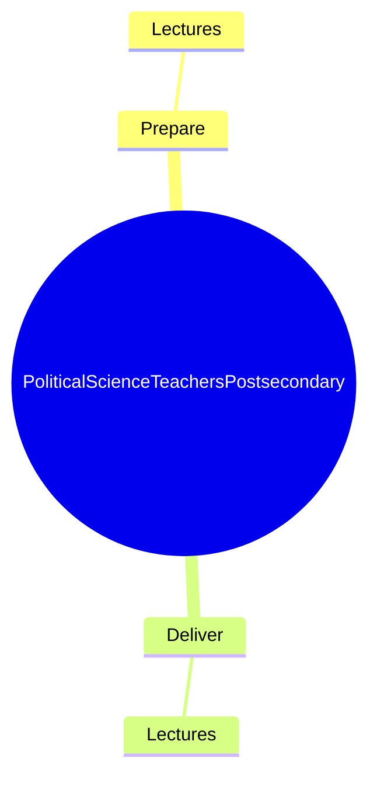
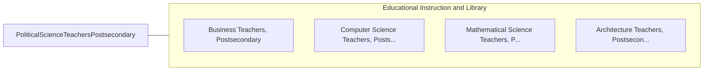

# Political Science Teachers, Postsecondary

> Teach courses in political science, international affairs, and international relations. Includes both teachers primarily engaged in teaching and those who do a combination of teaching and research.

## Overview

Political Science Teachers, Postsecondary is an occupation within the Educational Instruction and Library category. Teach courses in political science, international affairs, and international relations. 

## Classification Hierarchy

## Key Statistics

| Metric | Value |
|--------|-------|
| SOC Code | 25-1065.00 |
| Category | [Educational Instruction and Library](/occupations/Education) |
| Task Count | 8 |
| Source | O*NET |

## Core Tasks

### prepare.Lectures

Political Science Teachers, Postsecondary prepare lectures as part of their core responsibilities.

**Actions:**
- `prepare.Lectures.to.ClassicalPoliticalThought`
- `prepare.Lectures.to.InternationalRelations`
- `prepare.Lectures.to.Democracy`
- `prepare.Lectures.to.Citizenship`

### deliver.Lectures

Political Science Teachers, Postsecondary deliver lectures as part of their core responsibilities.

**Actions:**
- `deliver.Lectures.to.ClassicalPoliticalThought`
- `deliver.Lectures.to.InternationalRelations`
- `deliver.Lectures.to.Democracy`
- `deliver.Lectures.to.Citizenship`

## Skills & Competencies

### Technical Skills
- **Curriculum Development** - Advanced
- **Instructional Design** - Advanced
- **Assessment** - Advanced

### Soft Skills
- **Communication** - Essential
- **Problem Solving** - Essential
- **Critical Thinking** - Important
- **Teamwork** - Important
- **Adaptability** - Important

## Related Occupations

## Industries

This occupation is found across multiple industries. See [Industries](/industries) for sector-specific employment data.

## Career Progression

---

*Source: O*NET 25-1065.00 - ONETOccupation*
