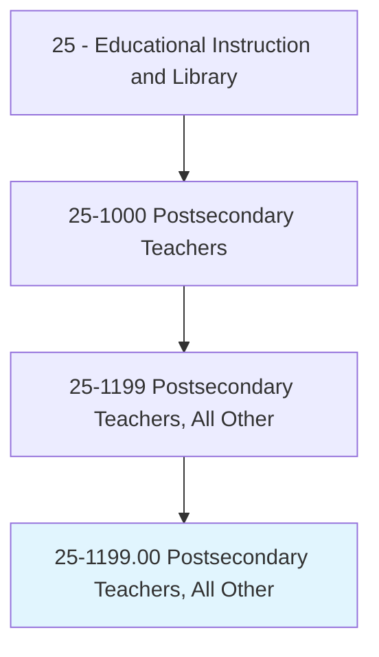
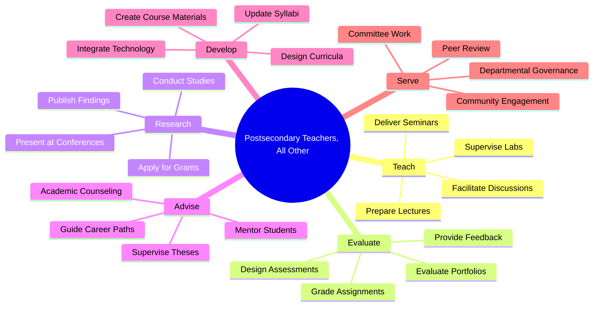
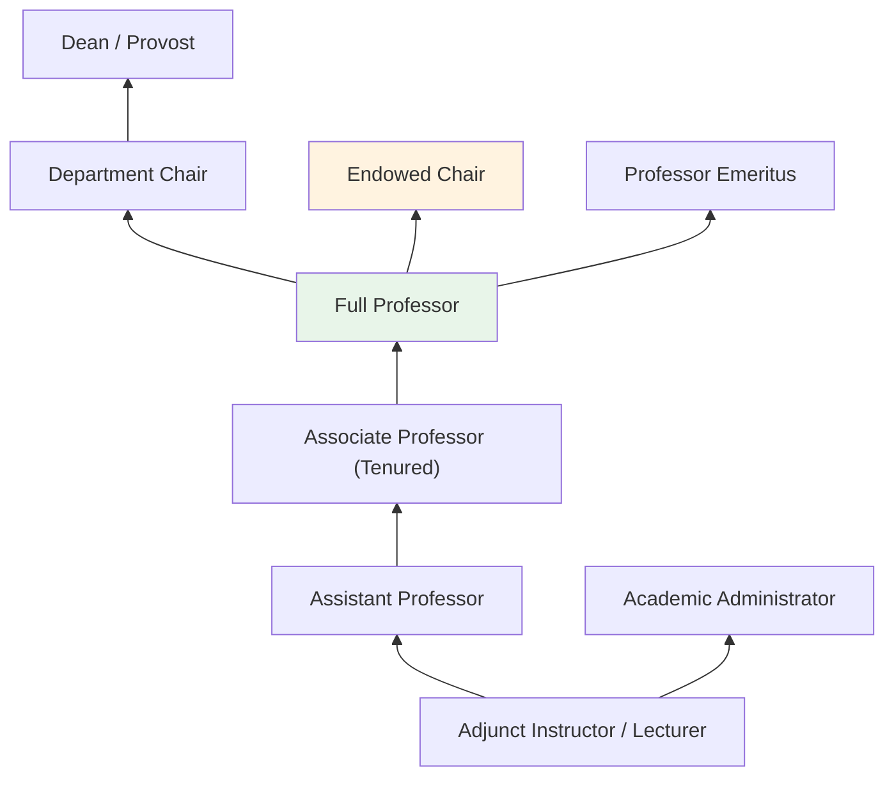
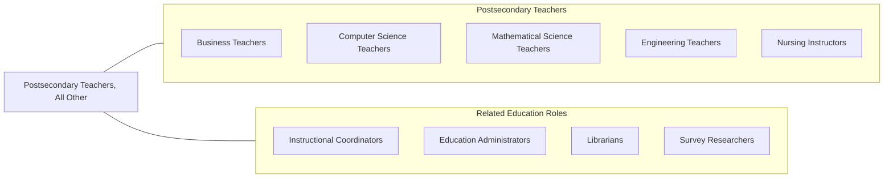

# Postsecondary Teachers, All Other

> All postsecondary teachers not listed separately.

## Overview

Postsecondary Teachers, All Other encompasses the broad range of college and university instructors whose disciplines do not fall neatly into the specifically defined postsecondary teaching categories. These educators teach at community colleges, four-year universities, professional schools, and technical institutes across a wide variety of subjects including interdisciplinary studies, emerging fields, and specialized niche disciplines that span traditional departmental boundaries.

These professionals are responsible for developing course materials, delivering lectures and seminars, evaluating student performance, and contributing to the academic mission of their institutions. Many combine teaching with scholarly research, publishing in academic journals, presenting at conferences, and mentoring graduate students. They play a critical role in expanding the range of knowledge available to students, often pioneering courses in new and evolving fields that have not yet been formalized into standalone academic departments.

The diversity of this category reflects the dynamic nature of higher education, where new disciplines continuously emerge at the intersection of established fields. These teachers must be highly adaptable, capable of designing curricula from the ground up, and skilled at communicating complex ideas across disciplinary boundaries.

## Classification Hierarchy

## Key Statistics

| Metric | Value |
|--------|-------|
| SOC Code | 25-1199.00 |
| Job Zone | 5 (Extensive Preparation) |
| Category | [Educational Instruction and Library](/occupations/Education/index) |
| Median Salary | $67,000 - $85,000 |
| Employment | ~130,000 |
| Projected Growth | 8-12% (Faster than average) |
| Source | O*NET |

## Core Tasks

### prepare.Lectures

Postsecondary Teachers prepare and organize instructional content across a variety of disciplines.

**Actions:**
- `prepare.Lectures.on.InterdisciplinaryTopics` - Develop lecture materials spanning multiple academic fields
- `prepare.CourseMaterials.for.NewDisciplines` - Create syllabi and resources for emerging subject areas
- `prepare.Assessments.to.EvaluateStudentLearning` - Design exams, projects, and rubrics

### deliver.Instruction

Postsecondary Teachers deliver course content through multiple instructional modalities.

**Actions:**
- `deliver.Lectures.to.UndergraduateStudents` - Present course material in classroom and online settings
- `deliver.Seminars.to.GraduateStudents` - Facilitate advanced seminar discussions
- `facilitate.Discussions.on.CourseTopics` - Lead interactive class discussions and group activities

### evaluate.StudentPerformance

Postsecondary Teachers assess student learning through varied evaluation methods.

**Actions:**
- `evaluate.StudentWork.using.Rubrics` - Assess assignments, exams, and research papers
- `provide.Feedback.to.Students` - Offer constructive guidance on academic progress
- `grade.Assignments.for.CourseCompletion` - Assign grades based on demonstrated competency

### advise.Students

Postsecondary Teachers mentor and counsel students on academic and career matters.

**Actions:**
- `advise.Students.on.AcademicCurricula` - Guide students through course selection and degree requirements
- `advise.Students.on.CareerOpportunities` - Counsel students on professional paths
- `supervise.Research.of.GraduateStudents` - Direct thesis and dissertation work

## Skills & Competencies

### Technical Skills
- **Curriculum Design** - Expert (interdisciplinary course development)
- **Pedagogy** - Advanced (lecture, seminar, experiential learning)
- **Research Methods** - Advanced (qualitative, quantitative, mixed methods)
- **Assessment Design** - Advanced (formative and summative evaluation)
- **Educational Technology** - Advanced (LMS, multimedia, online platforms)
- **Academic Writing** - Expert (scholarly publication, grant proposals)

### Soft Skills
- **Communication** - Critical (explaining complex interdisciplinary concepts)
- **Adaptability** - Critical (teaching across varied disciplines)
- **Critical Thinking** - Essential
- **Collaboration** - Essential (interdepartmental projects)
- **Mentorship** - Essential (graduate and undergraduate advising)
- **Time Management** - Important (balancing teaching, research, service)

## Education & Certifications

| Requirement | Details |
|-------------|---------|
| Typical Education | Ph.D. or terminal degree in relevant discipline |
| Alternative Entry | Master's degree for community college or adjunct positions |
| Work Experience | Teaching and/or research experience required |
| On-the-Job Training | Faculty development workshops, teaching mentorship |
| Common Certifications | Discipline-specific credentials; teaching certificates for higher education |

## Career Progression

## Setting Variations

### Research Universities
Strong emphasis on original scholarship, grant acquisition, and doctoral student supervision. Teaching loads are typically lighter to accommodate research expectations.

### Teaching-Focused Colleges
Primary focus on undergraduate instruction with higher course loads. Emphasis on pedagogical innovation and student mentorship.

### Community Colleges
Open-access teaching with diverse student populations. Focus on foundational skills, transfer preparation, and workforce development. Master's degree typically sufficient.

### Online Institutions
Asynchronous and synchronous course delivery. Requires proficiency with learning management systems and digital pedagogy. Global student body.

### Vocational and Technical Schools
Applied instruction in specialized trade and technical fields. Close industry partnerships and practical skill development.

## Technology & Tools

| Category | Tools |
|----------|-------|
| Learning Management Systems | Canvas, Blackboard, Moodle, D2L Brightspace |
| Video & Communication | Zoom, Microsoft Teams, Panopto, Kaltura |
| Assessment Platforms | Turnitin, Gradescope, ExamSoft, Respondus |
| Productivity | Microsoft Office, Google Workspace, LaTeX |
| Research Tools | JSTOR, PubMed, Google Scholar, Zotero, Mendeley |
| Course Design | Articulate, Adobe Creative Suite, H5P |

## Related Occupations

## Industries

- [Educational Services - Colleges and Universities](/industries/Education/index) - Primary Employment
- [Government](/industries/PublicAdministration) - Public Universities and Research Institutions
- [Professional, Scientific, and Technical Services](/industries/Scientific) - Training and Consulting
- [Healthcare and Social Assistance](/industries/Healthcare) - Health Education Programs

## Departments

This occupation typically works in:
- Academic Affairs
- Interdisciplinary Studies
- Continuing Education
- Graduate Studies

---

*Source: O*NET 25-1199.00 - ONETOccupation*
