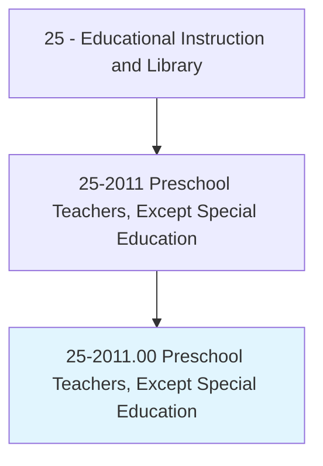
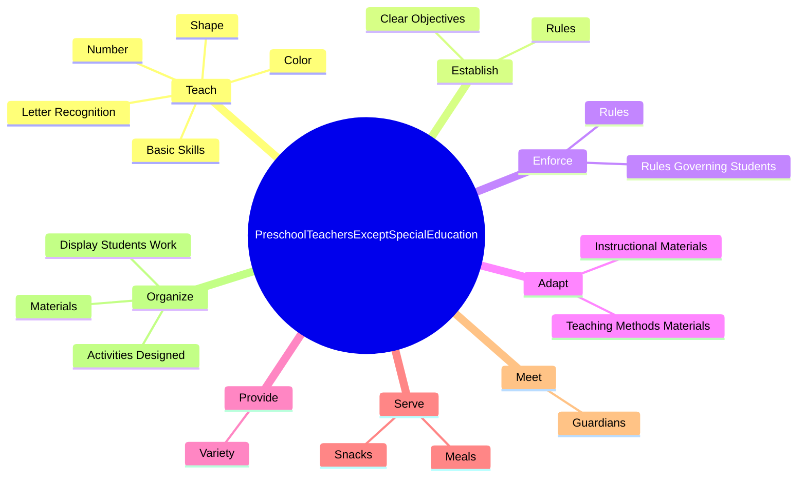
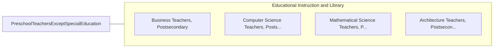

# Preschool Teachers, Except Special Education

> Instruct preschool-aged students, following curricula or lesson plans, in activities designed to promote social, physical, and intellectual growth.

## Overview

Preschool Teachers, Except Special Education is classified under Educational Instruction and Library (SOC 25). Instruct preschool-aged students, following curricula or lesson plans, in activities designed to promote social, physical, and intellectual growth.

## Classification Hierarchy

## Key Statistics

| Metric | Value |
|--------|-------|
| SOC Code | 25-2011.00 |
| Category | [Educational Instruction and Library](/occupations/Education/index) |
| Task Count | 153 |
| Source | O*NET |

## Core Tasks

### teach.BasicSkills

Preschool Teachers, Except Special Education teach basic skills as part of their core responsibilities.

**Actions:**
- `teach.BasicSkills`
- `teach.Color`
- `teach.Shape`
- `teach.Number`

### establish.Rules

Preschool Teachers, Except Special Education establish rules as part of their core responsibilities.

**Actions:**
- `establish.Rules.for.Behavior.for.MaintainingOrder`
- `establish.Rules.for.Procedures.for.MaintainingOrder`
- `establish.ClearObjectives.for.Lessons`
- `establish.ClearObjectives.for.Units`

### enforce.Rules

Preschool Teachers, Except Special Education enforce rules as part of their core responsibilities.

**Actions:**
- `enforce.Rules.for.Behavior.for.MaintainingOrder`
- `enforce.Rules.for.Procedures.for.MaintainingOrder`
- `enforce.RulesGoverningStudents`

## Skills & Competencies

### Technical Skills
- **Curriculum Development** - Advanced
- **Instructional Design** - Advanced
- **Assessment** - Advanced

### Soft Skills
- **Communication** - Essential
- **Problem Solving** - Essential
- **Critical Thinking** - Important
- **Teamwork** - Important
- **Adaptability** - Important

## Related Occupations

## Industries

This occupation is found across multiple industries. See [Industries](/industries) for sector-specific employment data.

## Career Progression

---

*Source: O*NET 25-2011.00 - ONETOccupation*
