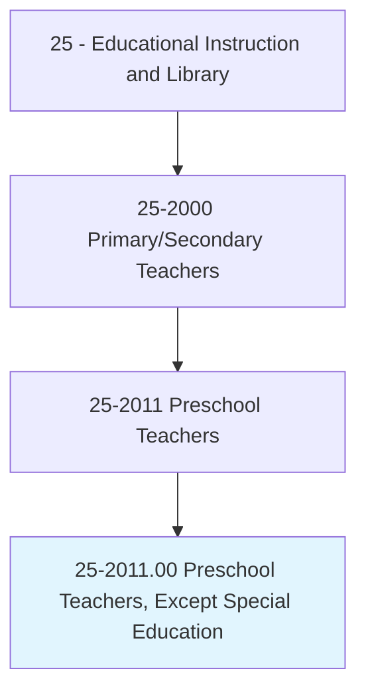
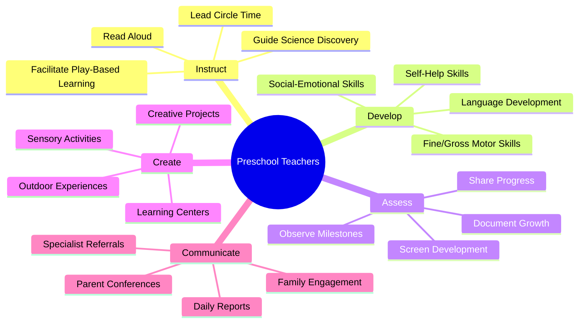
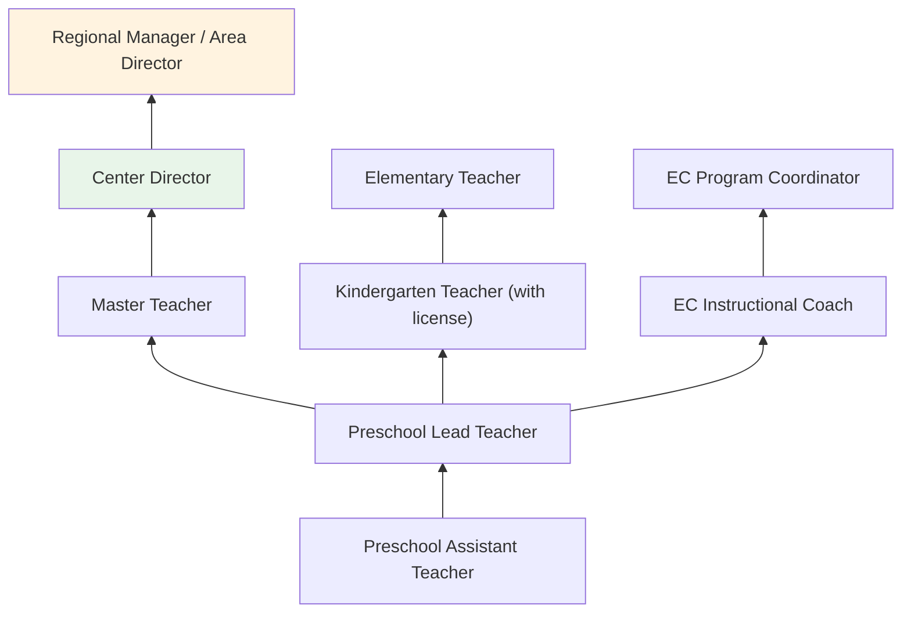
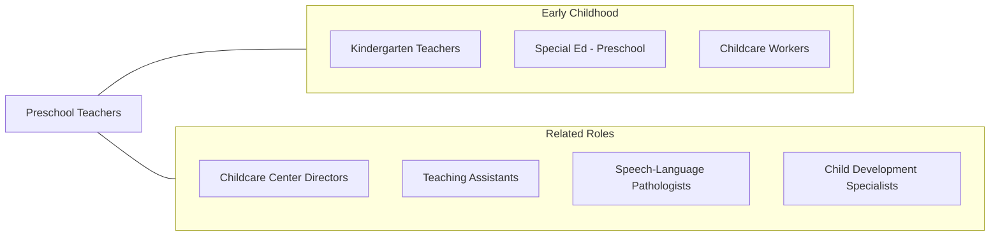

# Preschool Teachers, Except Special Education

> Instruct preschool-aged children in activities designed to promote social, physical, and intellectual growth needed for primary school in preschool, day care center, or other child development facility. May be required to hold State certification.

## Overview

Preschool Teachers instruct children ages 3-5 in developmentally appropriate activities that promote cognitive, social-emotional, physical, and language development in preparation for kindergarten. They design play-based learning experiences covering early literacy, numeracy, science exploration, creative arts, and social skills within structured yet flexible daily routines. These educators work in preschool programs, child care centers, Head Start programs, and public pre-K classrooms.

Preschool teaching centers on the whole child, addressing cognitive readiness alongside social-emotional development, self-help skills, and physical coordination. Teachers create rich learning environments with activity centers, outdoor play spaces, and sensory experiences that stimulate curiosity and discovery. They use observation-based assessment to track developmental milestones, identify potential delays, and plan responsive instruction.

The growing recognition of early childhood education's long-term impact on academic success and life outcomes has driven expansion of publicly funded pre-K programs nationwide. This has increased demand for qualified preschool teachers and elevated professional standards, with many states now requiring bachelor's degrees and early childhood licensure for pre-K teachers in public programs.

## Classification Hierarchy

## Key Statistics

| Metric | Value |
|--------|-------|
| SOC Code | 25-2011.00 |
| Job Zone | 3-4 (Medium to Considerable Preparation) |
| Category | [Educational Instruction and Library](/occupations/Education/index) |
| Median Salary | $35,000 - $48,000 (varies widely by setting; public pre-K pays more) |
| Employment | ~430,000 |
| Projected Growth | 8-12% (Faster than average) |
| Source | O*NET |

## Core Tasks

### facilitate.DevelopmentalLearning

Preschool Teachers design play-based experiences for young learners.

**Actions:**
- `facilitate.PlayBasedLearning.for.CognitiveDevelopment` - Engage children in exploratory activities building thinking skills
- `read.Books.to.DevelopLanguage` - Conduct interactive read-alouds supporting vocabulary and comprehension
- `guide.ScienceDiscovery.through.HandsOnExploration` - Lead nature walks, experiments, and sensory investigations

### develop.SchoolReadiness

Preschool Teachers build the foundational skills children need for kindergarten.

**Actions:**
- `develop.SocialEmotionalSkills.through.GuidedInteraction` - Teach sharing, empathy, and emotional expression
- `develop.LanguageSkills.through.ConversationAndStorytelling` - Build vocabulary, sentence structure, and narrative abilities
- `develop.MotorSkills.through.ArtAndMovement` - Strengthen fine motor (cutting, drawing) and gross motor (running, climbing) abilities

## Skills & Competencies

### Technical Skills
- **Early Childhood Development** - Expert (developmental milestones, DAP, learning through play)
- **Curriculum Design** - Advanced (emergent curriculum, thematic units, learning standards)
- **Assessment** - Advanced (observational assessment, Teaching Strategies GOLD, ASQ)
- **Classroom Environment** - Advanced (learning centers, sensory areas, safety)
- **Literacy Foundations** - Advanced (print awareness, vocabulary, phonological awareness)
- **Health and Safety** - Advanced (nutrition, hygiene, allergen management, CPR)

### Soft Skills
- **Nurturing** - Critical (emotional warmth and security for young children)
- **Patience** - Critical (developmental variability, toilet training, behavior)
- **Communication** - Essential (child-level language, family partnerships)
- **Creativity** - Essential (engaging activities for short attention spans)
- **Observation** - Essential (noticing developmental cues and concerns)
- **Physical Stamina** - Important (active, hands-on engagement with children)

## Education & Certifications

| Requirement | Details |
|-------------|---------|
| Typical Education | CDA to bachelor's degree depending on setting (public pre-K requires bachelor's in many states) |
| State Requirements | Varies: CDA for childcare; bachelor's + license for public pre-K |
| Work Experience | Experience with young children required |
| On-the-Job Training | Moderate; ongoing professional development |
| Common Certifications | CDA (Child Development Associate); state ECE teaching license; CPR/First Aid; Child Abuse Recognition training |

## Career Progression

## Setting Variations

### Public Pre-K Programs
State-funded programs with teacher licensure requirements. Standards-aligned curriculum. Often in elementary school buildings.

### Head Start
Federally funded comprehensive early childhood programs. Serves low-income families with education, health, and family services.

### Private Preschools
Varied philosophies (Montessori, Reggio Emilia, Waldorf, play-based). Tuition-funded with independent governance.

### Child Care Centers
Full-day programs combining care and education. Licensing standards vary by state.

### Home-Based Programs
Family child care providers offering preschool programming in home settings. Smaller group sizes.

## Technology & Tools

| Category | Tools |
|----------|-------|
| Assessment | Teaching Strategies GOLD, ASQ (Ages and Stages), COR Advantage |
| Communication | Brightwheel, HiMama, Tadpoles, ProCare |
| Interactive Learning | Starfall, PBS Kids, ABCmouse |
| Documentation | Digital portfolios, photo documentation |
| Classroom | Sensory tables, light tables, block centers, outdoor classrooms |
| Administrative | ProCare, ChildCare Manager |

## Related Occupations

## Industries

- Social Assistance - Child Day Care - Primary Employment
- [Educational Services](/industries/Education/index) - Public Pre-K Programs
- [Religious Organizations](/industries/ReligiousOrganizations) - Church-Based Preschools
- [Government](/industries/PublicAdministration) - Head Start, State Pre-K

## Departments

This occupation typically works in:
- [Early Childhood Education](/departments/Operations)
- Pre-K Program
- Child Development Center

---

*Source: O*NET 25-2011.00 - ONETOccupation*
