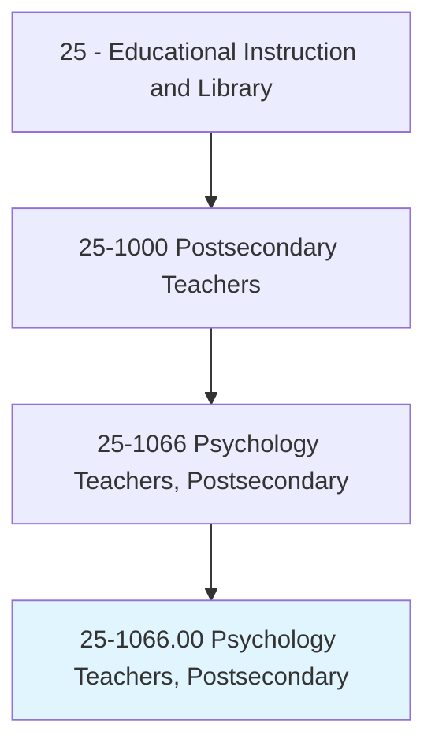
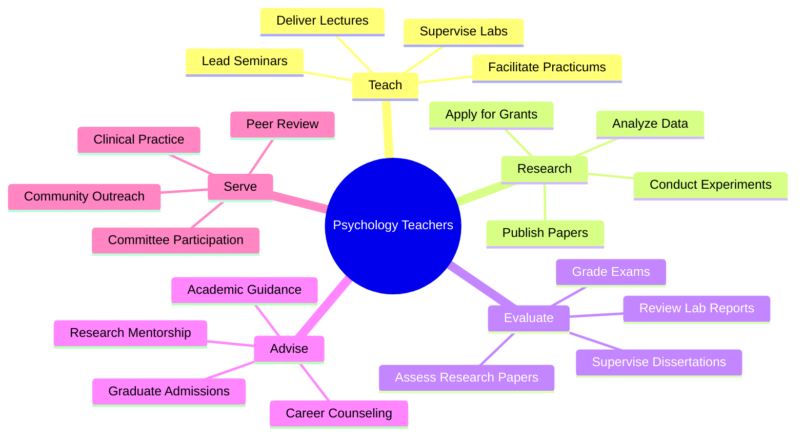
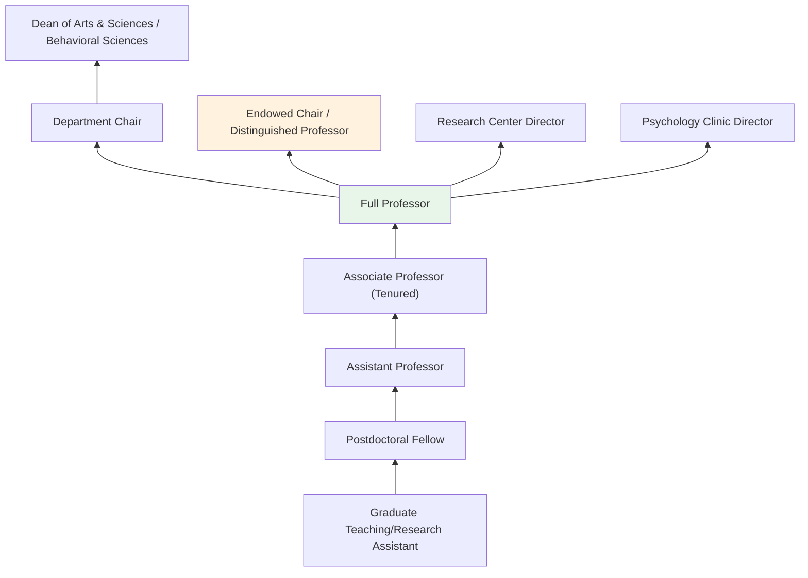
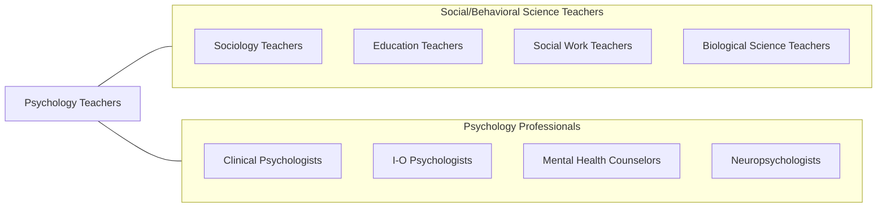

# Psychology Teachers, Postsecondary

> Teach courses in psychology, such as child psychology, clinical psychology, and developmental psychology. Includes both teachers primarily engaged in teaching and those who do a combination of teaching and research.

## Overview

Psychology Teachers in postsecondary education instruct students in the scientific study of behavior and mental processes. They teach courses covering introductory psychology, developmental psychology, social psychology, cognitive psychology, abnormal psychology, research methods, neuroscience, industrial-organizational psychology, and clinical psychology. These educators train students to understand human behavior through empirical research, theoretical frameworks, and applied practice, preparing them for careers in clinical practice, research, counseling, human resources, and numerous other fields.

Many psychology professors maintain active research programs investigating topics such as memory and cognition, mental health interventions, child development, social behavior, neurological processes, and organizational dynamics. They publish in journals including Psychological Science, Journal of Personality and Social Psychology, and Developmental Psychology. Psychology is one of the most popular undergraduate majors, giving faculty significant influence in developing students' scientific literacy, critical thinking, and understanding of human behavior.

The breadth of psychology as a discipline means that faculty may specialize in highly focused areas while teaching broadly. Some maintain clinical licenses and see patients alongside their academic work, while others focus exclusively on basic research. The field continues to expand into emerging areas such as health psychology, forensic psychology, positive psychology, and computational neuroscience.

## Classification Hierarchy

## Key Statistics

| Metric | Value |
|--------|-------|
| SOC Code | 25-1066.00 |
| Job Zone | 5 (Extensive Preparation) |
| Category | [Educational Instruction and Library](/occupations/Education/index) |
| Median Salary | $78,000 - $102,000 |
| Employment | ~42,000 |
| Projected Growth | 6-10% (Faster than average) |
| Source | O*NET |

## Core Tasks

### teach.PsychologyCourses

Psychology Teachers deliver instruction across psychological disciplines.

**Actions:**
- `deliver.Lectures.on.IntroductoryPsychology` - Teach foundational concepts across all psychology subfields
- `deliver.Lectures.on.ResearchMethods` - Instruct on experimental design, statistics, and scientific writing
- `supervise.ResearchLabs.for.StudentProjects` - Guide undergraduate and graduate research experiences

### conduct.PsychologicalResearch

Psychology Teachers pursue original behavioral and mental science research.

**Actions:**
- `conduct.Experiments.on.HumanBehavior` - Design and execute empirical studies
- `analyze.Data.using.StatisticalMethods` - Apply advanced statistical techniques to behavioral data
- `publish.Findings.in.PsychologyJournals` - Contribute to peer-reviewed psychological science literature

## Skills & Competencies

### Technical Skills
- **Psychological Theory** - Expert (developmental, social, cognitive, clinical, biological)
- **Research Methods** - Expert (experimental, correlational, longitudinal, meta-analysis)
- **Statistical Analysis** - Expert (SPSS, R, Mplus, AMOS, HLM)
- **Assessment** - Advanced (psychometric tools, clinical assessment)
- **Curriculum Design** - Advanced (APA guidelines for undergraduate education)
- **IRB and Ethics** - Advanced (human subjects research protection)

### Soft Skills
- **Communication** - Critical (explaining complex behavioral concepts)
- **Empathy** - Essential (clinical sensitivity, student support)
- **Critical Thinking** - Essential (evaluating research claims)
- **Mentorship** - Essential (research apprenticeship model)
- **Collaboration** - Essential (interdisciplinary research teams)
- **Ethical Judgment** - Essential (research ethics, clinical boundaries)

## Education & Certifications

| Requirement | Details |
|-------------|---------|
| Typical Education | Ph.D. or Psy.D. in Psychology |
| Alternative Entry | Master's degree for community college or adjunct positions |
| Clinical License | Licensed Psychologist for clinical faculty (state-specific) |
| Work Experience | Research experience required; clinical experience for clinical faculty |
| Common Certifications | APA membership; state psychology license; ABPP board certification |

## Career Progression

## Setting Variations

### Research Universities
Heavy emphasis on funded research, doctoral student training, and publication. Strong laboratory research infrastructure.

### Liberal Arts Colleges
Focus on undergraduate teaching excellence. Student-faculty research collaborations. Broad course offerings.

### Community Colleges
Introduction to Psychology and related courses for large student populations. Higher teaching loads.

### Clinical Programs
APA-accredited clinical and counseling psychology doctoral programs. Emphasis on clinical training alongside research.

### Online Programs
Growing enrollment in psychology bachelor's and master's programs. Asynchronous delivery with virtual labs.

## Technology & Tools

| Category | Tools |
|----------|-------|
| Statistical Software | SPSS, R, Mplus, JASP, Python |
| Experiment Design | E-Prime, PsychoPy, Qualtrics, Gorilla |
| Neuroimaging | fMRI analysis (SPM, FSL), EEG systems |
| Learning Management Systems | Canvas, Blackboard, Moodle |
| Research Databases | PsycINFO, PubMed, Google Scholar |
| Reference Management | Zotero, Mendeley, APA Style |

## Related Occupations

## Industries

- [Educational Services - Colleges and Universities](/industries/Education/index) - Primary Employment
- [Healthcare](/industries/Healthcare) - Academic Medical Centers, Clinics
- [Government](/industries/PublicAdministration) - VA, NIH, Public Universities
- [Professional Services](/industries/Scientific) - Consulting and Research

## Departments

This occupation typically works in:
- Department of Psychology
- Department of Behavioral Sciences
- School of Education (Educational Psychology)
- Department of Neuroscience

---

*Source: O*NET 25-1066.00 - ONETOccupation*
