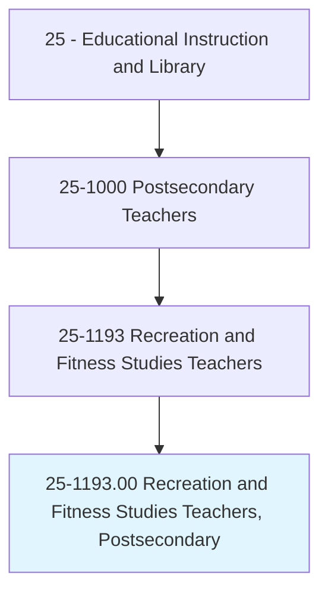
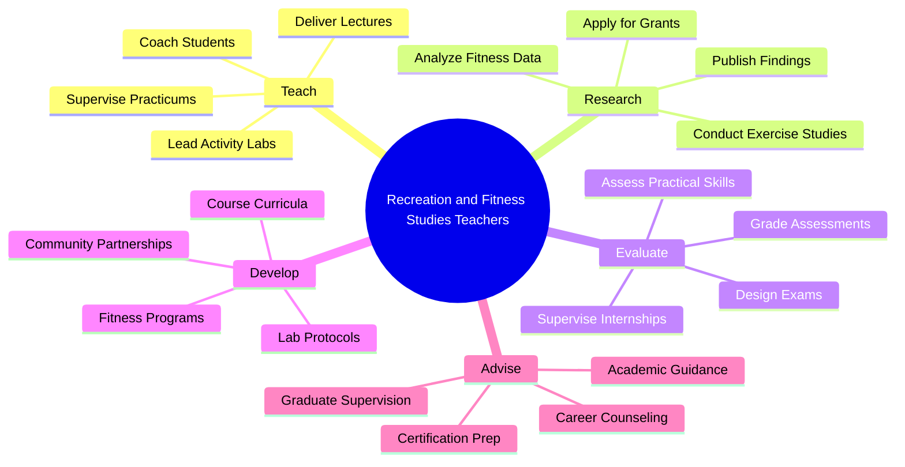
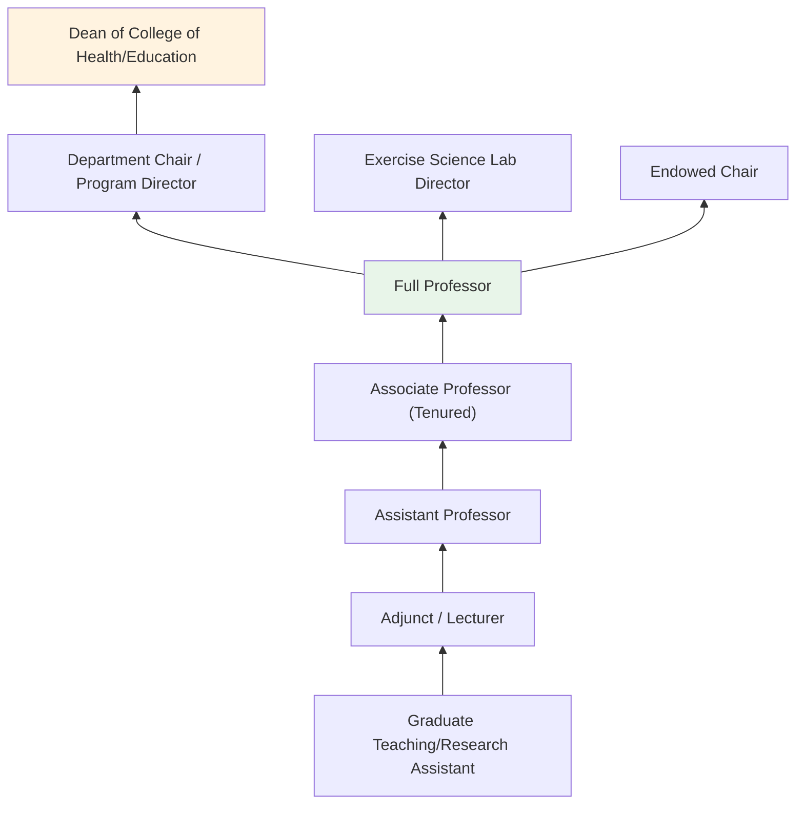
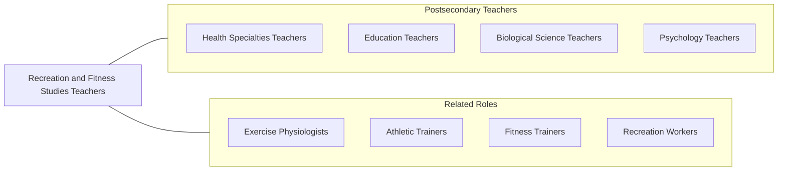

# Recreation and Fitness Studies Teachers, Postsecondary

> Teach courses in recreation and fitness studies. Includes both teachers primarily engaged in teaching and those who do a combination of teaching and research.

## Overview

Recreation and Fitness Studies Teachers in postsecondary education instruct students in kinesiology, exercise science, sports management, recreation administration, physical education pedagogy, and health promotion. They teach courses covering exercise physiology, biomechanics, motor learning, sports psychology, recreation programming, outdoor education, therapeutic recreation, and fitness assessment. These educators prepare students for professional careers in fitness training, sports management, parks and recreation, physical therapy assistance, and health promotion.

Many faculty members conduct research on topics such as physical activity interventions, sports injuries, exercise and chronic disease management, youth fitness, aging and mobility, and the psychological benefits of recreation. Their work contributes to evidence-based practices in exercise prescription, sports performance optimization, and community wellness programming. Faculty often maintain professional certifications and stay current with industry standards.

This field has expanded significantly with growing public awareness of the importance of physical activity and wellness. Faculty bridge academic research with practical application, training graduates who will design fitness programs, manage recreational facilities, coach athletes, develop community wellness initiatives, and promote active lifestyles across diverse populations.

## Classification Hierarchy

## Key Statistics

| Metric | Value |
|--------|-------|
| SOC Code | 25-1193.00 |
| Job Zone | 5 (Extensive Preparation) |
| Category | [Educational Instruction and Library](/occupations/Education/index) |
| Median Salary | $65,000 - $82,000 |
| Employment | ~10,000 |
| Projected Growth | 6-10% (Faster than average) |
| Source | O*NET |

## Core Tasks

### teach.KinesiologyAndExerciseScience

Faculty deliver instruction in movement science and fitness disciplines.

**Actions:**
- `deliver.Lectures.on.ExercisePhysiology` - Teach cardiorespiratory, metabolic, and neuromuscular responses to exercise
- `deliver.Lectures.on.SportsManagement` - Instruct on facility management, event planning, and sports marketing
- `supervise.ActivityLabs.for.FitnessAssessment` - Guide hands-on fitness testing and exercise prescription

### conduct.ExerciseScienceResearch

Faculty pursue original research in kinesiology and recreation.

**Actions:**
- `conduct.Research.on.PhysicalActivityInterventions` - Study exercise programs for health outcomes
- `conduct.Research.on.SportsPerformance` - Investigate biomechanical and physiological aspects of athletic performance
- `publish.Findings.in.KinesiologyJournals` - Contribute to journals in exercise science and recreation

## Skills & Competencies

### Technical Skills
- **Exercise Science** - Expert (physiology, biomechanics, motor behavior)
- **Fitness Assessment** - Expert (body composition, cardiorespiratory, strength testing)
- **Research Methods** - Advanced (experimental design, clinical trials)
- **Statistical Analysis** - Advanced (SPSS, R, biomechanical analysis software)
- **Curriculum Design** - Advanced (kinesiology and PE pedagogy)
- **Sports Technology** - Advanced (wearable sensors, force plates, motion capture)

### Soft Skills
- **Communication** - Critical (coaching, demonstration, clear instruction)
- **Motivation** - Essential (inspiring active participation)
- **Collaboration** - Essential (interdisciplinary health teams)
- **Mentorship** - Essential (guiding student practitioners)
- **Leadership** - Important (program development and team direction)
- **Adaptability** - Important (evolving fitness science and technology)

## Education & Certifications

| Requirement | Details |
|-------------|---------|
| Typical Education | Ph.D. in Kinesiology, Exercise Science, or Recreation |
| Alternative Entry | Master's degree for community college or applied positions |
| Work Experience | Professional experience in fitness, athletics, or recreation valued |
| On-the-Job Training | Faculty development; laboratory safety training |
| Common Certifications | ACSM Certified Exercise Physiologist; NSCA CSCS; NRPA CPRP; CPR/AED Instructor |

## Career Progression

## Setting Variations

### Research Universities
Emphasis on funded exercise science research, doctoral student training, and laboratory-based investigation. Publication in top kinesiology journals.

### Teaching-Focused Universities
Strong enrollment in kinesiology, PE teacher preparation, and sports management. Emphasis on practicum supervision and certification preparation.

### Community Colleges
Associate degree programs in fitness and recreation. Workforce preparation for personal training, recreation aide, and coaching positions.

### Online Programs
Distance learning in sports management, health promotion, and recreation administration. Growing demand for flexible professional development.

### Athletic Training Programs
Specialized curricula preparing students for BOC certification as athletic trainers. Clinical education emphasis.

## Technology & Tools

| Category | Tools |
|----------|-------|
| Fitness Assessment | Metabolic carts, DEXA, Bod Pod, Biodex |
| Biomechanics | Vicon, Kinovea, force plates, EMG systems |
| Statistical Software | SPSS, R, MATLAB |
| Learning Management Systems | Canvas, Blackboard, Moodle |
| Wearable Technology | Garmin, Polar, Apple Watch, accelerometers |
| Sports Analysis | Hudl, Dartfish, Coach's Eye |

## Related Occupations

## Industries

- [Educational Services - Colleges and Universities](/industries/Education/index) - Primary Employment
- Arts, Entertainment, and Recreation - Sports and Recreation
- [Healthcare](/industries/Healthcare) - Rehabilitation and Wellness
- [Government](/industries/PublicAdministration) - Parks and Recreation Departments

## Departments

This occupation typically works in:
- Department of Kinesiology
- Department of Exercise Science
- School of Health and Human Performance
- Department of Recreation and Sport Management

---

*Source: O*NET 25-1193.00 - ONETOccupation*
