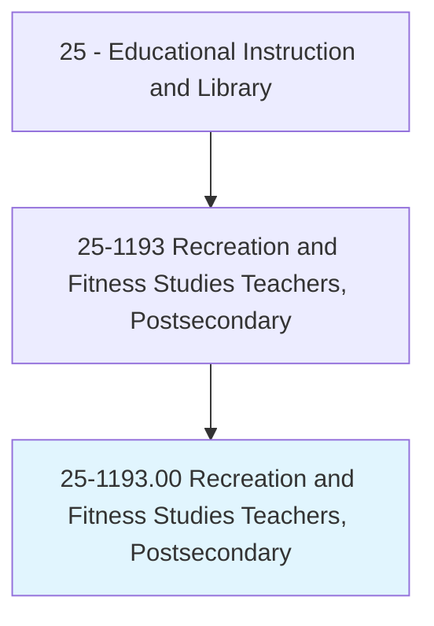
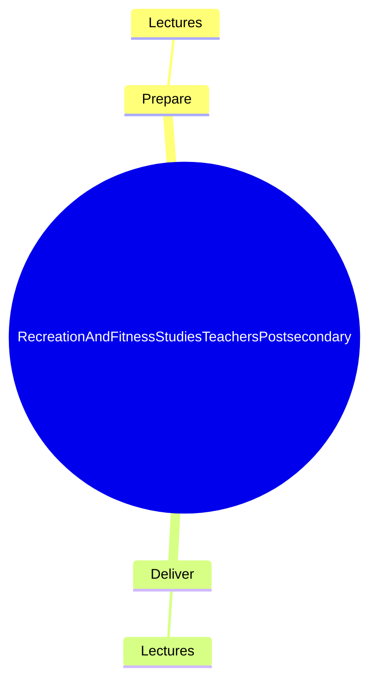
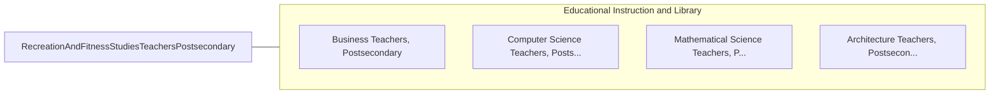

# Recreation and Fitness Studies Teachers, Postsecondary

> Teach courses pertaining to recreation, leisure, and fitness studies, including exercise physiology and facilities management. Includes both teachers primarily engaged in teaching and those who do a combination of teaching and research.

## Overview

Recreation and Fitness Studies Teachers, Postsecondary is an occupation within the Educational Instruction and Library category. Teach courses pertaining to recreation, leisure, and fitness studies, including exercise physiology and facilities management. 

## Classification Hierarchy

## Key Statistics

| Metric | Value |
|--------|-------|
| SOC Code | 25-1193.00 |
| Category | [Educational Instruction and Library](/occupations/Education) |
| Task Count | 8 |
| Source | O*NET |

## Core Tasks

### prepare.Lectures

Recreation and Fitness Studies Teachers, Postsecondary prepare lectures as part of their core responsibilities.

**Actions:**
- `prepare.Lectures.to.Anatomy`
- `prepare.Lectures.to.TherapeuticRecreation`
- `prepare.Lectures.to.ConditioningTheory`

### deliver.Lectures

Recreation and Fitness Studies Teachers, Postsecondary deliver lectures as part of their core responsibilities.

**Actions:**
- `deliver.Lectures.to.Anatomy`
- `deliver.Lectures.to.TherapeuticRecreation`
- `deliver.Lectures.to.ConditioningTheory`

## Skills & Competencies

### Technical Skills
- **Curriculum Development** - Advanced
- **Instructional Design** - Advanced
- **Assessment** - Advanced

### Soft Skills
- **Communication** - Essential
- **Problem Solving** - Essential
- **Critical Thinking** - Important
- **Teamwork** - Important
- **Adaptability** - Important

## Related Occupations

## Industries

This occupation is found across multiple industries. See [Industries](/industries) for sector-specific employment data.

## Career Progression

---

*Source: O*NET 25-1193.00 - ONETOccupation*
