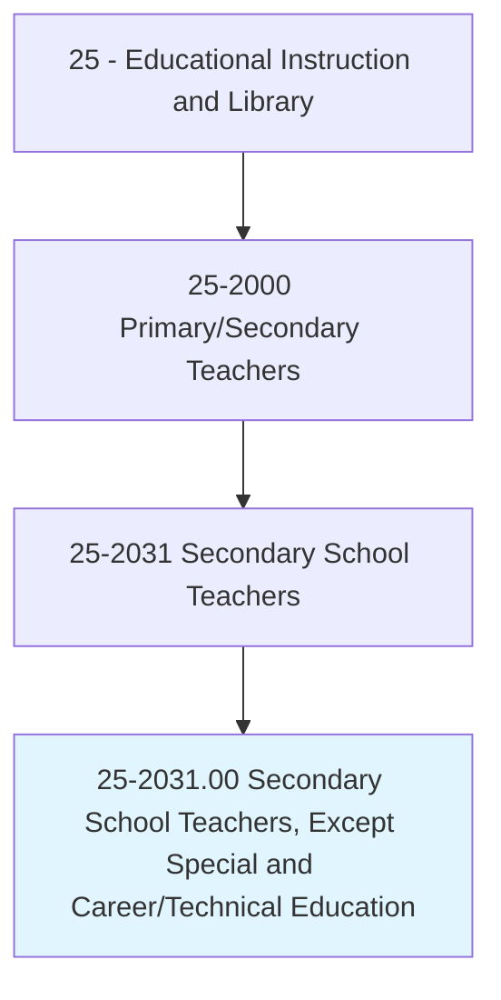
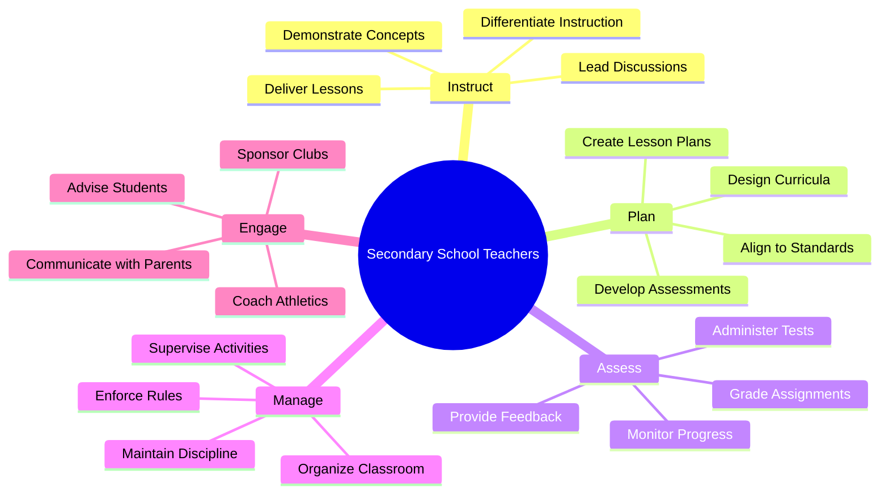
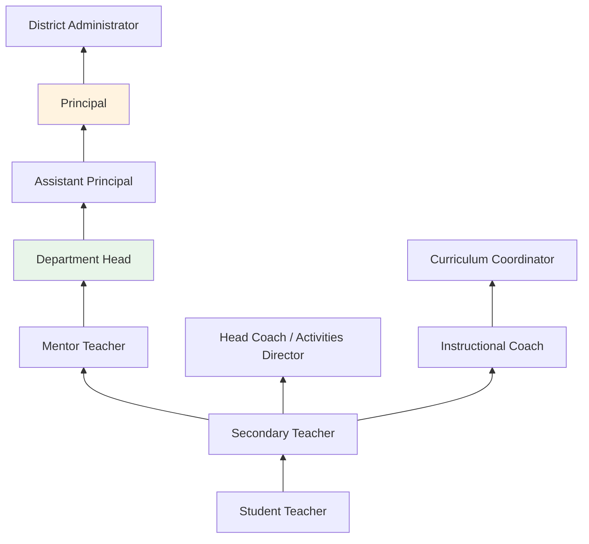
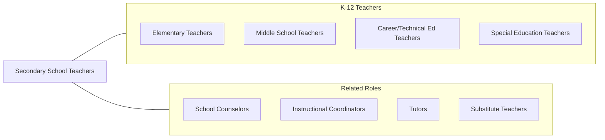

# Secondary School Teachers, Except Special and Career/Technical Education

> Teach one or more subjects to students at the secondary school level. May be designated according to subject matter specialty.

## Overview

Secondary School Teachers instruct students in grades 9-12 in specific subject areas such as English, mathematics, science, social studies, world languages, and the arts. They design and deliver curriculum aligned with state and national standards, prepare students for college and careers, and foster the intellectual and social development of adolescents. These educators typically specialize in one or two content areas, developing deep expertise that enables them to guide students through increasingly complex academic material.

Secondary teachers face the unique challenge of working with adolescents navigating significant physical, emotional, and social development. They must balance rigorous academic instruction with attention to students' well-being, motivation, and diverse learning needs. Effective secondary teachers create engaging classroom environments that challenge students intellectually while providing the support structures needed for academic success. They prepare students for standardized tests, Advanced Placement examinations, and the transition to postsecondary education or the workforce.

Beyond classroom instruction, secondary teachers serve as advisors, mentors, club sponsors, and coaches. They collaborate with colleagues in professional learning communities, participate in school improvement initiatives, and communicate regularly with families about student progress. The role requires continuous professional development to stay current with content knowledge, pedagogical research, and educational technology.

## Classification Hierarchy

## Key Statistics

| Metric | Value |
|--------|-------|
| SOC Code | 25-2031.00 |
| Job Zone | 4 (Considerable Preparation) |
| Category | [Educational Instruction and Library](/occupations/Education/index) |
| Median Salary | $62,000 - $72,000 |
| Employment | ~1,100,000 |
| Projected Growth | 3-5% (Average) |
| Source | O*NET |

## Core Tasks

### instruct.SecondaryStudents

Secondary Teachers deliver subject-specific instruction to adolescents.

**Actions:**
- `instruct.Students.in.SubjectMatter` - Teach specialized content (English, math, science, social studies, etc.)
- `differentiate.Instruction.for.DiverseLearners` - Adapt teaching methods for varied ability levels and learning styles
- `prepare.Students.for.CollegeAndCareer` - Provide rigorous academic preparation and guidance

### assess.StudentLearning

Secondary Teachers evaluate student understanding through multiple assessment methods.

**Actions:**
- `grade.Assignments.for.ContentMastery` - Evaluate student work against learning standards
- `administer.Examinations.for.Assessment` - Conduct formative and summative assessments
- `provide.Feedback.to.ImprovePerformance` - Offer constructive guidance on academic progress

### manage.Classroom

Secondary Teachers create and maintain productive learning environments.

**Actions:**
- `establish.ClassroomRules.for.Behavior` - Set expectations and procedures for student conduct
- `enforce.SchoolPolicies.for.OrderlyEnvironment` - Maintain discipline consistent with school guidelines
- `communicate.WithParents.about.StudentProgress` - Keep families informed through conferences, reports, and digital platforms

## Skills & Competencies

### Technical Skills
- **Content Knowledge** - Expert (specialized subject area mastery)
- **Pedagogy** - Advanced (instructional strategies, differentiation, formative assessment)
- **Curriculum Design** - Advanced (standards alignment, backward design, unit planning)
- **Assessment** - Advanced (rubrics, test design, data analysis)
- **Educational Technology** - Advanced (LMS, interactive tools, digital resources)
- **Classroom Management** - Advanced (PBIS, restorative practices, adolescent development)

### Soft Skills
- **Communication** - Critical (explaining complex concepts, parent engagement)
- **Patience** - Critical (adolescent development challenges)
- **Adaptability** - Essential (diverse learner needs, changing standards)
- **Organization** - Essential (multiple class sections, grading, duties)
- **Empathy** - Essential (understanding adolescent experiences)
- **Leadership** - Important (mentoring, club sponsorship, school improvement)

## Education & Certifications

| Requirement | Details |
|-------------|---------|
| Typical Education | Bachelor's degree with content-area major or minor |
| State Licensure | Required in all states; subject-specific endorsement required |
| Student Teaching | Supervised clinical experience in secondary classrooms required |
| Continuing Education | Professional development hours required for license renewal |
| Common Certifications | State teaching license with secondary endorsement; NBPTS certification; AP certification; Praxis Subject Assessment |

## Career Progression

## Setting Variations

### Public High Schools
Standards-aligned instruction serving diverse student populations. State testing and accountability requirements.

### Private and Independent Schools
May have more curricular flexibility. Smaller class sizes. Often selective enrollment.

### Magnet and Charter Schools
Specialized themes (STEM, arts, IB). Innovative pedagogical approaches.

### Online/Virtual Schools
Asynchronous and synchronous instruction through digital platforms. Growing enrollment.

### International Schools
American or IB curriculum abroad. Multicultural student bodies. Expatriate and local students.

## Technology & Tools

| Category | Tools |
|----------|-------|
| Learning Management Systems | Google Classroom, Canvas, Schoology |
| Assessment | Edulastic, Kahoot, Quizizz, Delta Math |
| Communication | Remind, ParentSquare, ClassDojo, email |
| Productivity | Microsoft Office, Google Workspace |
| Subject-Specific | Desmos, PhET, Newsela, CommonLit, Labster |
| Student Information | PowerSchool, Infinite Campus, Skyward |

## Related Occupations

## Industries

- [Educational Services - Secondary Schools](/industries/Education/index) - Primary Employment
- [Government](/industries/Government) - Public School Districts
- [Religious Organizations](/industries/ReligiousOrganizations) - Private Schools
- [Other Services](/industries/OtherServices) - Charter Schools, Online Academies

## Departments

This occupation typically works in:
- [Academic Subject Departments](/departments/Academic) (English, Math, Science, Social Studies, etc.)
- [Student Activities](/departments/StudentActivities)
- [Athletics](/departments/Athletics)
- [Guidance and Counseling](/departments/Guidance)

---

*Source: O*NET 25-2031.00 - ONETOccupation*
