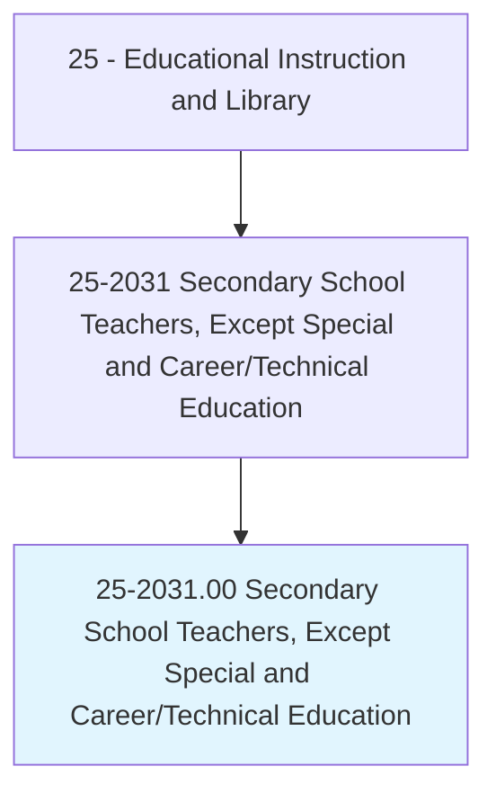
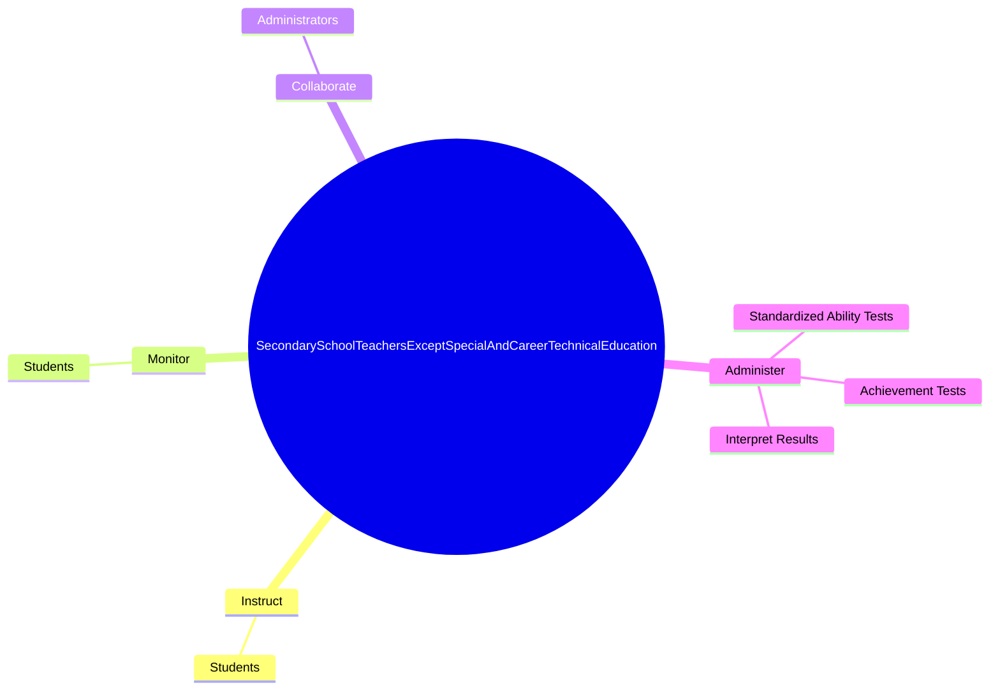
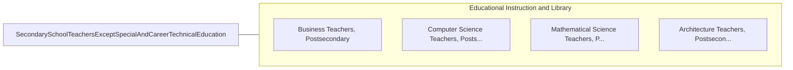

# Secondary School Teachers, Except Special and Career/Technical Education

> Teach one or more subjects to students at the secondary school level.

## Overview

Secondary School Teachers, Except Special and Career/Technical Education is classified under Educational Instruction and Library (SOC 25). Teach one or more subjects to students at the secondary school level.

## Classification Hierarchy

## Key Statistics

| Metric | Value |
|--------|-------|
| SOC Code | 25-2031.00 |
| Category | [Educational Instruction and Library](/occupations/Education) |
| Task Count | 6 |
| Source | O*NET |

## Core Tasks

### instruct.Students

Secondary School Teachers, Except Special and Career/Technical Education instruct students as part of their core responsibilities.

**Actions:**
- `instruct.Students.in.UseOfEquipment.to.prevent.InjuriesDamage`

### monitor.Students

Secondary School Teachers, Except Special and Career/Technical Education monitor students as part of their core responsibilities.

**Actions:**
- `monitor.Students.in.UseOfEquipment.to.prevent.InjuriesDamage`

### collaborate.Administrators

Secondary School Teachers, Except Special and Career/Technical Education collaborate administrators as part of their core responsibilities.

**Actions:**
- `collaborate.Administrators.in.Revision.of.SecondarySchoolPrograms`

## Skills & Competencies

### Technical Skills
- **Curriculum Development** - Advanced
- **Instructional Design** - Advanced
- **Assessment** - Advanced

### Soft Skills
- **Communication** - Essential
- **Problem Solving** - Essential
- **Critical Thinking** - Important
- **Teamwork** - Important
- **Adaptability** - Important

## Related Occupations

## Industries

This occupation is found across multiple industries. See [Industries](/industries) for sector-specific employment data.

## Career Progression

---

*Source: O*NET 25-2031.00 - ONETOccupation*
