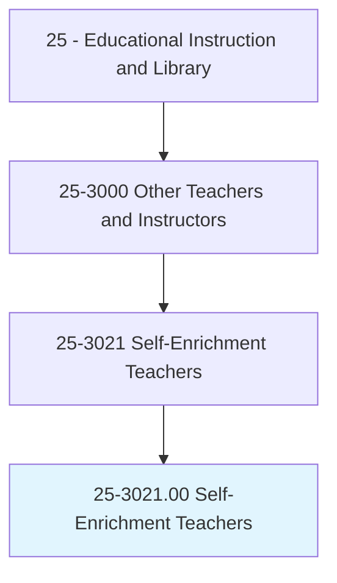
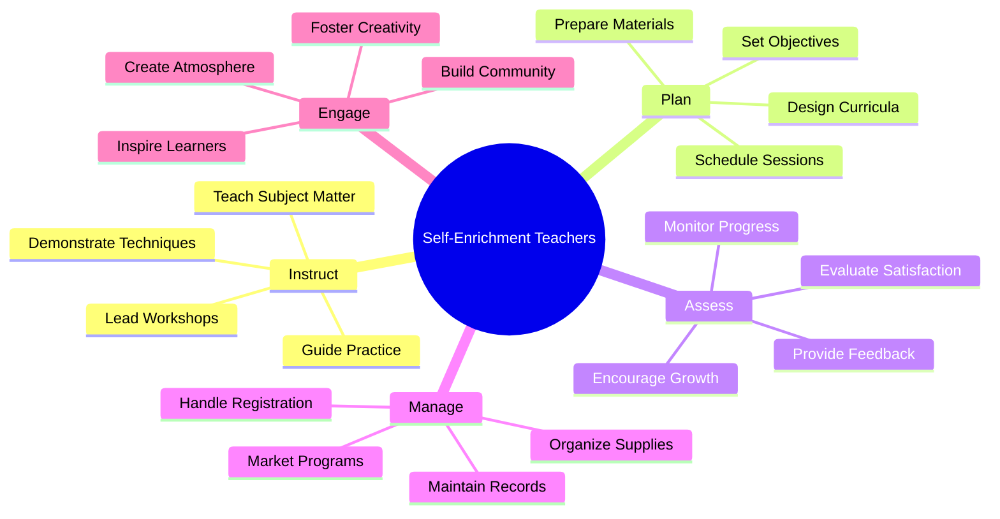
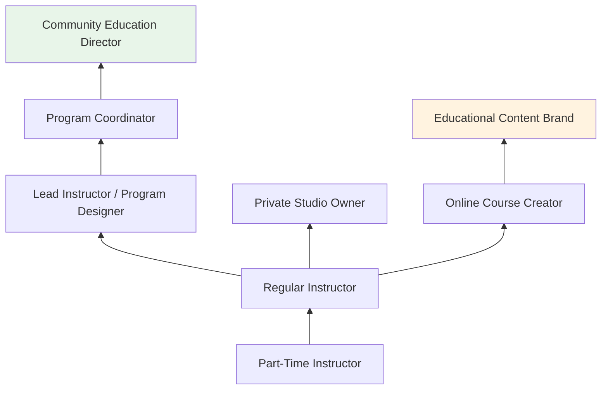
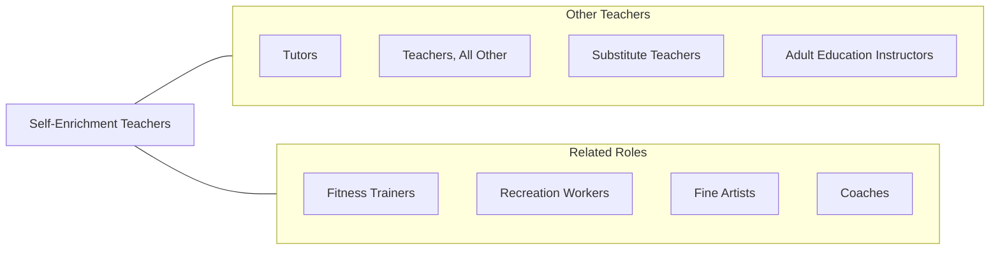

# Self-Enrichment Teachers

> Teach or instruct individuals or groups for the primary purpose of self-enrichment or recreation, rather than for an occupational objective, educational attainment, competition, or fitness.

## Overview

Self-Enrichment Teachers instruct individuals and groups in subjects pursued for personal development, creative expression, and recreational enjoyment rather than academic credit or professional certification. They teach courses in areas such as art, cooking, music, photography, creative writing, yoga, meditation, personal finance, gardening, woodworking, languages, dance, crafts, and countless other pursuits. These educators work in community centers, museums, art studios, recreation departments, continuing education programs, and private studios.

The self-enrichment education market has expanded significantly with growing consumer interest in lifelong learning, wellness, creative pursuits, and personal development. These teachers design engaging, accessible curricula for adult learners and hobbyists who are intrinsically motivated by curiosity and enjoyment. They must balance instructional structure with the relaxed, supportive atmosphere that characterizes recreational learning environments.

Self-enrichment teaching offers flexibility and creative freedom, as instructors are typically subject matter enthusiasts or practicing artists and artisans who share their passion with others. The rise of online platforms has further expanded opportunities, allowing instructors to reach global audiences through video courses, live workshops, and subscription-based content.

## Classification Hierarchy

## Key Statistics

| Metric | Value |
|--------|-------|
| SOC Code | 25-3021.00 |
| Job Zone | 3 (Medium Preparation) |
| Category | [Educational Instruction and Library](/occupations/Education/index) |
| Median Salary | $42,000 - $55,000 (varies widely; many part-time) |
| Employment | ~290,000 |
| Projected Growth | 8-12% (Faster than average) |
| Source | O*NET |

## Core Tasks

### prepare.InstructionalContent

Self-Enrichment Teachers design engaging learning experiences.

**Actions:**
- `prepare.Students.for.FurtherDevelopmentByEncouragingThem.to.explore.LearningOpportunitiesPersevereWithChallengingTasks`
- `prepare.InstructionalProgramObjectives` - Define learning goals for recreational courses
- `prepare.LessonPlans` - Create structured but flexible session plans

### monitor.StudentProgress

Self-Enrichment Teachers track participant engagement and development.

**Actions:**
- `monitor.StudentsPerformance.to.make.SuggestionsForImprovementEnsureTheySatisfyCourseStandards`
- `monitor.StudentsPerformance.to.TrainingRequirements` - Track skill development and participant satisfaction
- `provide.Feedback.for.ContinuedGrowth` - Offer encouragement and constructive guidance

## Skills & Competencies

### Technical Skills
- **Subject Matter Expertise** - Advanced (deep knowledge and skill in teaching area)
- **Instructional Design** - Intermediate (creating engaging recreational curricula)
- **Demonstration** - Advanced (modeling techniques clearly)
- **Materials Management** - Intermediate (supplies, equipment, space setup)
- **Marketing** - Basic to Intermediate (program promotion, social media)
- **Technology** - Basic to Intermediate (online platforms, video production)

### Soft Skills
- **Enthusiasm** - Critical (inspiring passion and engagement)
- **Communication** - Essential (clear, encouraging instruction)
- **Patience** - Essential (working with adult beginners)
- **Creativity** - Essential (designing engaging activities)
- **Adaptability** - Essential (varied skill levels within groups)
- **Interpersonal Skills** - Important (building welcoming community)

## Education & Certifications

| Requirement | Details |
|-------------|---------|
| Typical Education | Varies widely; demonstrated expertise in subject area |
| Formal Education | No degree required for most positions; specialized certifications in some areas |
| Work Experience | Professional practice or demonstrated mastery in subject |
| On-the-Job Training | Short-term; program-specific orientation |
| Common Certifications | Yoga Alliance (RYT); culinary certifications; art education credentials; CPR for physical activities |

## Career Progression

## Setting Variations

### Community Centers and Recreation Departments
Drop-in and session-based classes in arts, crafts, cooking, and wellness. Affordable, accessible programming.

### Museums and Cultural Institutions
Educational workshops connected to exhibitions. Art-making, history, and science programs.

### Private Studios and Workshops
Specialized instruction in art, music, cooking, or movement. Premium pricing for small-group experiences.

### Online Platforms
Video courses on Skillshare, Udemy, MasterClass, and personal websites. Global reach with asynchronous content.

### Corporate Settings
Team-building workshops, creative retreats, and wellness programs for employee development.

## Technology & Tools

| Category | Tools |
|----------|-------|
| Online Platforms | Skillshare, Udemy, Teachable, Patreon, YouTube |
| Video Production | iPhone/camera, ring lights, editing software |
| Communication | Email, social media, Eventbrite, SignUpGenius |
| Subject-Specific | Art supplies, musical instruments, cooking equipment, yoga props |
| Payment Processing | Square, PayPal, Stripe, Venmo |
| Scheduling | Calendly, Acuity, MindBody (wellness) |

## Related Occupations

## Industries

- [Arts, Entertainment, and Recreation](/industries/ArtsEntertainment) - Primary Employment
- [Educational Services](/industries/Education/index) - Community Education
- [Other Services](/industries/OtherServices) - Community Organizations
- [Information](/industries/Information) - Online Education Platforms

## Departments

This occupation typically works in:
- [Community Education](/departments/CommunityEducation)
- [Parks and Recreation](/departments/ParksRecreation)
- [Museum Education](/departments/MuseumEducation)
- [Continuing Education](/departments/ContinuingEducation)

---

*Source: O*NET 25-3021.00 - ONETOccupation*
