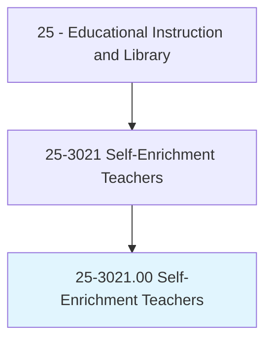
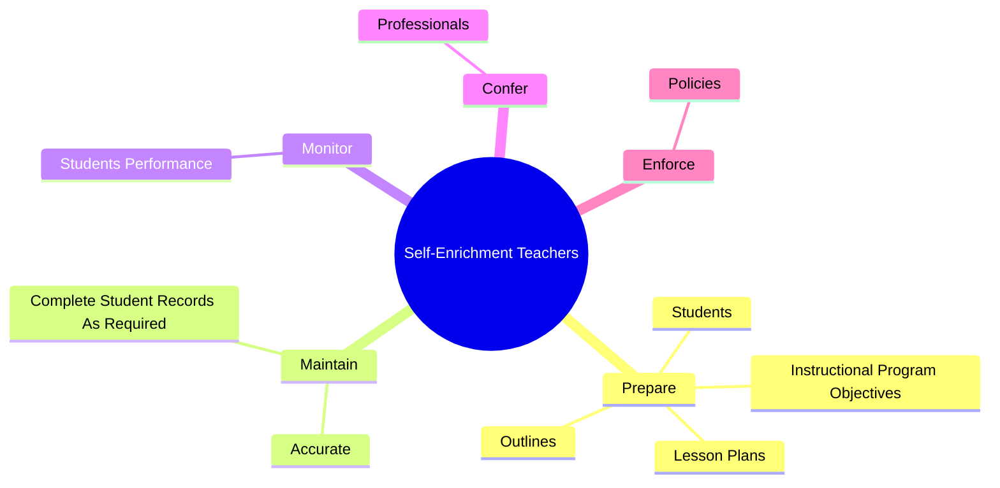
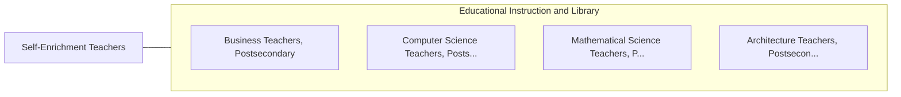

# Self-Enrichment Teachers

> Teach or instruct individuals or groups for the primary purpose of self-enrichment or recreation, rather than for an occupational objective, educational attainment, competition, or fitness.

## Overview

Self-Enrichment Teachers is classified under Educational Instruction and Library (SOC 25). Teach or instruct individuals or groups for the primary purpose of self-enrichment or recreation, rather than for an occupational objective, educational attainment, competition, or fitness.

## Classification Hierarchy

## Key Statistics

| Metric | Value |
|--------|-------|
| SOC Code | 25-3021.00 |
| Category | [Educational Instruction and Library](/occupations/Education/index) |
| Task Count | 52 |
| Source | O*NET |

## Core Tasks

### prepare.Students

Self-Enrichment Teachers prepare students as part of their core responsibilities.

**Actions:**
- `prepare.Students.for.FurtherDevelopmentByEncouragingThem.to.explore.LearningOpportunitiesPersevereWithChallengingTasks`
- `prepare.InstructionalProgramObjectives`
- `prepare.Outlines`
- `prepare.LessonPlans`

### maintain.Accurate

Self-Enrichment Teachers maintain accurate as part of their core responsibilities.

**Actions:**
- `maintain.Accurate.by.AdministrativePolicy`
- `maintain.CompleteStudentRecordsAsRequired.by.AdministrativePolicy`

### monitor.StudentsPerformance

Self-Enrichment Teachers monitor students performance as part of their core responsibilities.

**Actions:**
- `monitor.StudentsPerformance.to.make.SuggestionsForImprovementEnsureTheySatisfyCourseStandards`
- `monitor.StudentsPerformance.to.ToEnsureTheySatisfyCourseStandards`
- `monitor.StudentsPerformance.to.TrainingRequirements`
- `monitor.StudentsPerformance.to.Objectives`

## Skills & Competencies

### Technical Skills
- **Curriculum Development** - Advanced
- **Instructional Design** - Advanced
- **Assessment** - Advanced

### Soft Skills
- **Communication** - Essential
- **Problem Solving** - Essential
- **Critical Thinking** - Important
- **Teamwork** - Important
- **Adaptability** - Important

## Related Occupations

## Industries

This occupation is found across multiple industries. See [Industries](/industries) for sector-specific employment data.

## Career Progression

---

*Source: O*NET 25-3021.00 - ONETOccupation*
