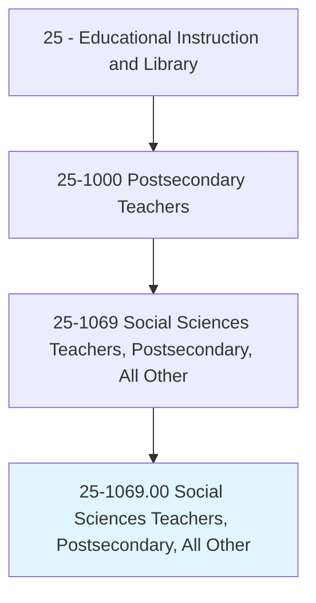
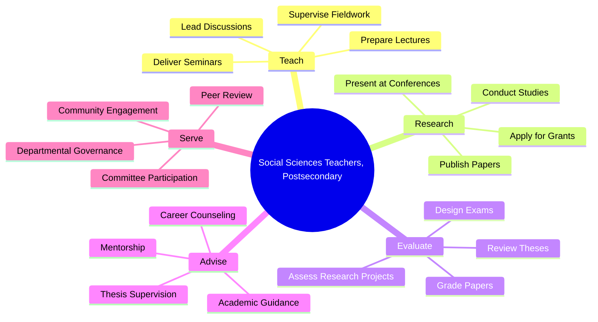
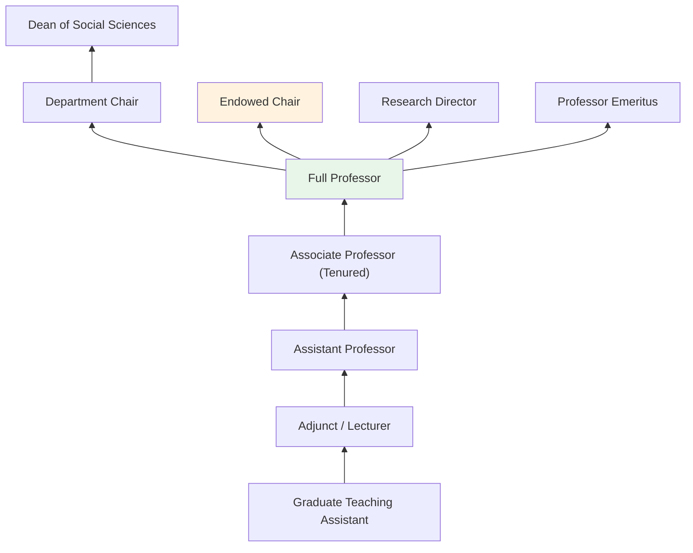
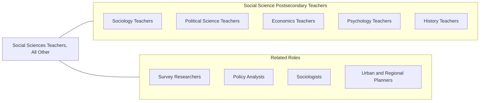

# Social Sciences Teachers, Postsecondary, All Other

> All postsecondary social sciences teachers not listed separately.

## Overview

Social Sciences Teachers, Postsecondary, All Other encompasses college and university faculty who teach social science disciplines not captured by more specific classifications such as economics, political science, sociology, psychology, or history. This includes instructors in fields like demography, urban studies, international relations, gender studies, criminology (where not specifically classified), social research methods, and interdisciplinary social science programs.

These educators play a vital role in helping students understand human behavior, social structures, and institutional dynamics through analytical frameworks drawn from multiple social science traditions. They develop courses that often bridge disciplinary boundaries, incorporating quantitative and qualitative research methods, theoretical perspectives, and applied social analysis. Many maintain active research programs, publishing scholarship that addresses pressing social issues such as inequality, migration, public policy, and cultural change.

Working primarily at four-year universities and community colleges, these professors contribute to both undergraduate general education and specialized graduate programs. They serve on academic committees, advise students, mentor junior scholars, and engage in community outreach that applies social science knowledge to real-world problems.

## Classification Hierarchy

## Key Statistics

| Metric | Value |
|--------|-------|
| SOC Code | 25-1069.00 |
| Job Zone | 5 (Extensive Preparation) |
| Category | [Educational Instruction and Library](/occupations/Education/index) |
| Median Salary | $72,000 - $95,000 |
| Employment | ~18,000 |
| Projected Growth | 5-8% (Average) |
| Source | O*NET |

## Core Tasks

### prepare.Lectures

Social Sciences Teachers prepare instructional content across interdisciplinary social science topics.

**Actions:**
- `prepare.Lectures.on.SocialResearchMethods` - Develop content on quantitative and qualitative research approaches
- `prepare.Lectures.on.InterdisciplinarySocialScience` - Create materials bridging multiple social science fields
- `prepare.Seminars.on.ContemporarySocialIssues` - Design discussions on current social challenges

### deliver.Instruction

Social Sciences Teachers present course material through varied pedagogical approaches.

**Actions:**
- `deliver.Lectures.to.UndergraduateStudents` - Teach introductory and advanced social science courses
- `deliver.Seminars.to.GraduateStudents` - Facilitate advanced scholarly discussions
- `supervise.Fieldwork.for.ResearchProjects` - Guide students in applied social research

### evaluate.StudentWork

Social Sciences Teachers assess learning through research papers, exams, and projects.

**Actions:**
- `evaluate.ResearchPapers.using.AcademicStandards` - Assess scholarly writing and analytical rigor
- `grade.Examinations.for.CourseCompletion` - Score assessments measuring conceptual understanding
- `review.Theses.for.GraduateStudents` - Evaluate and provide feedback on graduate research

## Skills & Competencies

### Technical Skills
- **Research Methods** - Expert (quantitative, qualitative, mixed methods)
- **Statistical Analysis** - Advanced (SPSS, Stata, R, NVivo)
- **Curriculum Design** - Advanced (interdisciplinary course development)
- **Academic Writing** - Expert (peer-reviewed publication)
- **Data Collection** - Advanced (surveys, interviews, ethnography)
- **Educational Technology** - Intermediate (LMS, digital humanities tools)

### Soft Skills
- **Critical Thinking** - Critical (social analysis and theory application)
- **Communication** - Critical (conveying complex social phenomena)
- **Cultural Competency** - Essential (diverse perspectives and populations)
- **Mentorship** - Essential (guiding student researchers)
- **Collaboration** - Essential (interdisciplinary research teams)
- **Public Speaking** - Important (lectures, conferences, public engagement)

## Education & Certifications

| Requirement | Details |
|-------------|---------|
| Typical Education | Ph.D. in a social science discipline or interdisciplinary social science |
| Alternative Entry | Master's degree for community college or adjunct positions |
| Work Experience | Research and teaching experience required |
| On-the-Job Training | Faculty development; research mentorship |
| Common Certifications | IRB certification for human subjects research; disciplinary association memberships |

## Career Progression

## Setting Variations

### Research Universities
Heavy emphasis on original research, grant acquisition, and graduate student supervision. Lower teaching loads with expectation of significant scholarly output.

### Liberal Arts Colleges
Focus on undergraduate teaching excellence and close faculty-student mentorship. Broader course coverage with emphasis on interdisciplinary thinking.

### Community Colleges
Introductory social science courses for transfer students and general education. Higher teaching loads with diverse student populations.

### Online Universities
Asynchronous course delivery with emphasis on discussion forums and digital assessment. Scalable instruction for large enrollments.

### Policy Institutes and Think Tanks
Applied social science research and teaching at affiliated academic programs. Focus on policy-relevant scholarship.

## Technology & Tools

| Category | Tools |
|----------|-------|
| Statistical Software | SPSS, Stata, R, SAS, NVivo, Atlas.ti |
| Learning Management Systems | Canvas, Blackboard, Moodle |
| Research Databases | JSTOR, EBSCO, ProQuest, Google Scholar |
| Survey Tools | Qualtrics, SurveyMonkey, REDCap |
| Reference Management | Zotero, Mendeley, EndNote |
| Presentation | PowerPoint, Prezi, Google Slides |

## Related Occupations

## Industries

- [Educational Services - Colleges and Universities](/industries/Education/index) - Primary Employment
- [Government](/industries/PublicAdministration) - Public Universities and Policy Research
- [Professional, Scientific, and Technical Services](/industries/Scientific) - Research and Consulting
- [Other Services](/industries/OtherServices) - Non-Profit Research Organizations

## Departments

This occupation typically works in:
- Department of Social Sciences
- Interdisciplinary Studies
- School of Public Affairs
- Research Centers

---

*Source: O*NET 25-1069.00 - ONETOccupation*
