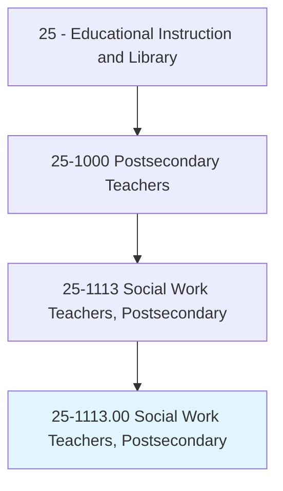
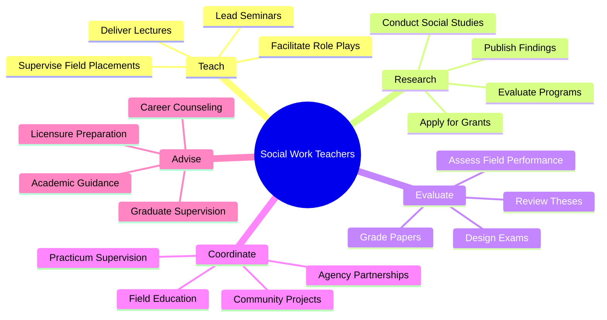
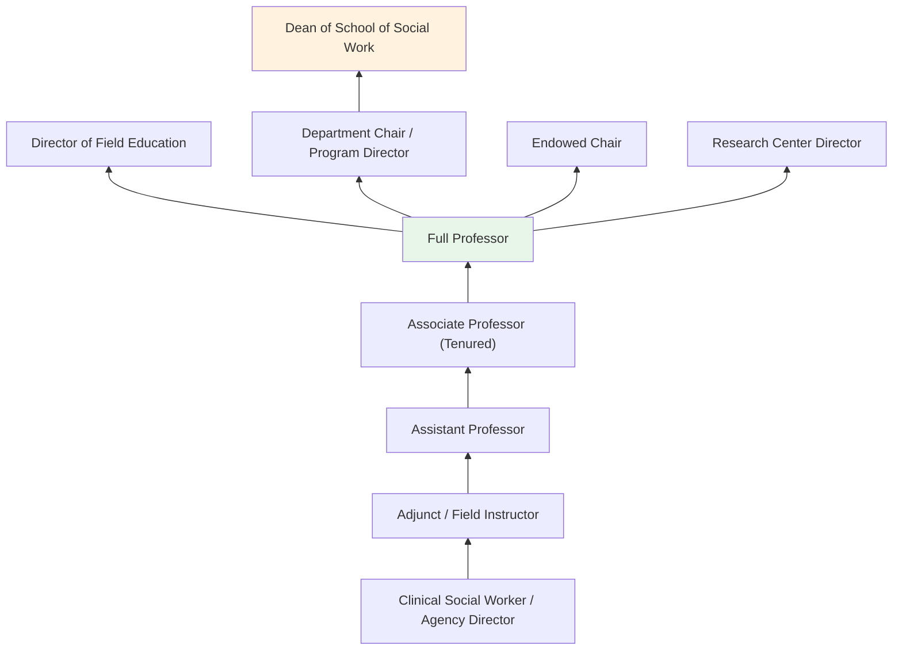
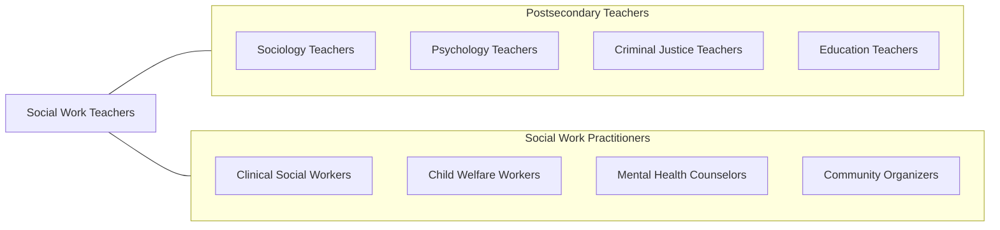

# Social Work Teachers, Postsecondary

> Teach courses in social work. Includes both teachers primarily engaged in teaching and those who do a combination of teaching and research.

## Overview

Social Work Teachers in postsecondary education instruct students in the theory, methods, and practice of professional social work. They teach courses covering social welfare policy, human behavior and the social environment, clinical practice methods, community organizing, research methods, child welfare, substance abuse, gerontology, and social justice. These educators prepare students for licensure and professional practice in direct service, community development, administration, and policy advocacy.

Many social work professors maintain active research programs addressing issues such as poverty, mental health, child abuse, healthcare access, homelessness, racial disparities, and evidence-based interventions. Their scholarship bridges academic research with applied practice, contributing to the knowledge base that informs social service delivery and social policy. Faculty often maintain clinical licenses and engage in practice to stay current with field realities.

Social work education is highly practice-oriented, with field placement (practicum) being a central component. Faculty coordinate field education experiences, supervise student learning in agency settings, and evaluate clinical competencies. They serve a critical role in training social workers who will address society's most pressing human needs.

## Classification Hierarchy

## Key Statistics

| Metric | Value |
|--------|-------|
| SOC Code | 25-1113.00 |
| Job Zone | 5 (Extensive Preparation) |
| Category | [Educational Instruction and Library](/occupations/Education/index) |
| Median Salary | $72,000 - $90,000 |
| Employment | ~11,000 |
| Projected Growth | 8-12% (Faster than average) |
| Source | O*NET |

## Core Tasks

### teach.SocialWorkPractice

Social Work Teachers instruct students in social work theory and methods.

**Actions:**
- `deliver.Lectures.on.ClinicalPractice` - Teach interviewing, assessment, and intervention techniques
- `deliver.Lectures.on.SocialWelfarePolicy` - Instruct on policy analysis, advocacy, and systems change
- `facilitate.RolePlays.for.PracticeSkills` - Guide experiential learning of clinical and community skills

### coordinate.FieldEducation

Social Work Teachers manage the practicum component of social work education.

**Actions:**
- `coordinate.FieldPlacements.with.SocialServiceAgencies` - Arrange student learning experiences in practice settings
- `supervise.StudentPractice.in.AgencySettings` - Provide clinical supervision and evaluate competencies
- `evaluate.FieldPerformance.for.ProgramCompletion` - Assess student readiness for professional practice

## Skills & Competencies

### Technical Skills
- **Social Work Practice** - Expert (clinical, community, policy, administrative)
- **Research Methods** - Advanced (program evaluation, mixed methods, community-based participatory research)
- **Curriculum Design** - Advanced (CSWE competency-based education)
- **Clinical Supervision** - Advanced (field education, licensed clinical practice)
- **Policy Analysis** - Advanced (social welfare systems, legislative advocacy)
- **Assessment** - Advanced (competency-based evaluation)

### Soft Skills
- **Empathy** - Critical (modeling professional empathy for students)
- **Communication** - Critical (classroom, supervision, community engagement)
- **Advocacy** - Essential (social justice orientation)
- **Cultural Competency** - Essential (diverse populations and perspectives)
- **Mentorship** - Essential (clinical development of emerging practitioners)
- **Ethical Judgment** - Essential (professional ethics, boundary management)

## Education & Certifications

| Requirement | Details |
|-------------|---------|
| Typical Education | Ph.D. or DSW in Social Work or related field |
| Clinical License | LCSW, LICSW, or equivalent preferred or required |
| MSW Required | MSW from CSWE-accredited program typically required |
| Work Experience | Minimum 2 years of post-MSW practice experience |
| Common Certifications | LCSW/LICSW; CSWE membership; specialized certifications (ACSW, DCSW) |

## Career Progression

## Setting Variations

### Schools of Social Work
CSWE-accredited BSW and MSW programs with integrated field education. Both clinical and macro tracks.

### Community Colleges
Human services associate degree programs preparing students for entry-level social service positions.

### Online Programs
Distance MSW programs with in-person field placement components. Growing enrollment nationally.

### Continuing Education
Professional development for licensed social workers maintaining CEU requirements. Specialized workshops.

### Interdisciplinary Programs
Social work taught within schools of public health, public policy, or interdisciplinary human services programs.

## Technology & Tools

| Category | Tools |
|----------|-------|
| Learning Management Systems | Canvas, Blackboard, Moodle |
| Field Education | Tevera (Calliope), Sonia, IPT |
| Statistical Software | SPSS, NVivo, Atlas.ti |
| Clinical Tools | EHR training systems, telehealth platforms |
| Research Databases | Social Work Abstracts, PsycINFO, PubMed |
| Communication | Zoom, Microsoft Teams, Google Workspace |

## Related Occupations

## Industries

- [Educational Services - Schools of Social Work](/industries/Education/index) - Primary Employment
- [Healthcare and Social Assistance](/industries/Healthcare) - Clinical Faculty Positions
- [Government](/industries/PublicAdministration) - Public University and Agency Partnerships
- Social Assistance - Community-Based Research

## Departments

This occupation typically works in:
- School of Social Work
- Department of Social Work
- College of Health and Human Services
- School of Public Affairs

---

*Source: O*NET 25-1113.00 - ONETOccupation*
