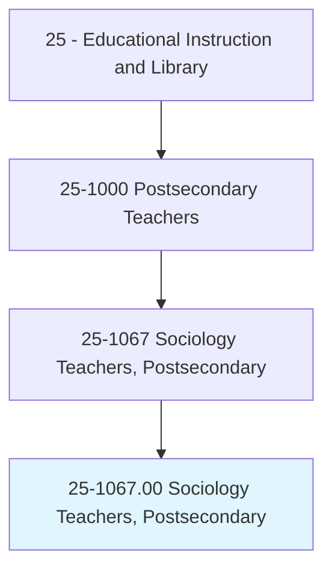
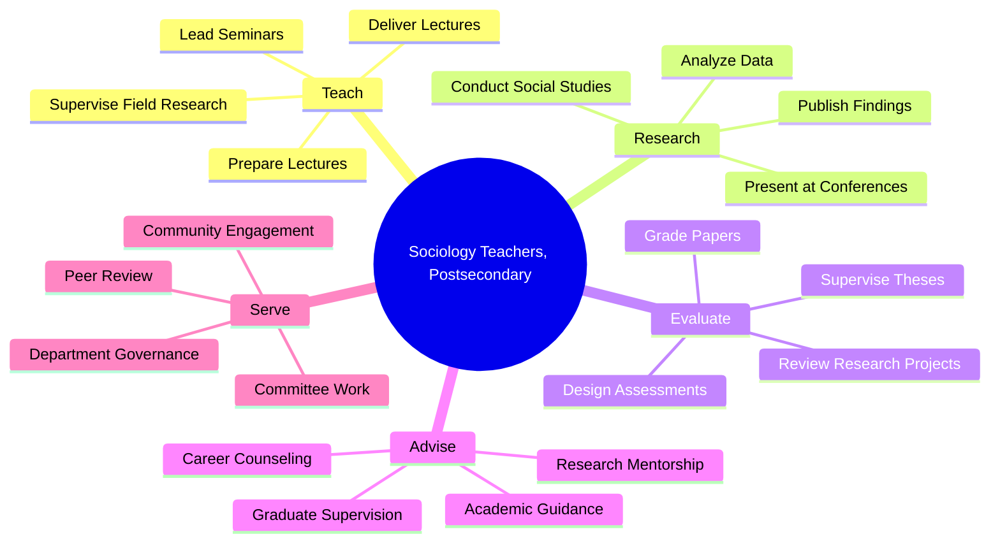
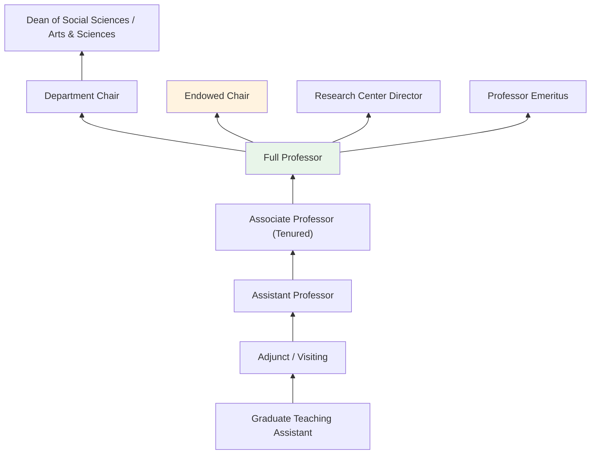
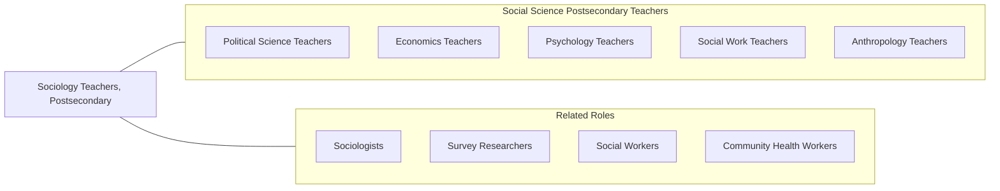

# Sociology Teachers, Postsecondary

> Teach courses in sociology. Includes both teachers primarily engaged in teaching and those who do a combination of teaching and research.

## Overview

Sociology Teachers in postsecondary education instruct students in the scientific study of human social behavior, relationships, institutions, and structures. They teach courses covering sociological theory, research methods, social stratification, race and ethnicity, gender studies, criminology, urban sociology, medical sociology, and the sociology of organizations. These educators train students to analyze social phenomena through empirical research and theoretical frameworks, developing critical perspectives on inequality, power, culture, and social change.

Many sociology professors maintain active research programs that investigate pressing social issues. Their scholarship spans topics from mass incarceration and healthcare disparities to immigration patterns, environmental justice, and digital culture. They employ diverse methodological approaches including survey research, ethnography, content analysis, and computational social science, publishing findings in journals such as the American Sociological Review and Social Forces.

Sociology faculty play a distinctive role in higher education by fostering students' abilities to understand and critically evaluate social structures and institutions. They prepare graduates for careers in social services, public policy, criminal justice, market research, human resources, and nonprofit management, while also training the next generation of sociological researchers and educators.

## Classification Hierarchy

## Key Statistics

| Metric | Value |
|--------|-------|
| SOC Code | 25-1067.00 |
| Job Zone | 5 (Extensive Preparation) |
| Category | [Educational Instruction and Library](/occupations/Education/index) |
| Median Salary | $75,000 - $95,000 |
| Employment | ~15,000 |
| Projected Growth | 4-6% (Average) |
| Source | O*NET |

## Core Tasks

### prepare.Lectures

Sociology Teachers develop instructional content covering sociological topics.

**Actions:**
- `prepare.Lectures.to.Measurement` - Create content on sociological research measurement techniques
- `prepare.Lectures.to.DataCollection` - Develop materials on survey, interview, and ethnographic methods
- `prepare.Lectures.to.WorkplaceSocialRelations` - Design content on organizational sociology and labor

### deliver.Lectures

Sociology Teachers present course material through lectures, discussions, and seminars.

**Actions:**
- `deliver.Lectures.to.Measurement` - Teach research design and measurement in sociology
- `deliver.Lectures.to.DataCollection` - Instruct on qualitative and quantitative data gathering
- `deliver.Lectures.to.WorkplaceSocialRelations` - Present sociological analysis of work and organizations

### conduct.Research

Sociology Teachers pursue scholarly research on social phenomena.

**Actions:**
- `conduct.Research.on.SocialInequality` - Study stratification, race, class, and gender dynamics
- `conduct.Research.using.EthnographicMethods` - Perform qualitative fieldwork in community settings
- `publish.Findings.in.SociologicalJournals` - Contribute to peer-reviewed sociological literature

## Skills & Competencies

### Technical Skills
- **Sociological Theory** - Expert (classical and contemporary perspectives)
- **Research Methods** - Expert (quantitative, qualitative, mixed methods)
- **Statistical Analysis** - Advanced (SPSS, Stata, R, HLM)
- **Qualitative Analysis** - Advanced (NVivo, Atlas.ti, coding techniques)
- **Curriculum Design** - Advanced (sociology pedagogy)
- **Academic Writing** - Expert (scholarly publication)

### Soft Skills
- **Critical Thinking** - Critical (structural analysis of social systems)
- **Communication** - Critical (engaging students with complex social topics)
- **Cultural Competency** - Essential (teaching about diversity and inequality)
- **Empathy** - Essential (understanding social experiences)
- **Mentorship** - Essential (guiding student researchers)
- **Public Engagement** - Important (public sociology, media commentary)

## Education & Certifications

| Requirement | Details |
|-------------|---------|
| Typical Education | Ph.D. in Sociology or related field (Criminology, Demography, Social Work) |
| Alternative Entry | Master's degree (M.A.) for community college or adjunct positions |
| Work Experience | Research and teaching experience required |
| On-the-Job Training | Faculty development; pedagogical training |
| Common Certifications | ASA membership; IRB certification for human subjects research |

## Career Progression

## Setting Variations

### Research Universities
Strong emphasis on original empirical research and graduate student training. Publication in top-tier sociological journals expected. Grant funding from NSF, NIH, and foundations.

### Liberal Arts Colleges
Focus on undergraduate teaching and mentorship. Broader course coverage with emphasis on sociological imagination and critical thinking.

### Community Colleges
Introduction to Sociology and Social Problems courses for diverse student populations. Higher teaching loads with emphasis on accessible instruction.

### Online Programs
Asynchronous delivery of sociology courses with emphasis on discussion forums and applied projects. Growing enrollment in criminal justice and social work tracks.

### Applied Settings
Sociology taught within schools of social work, public health, or criminal justice. Emphasis on applied research and professional preparation.

## Technology & Tools

| Category | Tools |
|----------|-------|
| Statistical Software | SPSS, Stata, R, SAS, HLM |
| Qualitative Software | NVivo, Atlas.ti, Dedoose, MAXQDA |
| Survey Tools | Qualtrics, SurveyMonkey, REDCap |
| Learning Management Systems | Canvas, Blackboard, Moodle |
| Data Sources | General Social Survey, Census, ICPSR, Add Health |
| Reference Management | Zotero, Mendeley, EndNote |

## Related Occupations

## Industries

- [Educational Services - Colleges and Universities](/industries/Education/index) - Primary Employment
- [Government](/industries/PublicAdministration) - Public Universities, Census Bureau
- [Professional, Scientific, and Technical Services](/industries/Scientific) - Social Research
- [Healthcare and Social Assistance](/industries/Healthcare) - Public Health Research

## Departments

This occupation typically works in:
- Department of Sociology
- Department of Criminal Justice
- School of Social Sciences
- Institute for Social Research

---

*Source: O*NET 25-1067.00 - ONETOccupation*
