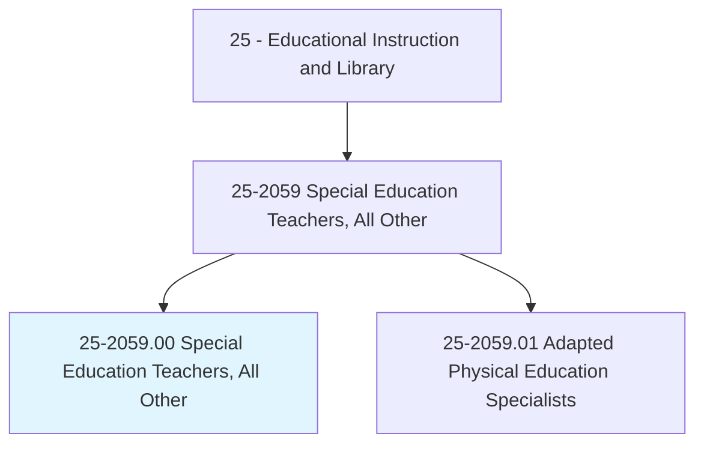
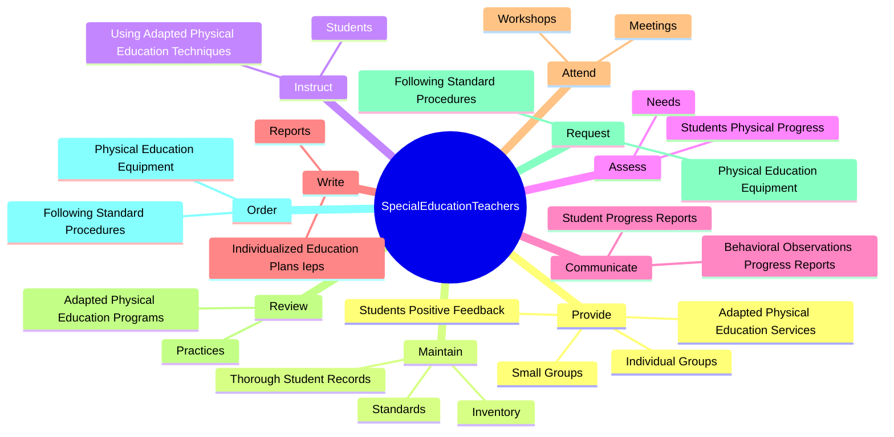
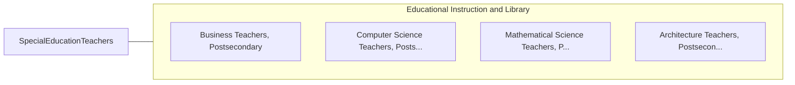

# Special Education Teachers, All Other

> All special education teachers not listed separately.

## Overview

Special Education Teachers, All Other is classified under Educational Instruction and Library (SOC 25). All special education teachers not listed separately.

## Classification Hierarchy

## Key Statistics

| Metric | Value |
|--------|-------|
| SOC Code | 25-2059.00 |
| Category | [Educational Instruction and Library](/occupations/Education/index) |
| Task Count | 72 |
| Source | O*NET |

## Core Tasks

### provide.IndividualGroups

Special Education Teachers, All Other provide individual groups as part of their core responsibilities.

**Actions:**
- `provide.IndividualGroups.of.Students`
- `provide.IndividualGroups.of.Goals`
- `provide.SmallGroups.of.Students`
- `provide.SmallGroups.of.Goals`

### maintain.Standards

Special Education Teachers, All Other maintain standards as part of their core responsibilities.

**Actions:**
- `maintain.Standards.of.Behavior`
- `maintain.Standards.of.Orderly`
- `maintain.Standards.of.EffectiveEnvironments`
- `maintain.ThoroughStudentRecords.to.DocumentAttendance`

### instruct.Students

Special Education Teachers, All Other instruct students as part of their core responsibilities.

**Actions:**
- `instruct.Students.to.PhysicalFitness`
- `instruct.Students.to.GrossMot`
- `instruct.Students.to.Skills`
- `instruct.Students.to.PerceptualMot`

## Skills & Competencies

### Technical Skills
- **Curriculum Development** - Advanced
- **Instructional Design** - Advanced
- **Assessment** - Advanced

### Soft Skills
- **Communication** - Essential
- **Problem Solving** - Essential
- **Critical Thinking** - Important
- **Teamwork** - Important
- **Adaptability** - Important

## Related Occupations

## Industries

This occupation is found across multiple industries. See [Industries](/industries) for sector-specific employment data.

## Career Progression

---

*Source: O*NET 25-2059.00 - ONETOccupation*
