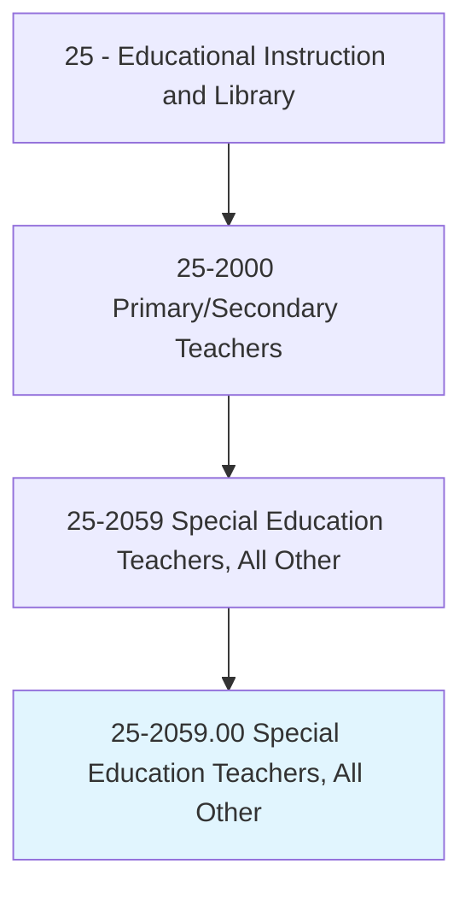
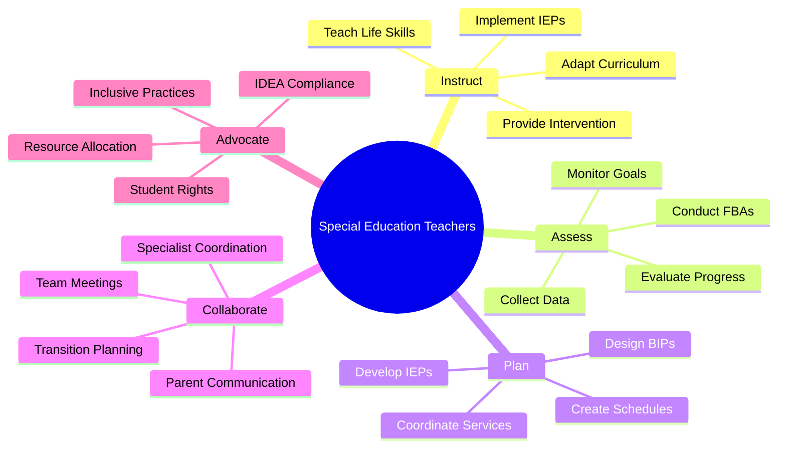
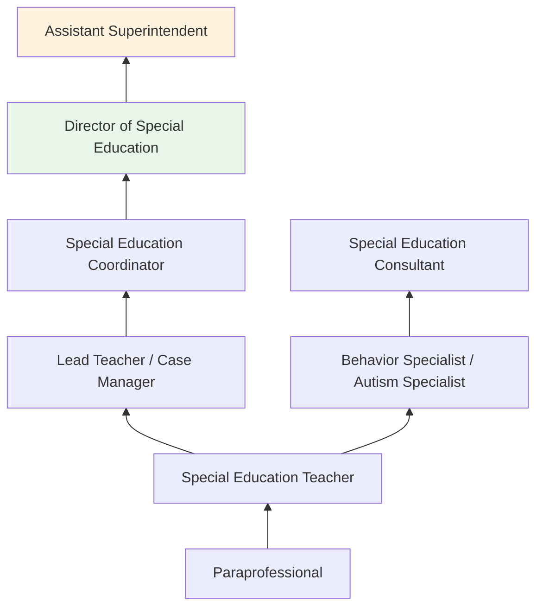
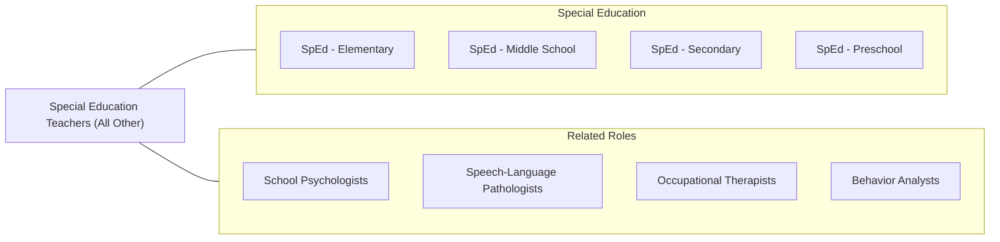

# Special Education Teachers, All Other

> All special education teachers not listed separately.

## Overview

Special Education Teachers in the "All Other" category include educators working in non-traditional settings or across multiple grade levels who do not fit neatly into the preschool, kindergarten, elementary, middle, or secondary classifications. They may work in residential treatment facilities, juvenile detention centers, hospital-based programs, transition programs for ages 18-21, homebound instruction, or multi-age special education classrooms. They serve students with a wide range of disabilities including intellectual disabilities, autism spectrum disorder, emotional and behavioral disorders, traumatic brain injuries, and multiple disabilities.

These teachers develop and implement Individualized Education Programs (IEPs), adapting curriculum and instruction to meet each student's unique learning needs, behavioral goals, and functional life skills objectives. They use evidence-based interventions, assistive technology, and specialized instructional strategies to help students access the general curriculum and make progress toward individualized goals. Many work with students whose needs require highly specialized programming beyond what typical school-based special education provides.

Collaboration is central to the role, as these teachers work with multidisciplinary teams including school psychologists, speech-language pathologists, occupational therapists, behavioral specialists, social workers, and families. They collect and analyze data on student progress, conduct functional behavioral assessments, and design behavioral intervention plans to support students with complex needs.

## Classification Hierarchy

## Key Statistics

| Metric | Value |
|--------|-------|
| SOC Code | 25-2059.00 |
| Job Zone | 4 (Considerable Preparation) |
| Category | [Educational Instruction and Library](/occupations/Education/index) |
| Median Salary | $55,000 - $68,000 |
| Employment | ~25,000 |
| Projected Growth | 4-6% (Average) |
| Source | O*NET |

## Core Tasks

### instruct.StudentsWithDisabilities

Special Education Teachers provide individualized instruction.

**Actions:**
- `implement.IEPs.for.StudentsWithDisabilities` - Deliver instruction aligned to individualized goals and objectives
- `adapt.Curriculum.using.SpecializedStrategies` - Modify materials and methods to meet diverse learning needs
- `teach.LifeSkills.for.IndependentLiving` - Develop functional, vocational, and self-care competencies

### assess.StudentProgressAndNeeds

Special Education Teachers evaluate and monitor student development.

**Actions:**
- `evaluate.StudentProgress.toward.IEPGoals` - Collect data and measure achievement of individualized objectives
- `conduct.FunctionalBehavioralAssessments.for.BehaviorSupport` - Analyze behavior patterns to design effective interventions
- `coordinate.TransitionPlanning.for.PostSchoolOutcomes` - Prepare students for employment, education, and independent living

## Skills & Competencies

### Technical Skills
- **Special Education Law** - Expert (IDEA, Section 504, ADA, FAPE, LRE)
- **IEP Development** - Expert (goal writing, progress monitoring, compliance)
- **Behavior Management** - Advanced (ABA, PBIS, FBA/BIP, crisis intervention)
- **Differentiated Instruction** - Advanced (multi-level, multi-modal, UDL)
- **Assistive Technology** - Advanced (AAC devices, adaptive software, switches)
- **Data Collection** - Advanced (progress monitoring, graphing, data-based decisions)

### Soft Skills
- **Patience** - Critical (working with complex needs and slow progress)
- **Empathy** - Critical (understanding student and family perspectives)
- **Flexibility** - Essential (adapting to unpredictable situations)
- **Advocacy** - Essential (championing student rights and services)
- **Collaboration** - Essential (multidisciplinary teamwork)
- **Resilience** - Important (managing emotional demands of the work)

## Education & Certifications

| Requirement | Details |
|-------------|---------|
| Typical Education | Bachelor's or master's degree in Special Education |
| State Licensure | Required; special education endorsement with disability category certification |
| Clinical Experience | Student teaching in special education settings required |
| Continuing Education | Professional development for license renewal |
| Common Certifications | State special education license; BCBA for behavior specialists; CPI/Crisis Prevention certification; Assistive Technology certification |

## Career Progression

## Setting Variations

### Residential Treatment Facilities
24-hour programs for students with severe emotional/behavioral needs. Therapeutic and educational integration.

### Transition Programs (18-21)
Post-secondary transition services focusing on employment, independent living, and community participation.

### Homebound/Hospital Programs
Instruction for students unable to attend school due to medical conditions or severe disabilities.

### Self-Contained Classrooms
Separate classrooms for students requiring intensive support. Low student-teacher ratios.

### Juvenile Justice Facilities
Educational programming for incarcerated youth, many with disabilities and IEPs.

## Technology & Tools

| Category | Tools |
|----------|-------|
| IEP Management | Frontline (IEP Direct), GoalBook, SEIS, Enrich |
| Assistive Technology | AAC devices, Proloquo2Go, switches, eye-gaze systems |
| Behavior Tracking | Catalyst, ABC data sheets, behavior graphing tools |
| Adaptive Software | Boardmaker, News-2-You, Unique Learning System |
| Communication | ParentSquare, Remind, ClassDojo |
| Data Collection | Google Forms, Excel, progress monitoring apps |

## Related Occupations

## Industries

- [Educational Services](/industries/Education/index) - Primary Employment
- [Healthcare and Social Assistance](/industries/Healthcare) - Residential Facilities
- [Government](/industries/PublicAdministration) - State Schools, Juvenile Justice
- Social Assistance - Group Homes, Day Programs

## Departments

This occupation typically works in:
- Special Education Department
- Student Support Services
- Transition Services

---

*Source: O*NET 25-2059.00 - ONETOccupation*
