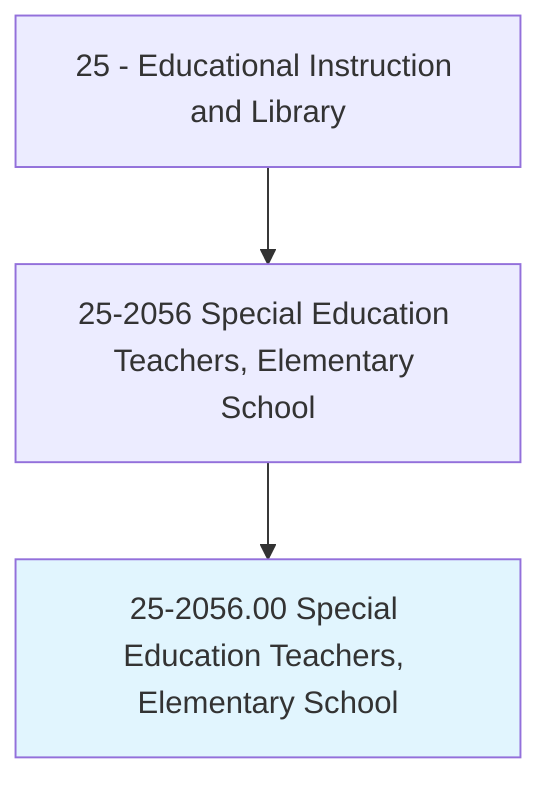
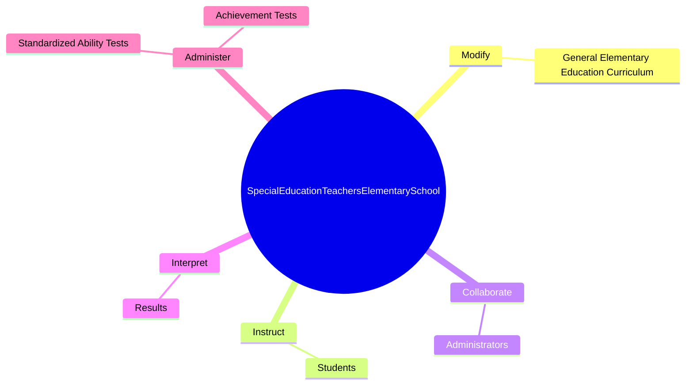
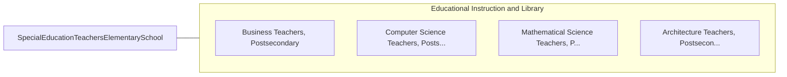

# Special Education Teachers, Elementary School

> Teach academic, social, and life skills to elementary school students with learning, emotional, or physical disabilities. Includes teachers who specialize and work with students who are blind or have visual impairments; students who are deaf or have hearing impairments; and students with intellectual disabilities.

## Overview

Special Education Teachers, Elementary School is an occupation within the Educational Instruction and Library category. Teach academic, social, and life skills to elementary school students with learning, emotional, or physical disabilities. 

## Classification Hierarchy

## Key Statistics

| Metric | Value |
|--------|-------|
| SOC Code | 25-2056.00 |
| Category | [Educational Instruction and Library](/occupations/Education) |
| Task Count | 11 |
| Source | O*NET |

## Core Tasks

### modify.GeneralElementaryEducationCurriculum

Special Education Teachers, Elementary School modify general elementary education curriculum as part of their core responsibilities.

**Actions:**
- `modify.GeneralElementaryEducationCurriculum.for.Students.with.Disabilities`

### instruct.Students

Special Education Teachers, Elementary School instruct students as part of their core responsibilities.

**Actions:**
- `instruct.Students.in.DailyLivingSkillsRequired.for.IndependentMaintenance`
- `instruct.Students.in.SelfSufficiency`
- `instruct.Students.in.Hygiene`
- `instruct.Students.in.Safety`

### collaborate.Administrators

Special Education Teachers, Elementary School collaborate administrators as part of their core responsibilities.

**Actions:**
- `collaborate.Administrators.to.revise.ElementarySchoolPrograms`

## Skills & Competencies

### Technical Skills
- **Curriculum Development** - Advanced
- **Instructional Design** - Advanced
- **Assessment** - Advanced

### Soft Skills
- **Communication** - Essential
- **Problem Solving** - Essential
- **Critical Thinking** - Important
- **Teamwork** - Important
- **Adaptability** - Important

## Related Occupations

## Industries

This occupation is found across multiple industries. See [Industries](/industries) for sector-specific employment data.

## Career Progression

---

*Source: O*NET 25-2056.00 - ONETOccupation*
