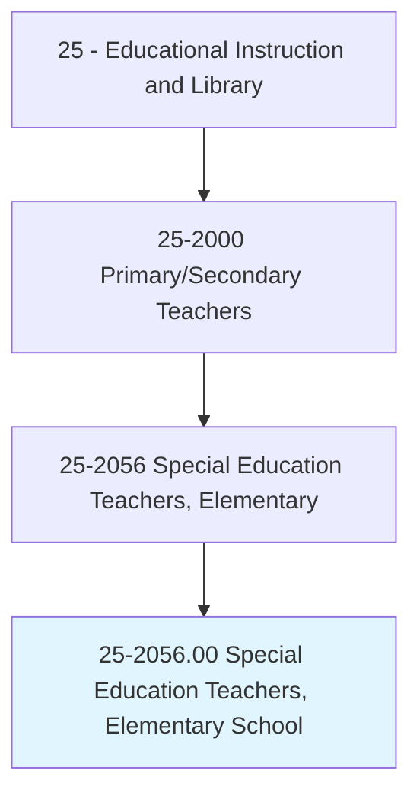
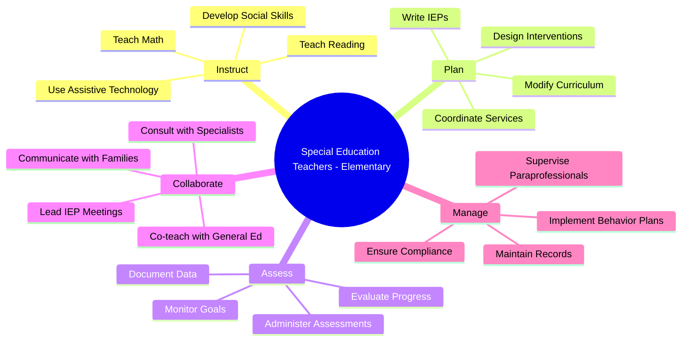
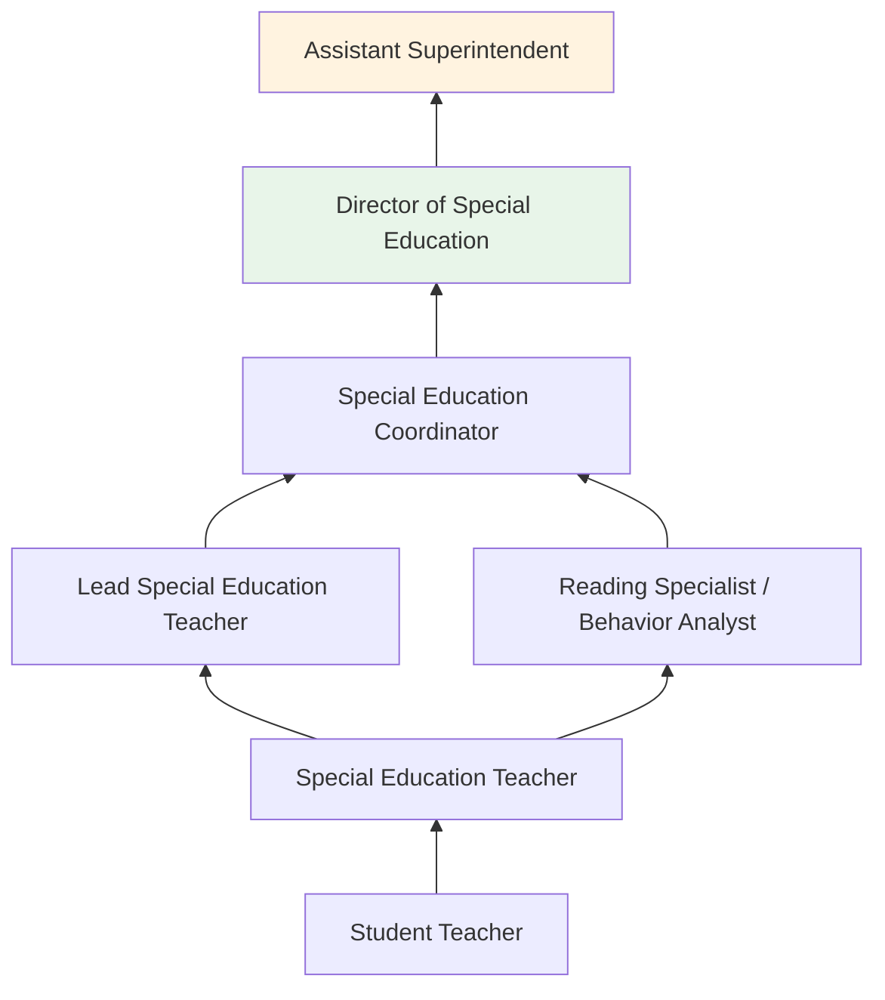
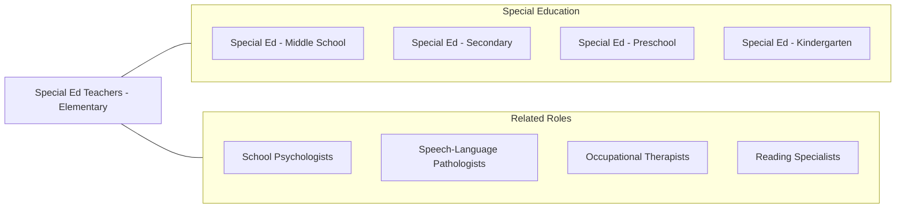

# Special Education Teachers, Elementary School

> Teach academic, social, and life skills to elementary school students with learning, emotional, or physical disabilities. Includes teachers who specialize and work with students who are blind or have visual impairments; students who are deaf or have hearing impairments; and students with intellectual disabilities.

## Overview

Special Education Teachers at the elementary school level work with students aged 5-11 who have disabilities including learning disabilities, speech and language impairments, autism spectrum disorder, emotional disturbances, intellectual disabilities, and physical impairments. They develop and implement Individualized Education Programs (IEPs) addressing each student's unique academic, behavioral, and social-emotional needs while ensuring access to grade-level content through appropriate modifications and accommodations.

Elementary special education teachers deliver instruction through multiple service models including resource rooms, self-contained classrooms, co-teaching partnerships with general educators, and push-in support. They teach foundational academic skills in reading, writing, and mathematics using evidence-based interventions such as Orton-Gillingham, Wilson Reading, and multi-sensory instruction. They also address social skills, self-regulation, functional communication, and daily living skills depending on the severity of students' disabilities.

The elementary level is critical for early identification and intervention. Special education teachers collaborate closely with school psychologists, speech-language pathologists, occupational therapists, and families to create comprehensive support systems. Their work during these formative years can significantly alter students' academic trajectories and long-term outcomes.

## Classification Hierarchy

## Key Statistics

| Metric | Value |
|--------|-------|
| SOC Code | 25-2056.00 |
| Job Zone | 4 (Considerable Preparation) |
| Category | [Educational Instruction and Library](/occupations/Education/index) |
| Median Salary | $62,000 - $72,000 |
| Employment | ~180,000 |
| Projected Growth | 4-6% (Average) |
| Source | O*NET |

## Core Tasks

### develop.IndividualizedEducationPrograms

Special Education Teachers create comprehensive IEPs for each student.

**Actions:**
- `develop.IEPs.with.MeasurableGoals` - Write academic, behavioral, and functional goals
- `design.Interventions.using.EvidenceBasedPractices` - Select research-based instructional approaches
- `coordinate.RelatedServices.for.ComprehensiveSupport` - Align OT, PT, speech, and counseling services

### instruct.StudentsWithDisabilities

Teachers deliver specialized instruction in foundational skills.

**Actions:**
- `instruct.Students.in.Reading.using.StructuredLiteracy` - Teach phonics, fluency, and comprehension through systematic approaches
- `instruct.Students.in.Mathematics.using.ConcreteManipulatives` - Build number sense and operations through hands-on learning
- `teach.SocialSkills.using.ExplicitInstruction` - Develop peer interaction, self-regulation, and conflict resolution skills

## Skills & Competencies

### Technical Skills
- **Special Education Law** - Expert (IDEA, Section 504, ADA)
- **IEP Development** - Expert (goal writing, progress monitoring, compliance)
- **Evidence-Based Instruction** - Expert (structured literacy, explicit instruction, UDL)
- **Behavior Management** - Advanced (FBA, BIP, PBIS)
- **Assistive Technology** - Advanced (AAC, text-to-speech, adapted materials)
- **Assessment** - Advanced (curriculum-based measurement, diagnostic assessment)

### Soft Skills
- **Patience** - Critical (supporting students through frustration and slow progress)
- **Communication** - Critical (IEP meetings, family partnerships, team collaboration)
- **Empathy** - Essential (understanding student experiences)
- **Advocacy** - Essential (ensuring student needs are met)
- **Flexibility** - Essential (adapting instruction in real time)
- **Organization** - Essential (managing multiple IEPs and compliance requirements)

## Education & Certifications

| Requirement | Details |
|-------------|---------|
| Typical Education | Bachelor's degree in Special Education; Master's preferred |
| State Licensure | Required; special education endorsement for elementary grades |
| Student Teaching | Clinical experience in special education required |
| Continuing Education | Professional development for license renewal |
| Common Certifications | State special education license; CPI; CPR/First Aid; Wilson/Orton-Gillingham training |

## Career Progression

## Setting Variations

### Inclusive Classrooms
Co-teaching and push-in support within general education settings. Focus on access and participation.

### Resource Rooms
Pull-out instruction for targeted skill building in small groups. Specialized materials and approaches.

### Self-Contained Classrooms
Full-day instruction for students with significant disabilities. Functional academics and life skills.

### Early Intervention (K-2)
Intensive early literacy and math intervention. Critical window for skill development.

### Virtual/Hybrid Settings
Online special education services with adapted digital instruction and teletherapy.

## Technology & Tools

| Category | Tools |
|----------|-------|
| IEP Management | Frontline IEP, SEIS, EasyIEP, Goalbook |
| Assistive Technology | Kurzweil, Bookshare, Proloquo2Go, Co:Writer |
| Assessment | AIMSweb, DIBELS, easyCBM, STAR |
| Learning Management | Google Classroom, Seesaw, Canvas |
| Behavior | Kickboard, ClassDojo, token boards |
| Communication | ParentSquare, Remind, Talking Points |

## Related Occupations

## Industries

- [Educational Services - Elementary Schools](/industries/Education/index) - Primary Employment
- [Government](/industries/PublicAdministration) - Public School Districts
- Social Assistance - Residential Programs
- [Healthcare](/industries/Healthcare) - Therapeutic Day Schools

## Departments

This occupation typically works in:
- Special Education Department
- Student Support Services
- Intervention Services
- Related Services

---

*Source: O*NET 25-2056.00 - ONETOccupation*
