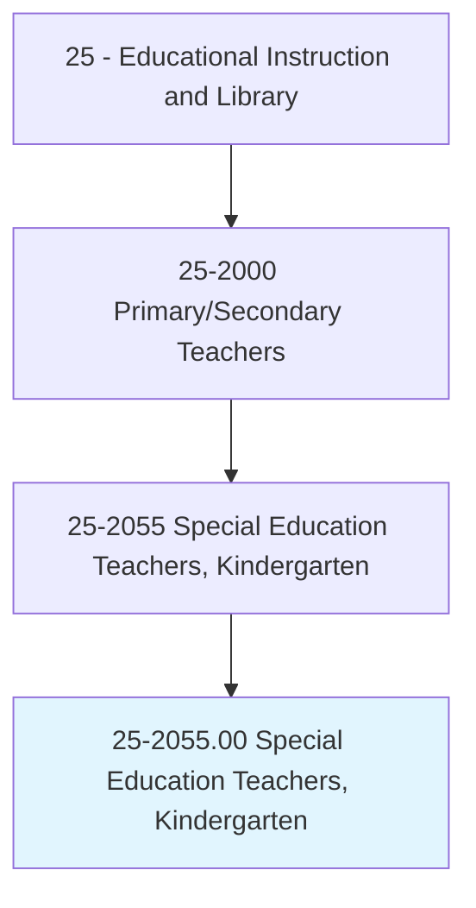
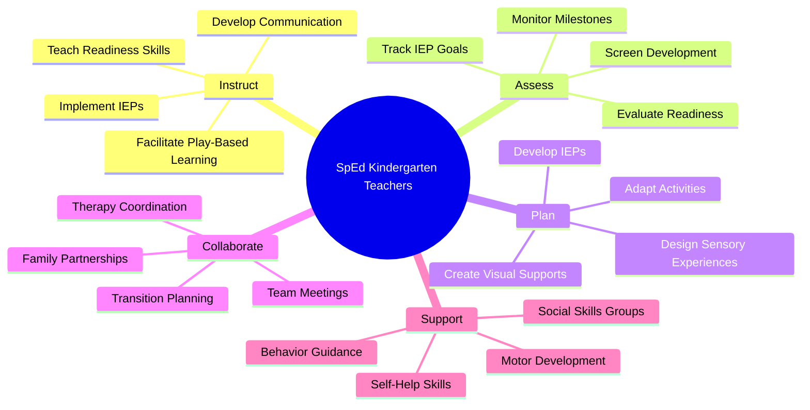
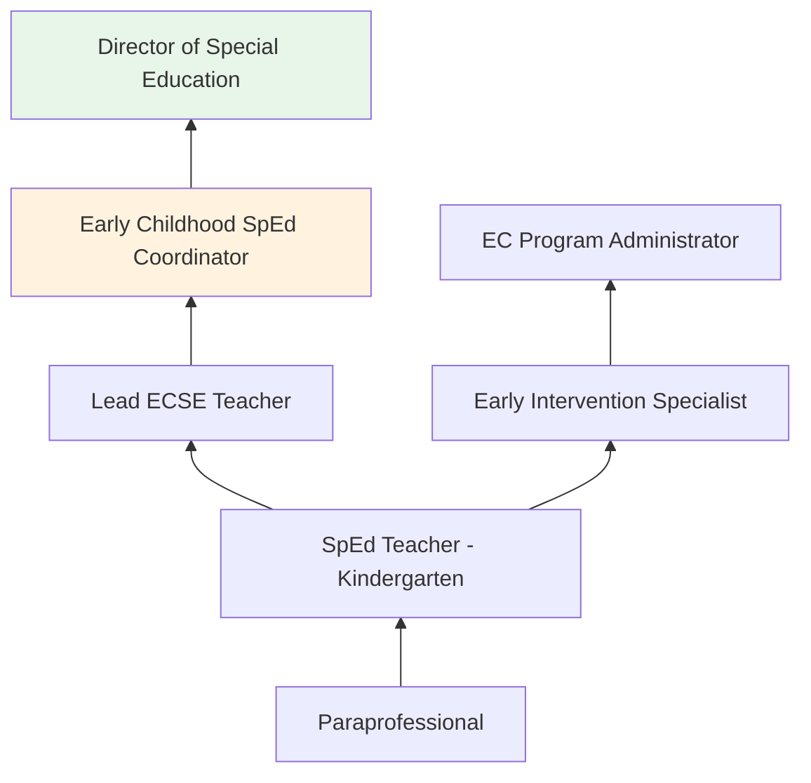
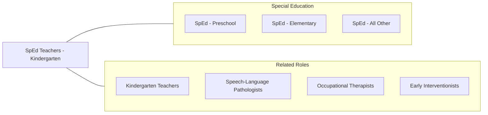

# Special Education Teachers, Kindergarten

> Teach academic, social, and life skills to kindergarten students with learning, emotional, or physical disabilities. Includes teachers who specialize and work with students who are blind or have visual impairments; students who are deaf or have hearing impairments; and students with intellectual disabilities.

## Overview

Special Education Teachers at the kindergarten level instruct children aged 4-6 with identified disabilities in academic readiness, social-emotional development, communication, motor skills, and adaptive behavior. They serve students with developmental delays, autism spectrum disorder, speech/language impairments, intellectual disabilities, sensory impairments, and other health impairments during a critical transition year from early intervention services to formal schooling.

Kindergarten special education teachers create nurturing, structured environments where young children with disabilities can develop foundational skills alongside their typically developing peers whenever appropriate. They implement IEPs with goals addressing early literacy, numeracy, communication, social interaction, self-help skills, and motor development. Instruction is heavily play-based, sensory-rich, and individualized to each child's developmental level and learning style.

The kindergarten year often involves significant transition planning as children move from Part C (Early Intervention) or Part B/619 (preschool special education) services to school-age programs. Teachers collaborate closely with families, early childhood specialists, speech-language pathologists, occupational therapists, and school psychologists to ensure continuity of services and smooth transitions.

## Classification Hierarchy

## Key Statistics

| Metric | Value |
|--------|-------|
| SOC Code | 25-2055.00 |
| Job Zone | 4 (Considerable Preparation) |
| Category | [Educational Instruction and Library](/occupations/Education/index) |
| Median Salary | $58,000 - $68,000 |
| Employment | ~20,000 |
| Projected Growth | 4-6% (Average) |
| Source | O*NET |

## Core Tasks

### instruct.KindergartenStudentsWithDisabilities

Teachers provide individualized instruction for young learners with disabilities.

**Actions:**
- `implement.IEPs.for.KindergartenStudents` - Deliver specialized instruction aligned to developmental goals
- `facilitate.PlayBasedLearning.for.SkillDevelopment` - Use structured play to build cognitive, social, and motor skills
- `develop.CommunicationSkills.using.VisualSupports` - Teach language through AAC, visual schedules, and social stories

### coordinate.TransitionAndServices

Teachers manage the transition into school-age special education.

**Actions:**
- `coordinate.TransitionPlanning.from.EarlyIntervention` - Ensure continuity as children move from Part C to school-age services
- `collaborate.WithTherapists.for.IntegratedServices` - Align IEP goals with speech, OT, and PT services
- `engage.Families.in.EducationalPlanning` - Partner with parents on goals, strategies, and home carryover

## Skills & Competencies

### Technical Skills
- **Early Childhood Special Education** - Expert (developmental approaches, play-based intervention)
- **IEP Development** - Expert (early childhood goal writing, present levels)
- **Behavior Support** - Advanced (visual supports, social stories, sensory strategies)
- **Assistive Technology** - Advanced (AAC, adapted materials, switches)
- **Developmental Assessment** - Advanced (screening, observational assessment, milestone tracking)
- **Early Literacy/Numeracy** - Advanced (emergent skills for children with disabilities)

### Soft Skills
- **Nurturing** - Critical (emotional security for young children with disabilities)
- **Patience** - Critical (developmental variability and slow progress)
- **Communication** - Essential (family partnerships, team coordination)
- **Creativity** - Essential (adapting activities for diverse abilities)
- **Observation** - Essential (noticing subtle developmental cues)
- **Flexibility** - Important (responding to unpredictable behaviors and needs)

## Education & Certifications

| Requirement | Details |
|-------------|---------|
| Typical Education | Bachelor's or master's degree in Early Childhood Special Education |
| State Licensure | Required; early childhood special education endorsement |
| Clinical Experience | Student teaching in early childhood special education |
| Continuing Education | Professional development for license renewal |
| Common Certifications | State ECSE license; CDA with special education focus; CPR/First Aid; CPI certification |

## Career Progression

## Setting Variations

### Inclusive Kindergarten Classrooms
Co-teaching with general education kindergarten teachers. Push-in support model.

### Self-Contained ECSE Classrooms
Specialized classrooms for children with significant needs. Integrated therapy services.

### Blended Classrooms
Mix of children with and without disabilities in preschool/kindergarten settings. Natural learning environment.

### Developmental Kindergarten
Extended early childhood program for students not yet ready for traditional kindergarten.

## Technology & Tools

| Category | Tools |
|----------|-------|
| IEP Management | Frontline, GoalBook, SEIS |
| Assistive Technology | Proloquo2Go, TouchChat, GoTalk, switches |
| Assessment | ASQ, Brigance, Teaching Strategies GOLD |
| Visual Supports | Boardmaker, Lessonpix, visual schedule apps |
| Communication | Brightwheel, ParentSquare, Remind |
| Interactive Learning | Starfall, PBS Kids, adapted tablets |

## Related Occupations

## Industries

- [Educational Services - Elementary Schools](/industries/Education/index) - Primary Employment
- [Government](/industries/PublicAdministration) - Public School Districts
- Social Assistance - Early Childhood Programs
- [Healthcare](/industries/Healthcare) - Developmental Centers

## Departments

This occupation typically works in:
- Special Education Department
- [Early Childhood Education](/departments/Operations)
- Student Support Services

---

*Source: O*NET 25-2055.00 - ONETOccupation*
