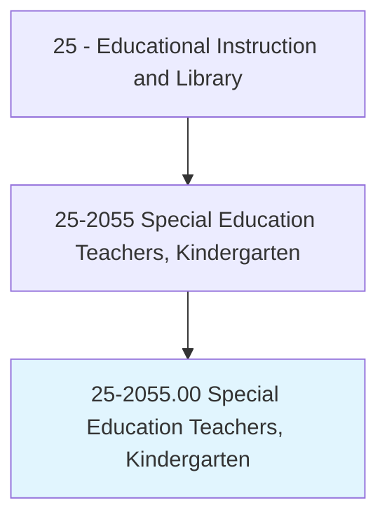
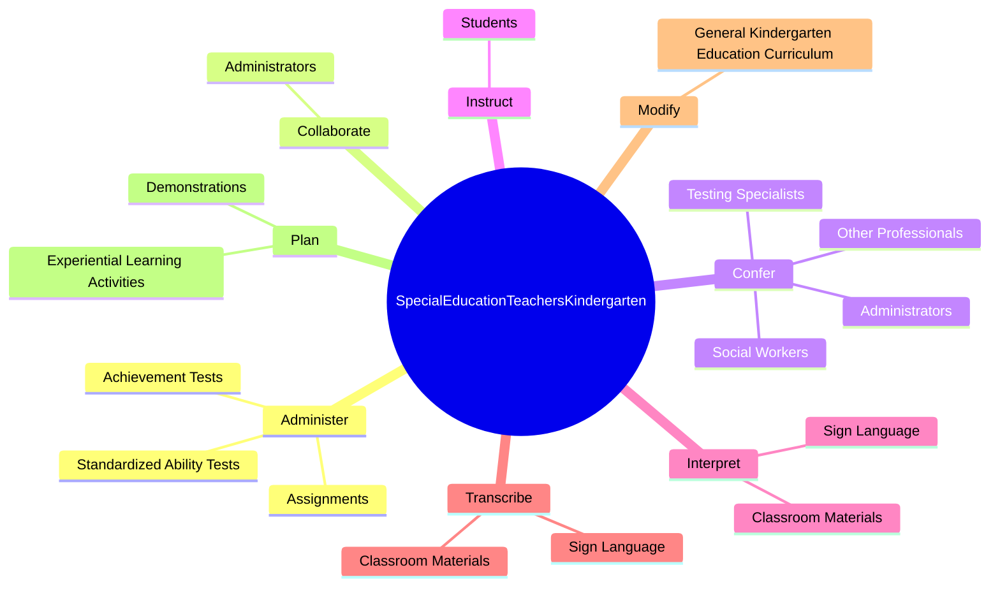
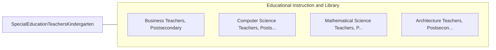

# Special Education Teachers, Kindergarten

> Teach academic, social, and life skills to kindergarten students with learning, emotional, or physical disabilities. Includes teachers who specialize and work with students who are blind or have visual impairments; students who are deaf or have hearing impairments; and students with intellectual disabilities.

## Overview

Special Education Teachers, Kindergarten is an occupation within the Educational Instruction and Library category. Teach academic, social, and life skills to kindergarten students with learning, emotional, or physical disabilities. 

## Classification Hierarchy

## Key Statistics

| Metric | Value |
|--------|-------|
| SOC Code | 25-2055.00 |
| Category | [Educational Instruction and Library](/occupations/Education/index) |
| Task Count | 42 |
| Source | O*NET |

## Core Tasks

### administer.StandardizedAbilityTests

Special Education Teachers, Kindergarten administer standardized ability tests as part of their core responsibilities.

**Actions:**
- `administer.StandardizedAbilityTests.to.KindergartenStudentsWithSpecialNeeds`
- `administer.AchievementTests.to.KindergartenStudentsWithSpecialNeeds`
- `administer.Assignments.to.evaluate.StudentsProgress`

### collaborate.Administrators

Special Education Teachers, Kindergarten collaborate administrators as part of their core responsibilities.

**Actions:**
- `collaborate.Administrators.to.revise.KindergartenPrograms`

### confer.Administrators

Special Education Teachers, Kindergarten confer administrators as part of their core responsibilities.

**Actions:**
- `confer.Administrators.to.develop.IndividualEducationalPlansIeps`
- `confer.Administrators.to.Physical`
- `confer.Administrators.to.SocialDevelopment`
- `confer.TestingSpecialists.to.develop.IndividualEducationalPlansIeps`

## Skills & Competencies

### Technical Skills
- **Curriculum Development** - Advanced
- **Instructional Design** - Advanced
- **Assessment** - Advanced

### Soft Skills
- **Communication** - Essential
- **Problem Solving** - Essential
- **Critical Thinking** - Important
- **Teamwork** - Important
- **Adaptability** - Important

## Related Occupations

## Industries

This occupation is found across multiple industries. See [Industries](/industries) for sector-specific employment data.

## Career Progression

---

*Source: O*NET 25-2055.00 - ONETOccupation*
