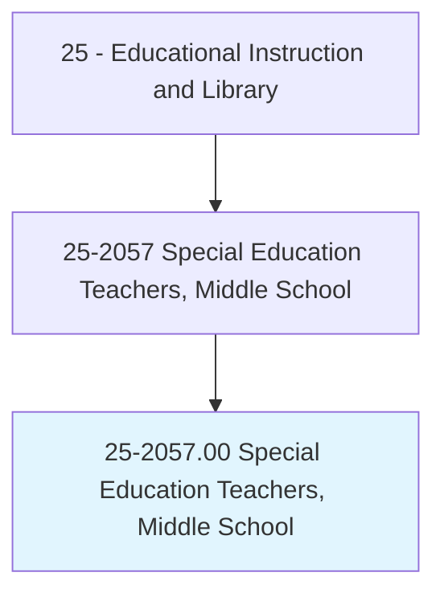
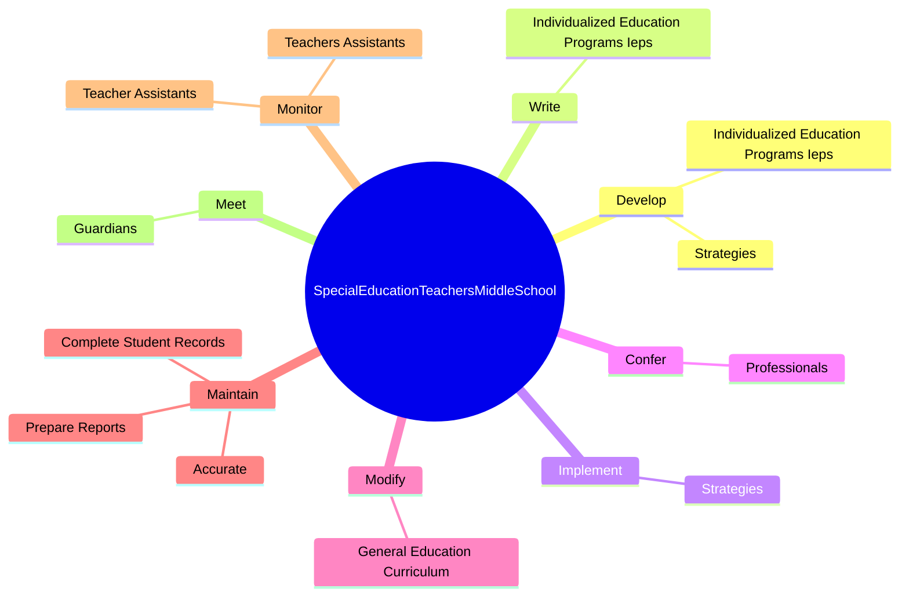
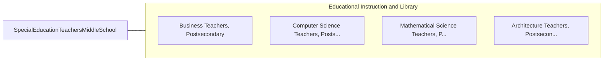

# Special Education Teachers, Middle School

> Teach academic, social, and life skills to middle school students with learning, emotional, or physical disabilities. Includes teachers who specialize and work with students who are blind or have visual impairments; students who are deaf or have hearing impairments; and students with intellectual disabilities.

## Overview

Special Education Teachers, Middle School is an occupation within the Educational Instruction and Library category. Teach academic, social, and life skills to middle school students with learning, emotional, or physical disabilities. 

## Classification Hierarchy

## Key Statistics

| Metric | Value |
|--------|-------|
| SOC Code | 25-2057.00 |
| Category | [Educational Instruction and Library](/occupations/Education/index) |
| Task Count | 24 |
| Source | O*NET |

## Core Tasks

### develop.IndividualizedEducationProgramsIeps

Special Education Teachers, Middle School develop individualized education programs ieps as part of their core responsibilities.

**Actions:**
- `develop.IndividualizedEducationProgramsIeps`
- `develop.Strategies.to.meet.NeedsOfStudentsWithVarietyOfHandicappingConditions`

### write.IndividualizedEducationProgramsIeps

Special Education Teachers, Middle School write individualized education programs ieps as part of their core responsibilities.

**Actions:**
- `write.IndividualizedEducationProgramsIeps`

### implement.Strategies

Special Education Teachers, Middle School implement strategies as part of their core responsibilities.

**Actions:**
- `implement.Strategies.to.meet.NeedsOfStudentsWithVarietyOfHandicappingConditions`

## Skills & Competencies

### Technical Skills
- **Curriculum Development** - Advanced
- **Instructional Design** - Advanced
- **Assessment** - Advanced

### Soft Skills
- **Communication** - Essential
- **Problem Solving** - Essential
- **Critical Thinking** - Important
- **Teamwork** - Important
- **Adaptability** - Important

## Related Occupations

## Industries

This occupation is found across multiple industries. See [Industries](/industries) for sector-specific employment data.

## Career Progression

---

*Source: O*NET 25-2057.00 - ONETOccupation*
