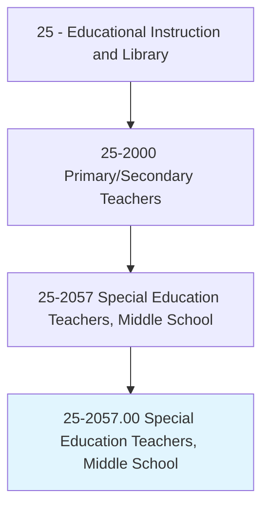
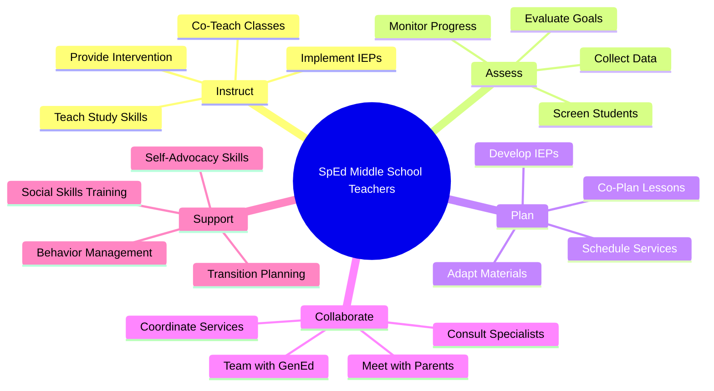
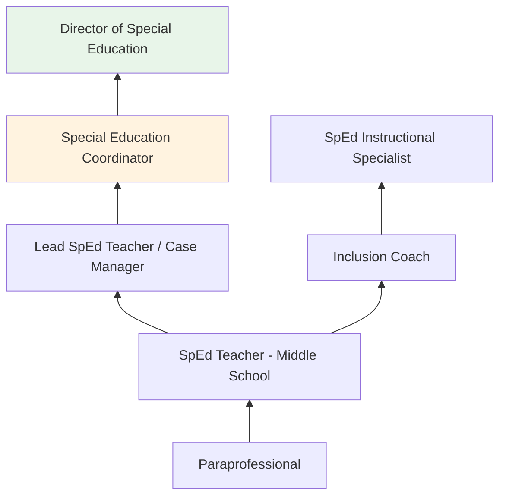
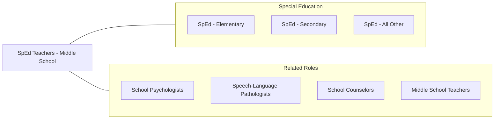

# Special Education Teachers, Middle School

> Teach academic, social, and life skills to middle school students with learning, emotional, or physical disabilities. Includes teachers who specialize and work with students who are blind or have visual impairments; students who are deaf or have hearing impairments; and students with intellectual disabilities.

## Overview

Special Education Teachers at the middle school level instruct students aged 11-14 with disabilities in academic content, social skills, self-advocacy, and functional skills during a challenging developmental period. They serve students with learning disabilities, autism spectrum disorder, emotional/behavioral disorders, intellectual disabilities, sensory impairments, and other health impairments. These educators work in co-taught inclusive classrooms, resource rooms, and self-contained settings within middle schools.

Middle school special education presents unique challenges as students encounter departmentalized instruction, increased academic rigor, and complex social dynamics while navigating puberty and identity development. Teachers must support students in accessing grade-level content across multiple subjects while addressing significant skill gaps, often spanning several grade levels. They implement IEPs with measurable goals, provide specially designed instruction, and use accommodations and modifications to ensure student access to the general curriculum.

Collaboration with general education teachers is essential, as most students with disabilities spend significant time in inclusive settings. Special education teachers co-plan lessons, consult on accommodations, facilitate IEP meetings, communicate with families, and coordinate with related service providers. They also teach self-advocacy skills, helping adolescents understand their disabilities and communicate their learning needs.

## Classification Hierarchy

## Key Statistics

| Metric | Value |
|--------|-------|
| SOC Code | 25-2057.00 |
| Job Zone | 4 (Considerable Preparation) |
| Category | [Educational Instruction and Library](/occupations/Education/index) |
| Median Salary | $62,000 - $72,000 |
| Employment | ~75,000 |
| Projected Growth | 4-6% (Average) |
| Source | O*NET |

## Core Tasks

### instruct.MiddleSchoolStudentsWithDisabilities

Special Education Teachers provide individualized instruction at the middle level.

**Actions:**
- `implement.IEPs.for.MiddleSchoolStudents` - Deliver specially designed instruction aligned to individual goals
- `coTeach.Classes.with.GeneralEducationTeachers` - Provide in-class support using co-teaching models
- `teach.SelfAdvocacy.to.AdolescentStudents` - Help students understand and communicate their learning needs

### manage.IEPProcessAndCompliance

Special Education Teachers lead the IEP process for their caseloads.

**Actions:**
- `develop.IEPs.with.MeasurableGoals` - Write standards-aligned goals with progress monitoring plans
- `monitor.StudentProgress.using.DataCollection` - Track achievement toward IEP goals through regular assessment
- `facilitate.IEPMeetings.with.Stakeholders` - Lead collaborative meetings with families, teachers, and specialists

## Skills & Competencies

### Technical Skills
- **Special Education Law** - Expert (IDEA, Section 504, procedural safeguards)
- **IEP Development** - Expert (goal writing, present levels, transition planning)
- **Co-Teaching Models** - Advanced (station, parallel, alternative, team teaching)
- **Content Intervention** - Advanced (reading, math, writing strategies for middle grades)
- **Behavior Support** - Advanced (PBIS, FBA/BIP, self-regulation strategies)
- **Assistive Technology** - Intermediate (text-to-speech, graphic organizers, speech recognition)

### Soft Skills
- **Patience** - Critical (supporting adolescents with diverse needs)
- **Collaboration** - Critical (partnering with multiple general education teachers)
- **Empathy** - Essential (understanding adolescent identity and disability)
- **Flexibility** - Essential (adapting to varied classroom and student needs)
- **Communication** - Essential (family engagement, team coordination)
- **Advocacy** - Important (ensuring students receive appropriate services)

## Education & Certifications

| Requirement | Details |
|-------------|---------|
| Typical Education | Bachelor's or master's degree in Special Education |
| State Licensure | Required; special education endorsement for middle grades |
| Content Knowledge | May need content endorsement for co-teaching assignments |
| Clinical Experience | Student teaching in special education at middle school level |
| Common Certifications | State special education license; Praxis Special Education; CPI certification; content-area endorsements |

## Career Progression

## Setting Variations

### Inclusive / Co-Taught Classrooms
Students with disabilities learn alongside general education peers. Co-teaching partnership models.

### Resource Rooms
Pull-out instruction for targeted skill development in reading, math, or writing. Small group settings.

### Self-Contained Classrooms
Full-day specialized instruction for students with significant needs. Low student-teacher ratios with paraprofessional support.

### Behavioral Programs
Structured programs for students with emotional/behavioral disorders. Therapeutic integration.

## Technology & Tools

| Category | Tools |
|----------|-------|
| IEP Management | Frontline, GoalBook, SEIS |
| Assistive Technology | Read&Write, Snap&Read, Co:Writer, speech-to-text |
| Intervention | IXL, Read Naturally, Moby Max, Lexia |
| Behavior | ClassDojo, behavior tracking apps, PBIS Rewards |
| Communication | ParentSquare, Remind, Google Classroom |
| Progress Monitoring | AIMSweb, DIBELS, easyCBM |

## Related Occupations

## Industries

- [Educational Services - Middle Schools](/industries/Education/index) - Primary Employment
- [Government](/industries/PublicAdministration) - Public School Districts
- Social Assistance - Alternative Programs
- [Healthcare](/industries/Healthcare) - Therapeutic Day Schools

## Departments

This occupation typically works in:
- Special Education Department
- Student Support Services
- Grade-Level Teams

---

*Source: O*NET 25-2057.00 - ONETOccupation*
