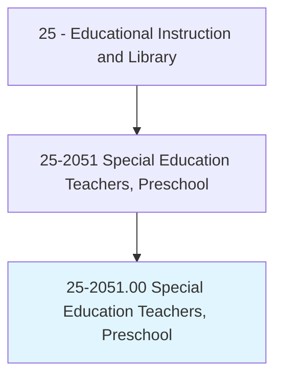
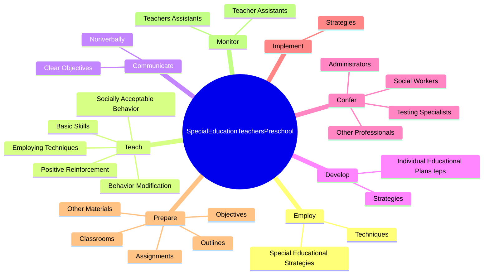
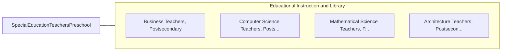

# Special Education Teachers, Preschool

> Teach academic, social, and life skills to preschool-aged students with learning, emotional, or physical disabilities. Includes teachers who specialize and work with students who are blind or have visual impairments; students who are deaf or have hearing impairments; and students with intellectual disabilities.

## Overview

Special Education Teachers, Preschool is an occupation within the Educational Instruction and Library category. Teach academic, social, and life skills to preschool-aged students with learning, emotional, or physical disabilities. 

## Classification Hierarchy

## Key Statistics

| Metric | Value |
|--------|-------|
| SOC Code | 25-2051.00 |
| Category | [Educational Instruction and Library](/occupations/Education) |
| Task Count | 94 |
| Source | O*NET |

## Core Tasks

### employ.SpecialEducationalStrategies

Special Education Teachers, Preschool employ special educational strategies as part of their core responsibilities.

**Actions:**
- `employ.SpecialEducationalStrategies.during.Instruction.to.improve.DevelopmentOfSensorySkills`
- `employ.SpecialEducationalStrategies.during.InstructionToPerceptualMotorSkills`
- `employ.SpecialEducationalStrategies.during.Instruction.to.Language`
- `employ.SpecialEducationalStrategies.during.Instruction.to.Cognition`

### teach.SociallyAcceptableBehavior

Special Education Teachers, Preschool teach socially acceptable behavior as part of their core responsibilities.

**Actions:**
- `teach.SociallyAcceptableBehavior`
- `teach.EmployingTechniques`
- `teach.BehaviorModification`
- `teach.PositiveReinforcement`

### communicate.Nonverbally

Special Education Teachers, Preschool communicate nonverbally as part of their core responsibilities.

**Actions:**
- `communicate.Nonverbally.with.Children.to.provide.ThemWithComfort`
- `communicate.Nonverbally.with.Encouragement`
- `communicate.Nonverbally.with.PositiveReinforcement`
- `communicate.ClearObjectives.for.Lessons`

## Skills & Competencies

### Technical Skills
- **Curriculum Development** - Advanced
- **Instructional Design** - Advanced
- **Assessment** - Advanced

### Soft Skills
- **Communication** - Essential
- **Problem Solving** - Essential
- **Critical Thinking** - Important
- **Teamwork** - Important
- **Adaptability** - Important

## Related Occupations

## Industries

This occupation is found across multiple industries. See [Industries](/industries) for sector-specific employment data.

## Career Progression

---

*Source: O*NET 25-2051.00 - ONETOccupation*
