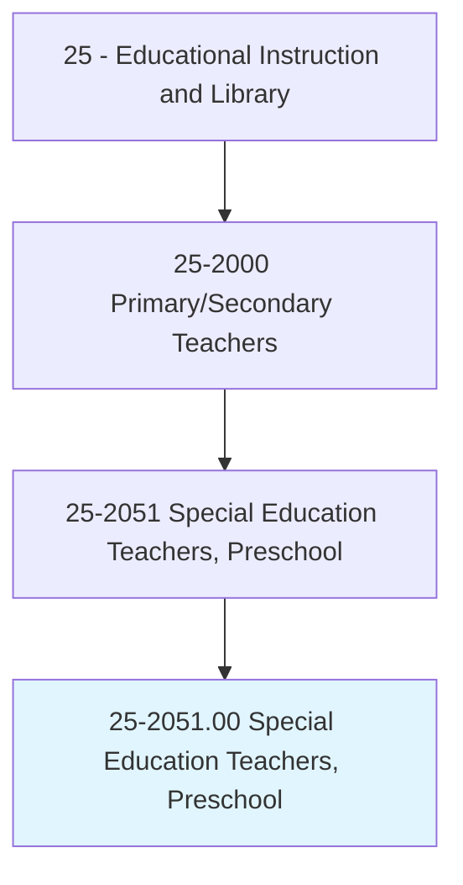
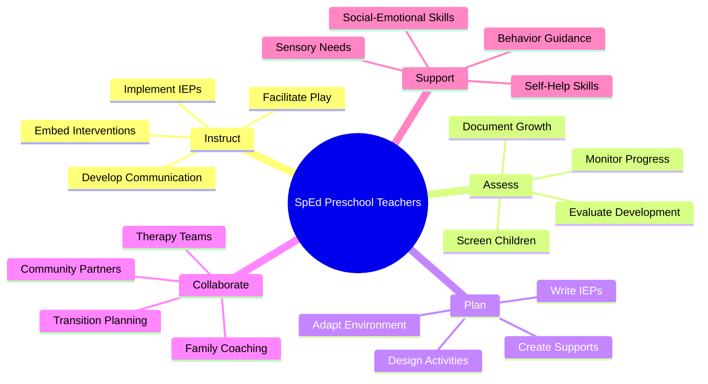
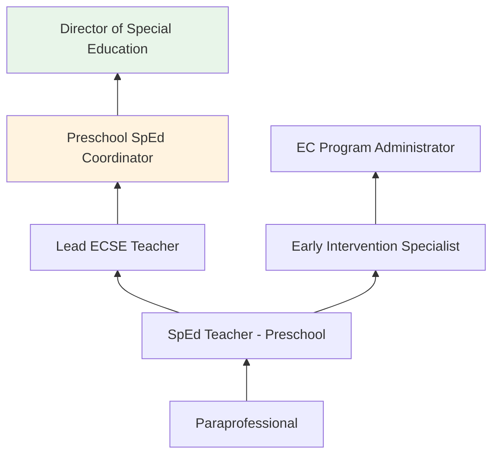
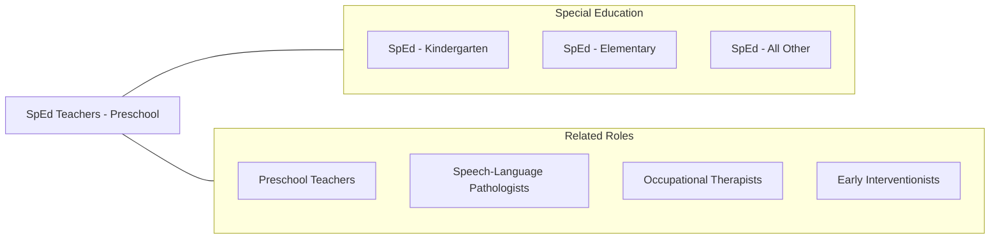

# Special Education Teachers, Preschool

> Teach academic, social, and life skills to preschool-aged students with learning, emotional, or physical disabilities. Includes teachers who specialize and work with students who are blind or have visual impairments; students who are deaf or have hearing impairments; and students with intellectual disabilities.

## Overview

Special Education Teachers at the preschool level instruct children aged 3-5 with identified disabilities or developmental delays in early learning, communication, social interaction, motor development, and adaptive skills. They serve children eligible for Part B/Section 619 services under IDEA, working in school-based preschool programs, Head Start classrooms, community-based settings, and home-based programs. These educators provide the earliest formal special education services, addressing delays before they compound.

Preschool special education is rooted in early intervention research demonstrating that targeted services during the critical developmental window of ages 3-5 yield significant long-term benefits for children with disabilities. Teachers use naturalistic, play-based interventions embedded within daily routines and activities to build skills in language, cognition, social-emotional development, and motor function. They create individualized programs based on each child's strengths, needs, and family priorities.

These teachers coordinate multidisciplinary teams that often include speech-language pathologists, occupational therapists, physical therapists, behavior analysts, and developmental pediatricians. They facilitate transition planning as children move from early intervention (Part C) into preschool and from preschool into kindergarten, ensuring continuity of services and supports.

## Classification Hierarchy

## Key Statistics

| Metric | Value |
|--------|-------|
| SOC Code | 25-2051.00 |
| Job Zone | 4 (Considerable Preparation) |
| Category | [Educational Instruction and Library](/occupations/Education/index) |
| Median Salary | $50,000 - $62,000 |
| Employment | ~25,000 |
| Projected Growth | 6-8% (Faster than average) |
| Source | O*NET |

## Core Tasks

### instruct.PreschoolStudentsWithDisabilities

Teachers provide embedded, play-based intervention for young children.

**Actions:**
- `implement.IEPs.for.PreschoolChildren` - Deliver individualized instruction within natural routines and activities
- `embed.Interventions.in.PlayActivities` - Integrate skill-building into daily preschool experiences
- `develop.CommunicationSkills.through.NaturalisticMethods` - Support language through modeling, expansion, and AAC

### coordinate.EarlyChildhoodServices

Teachers manage the service coordination process for young children with disabilities.

**Actions:**
- `develop.IEPs.with.FamilyInput` - Write individualized programs reflecting family priorities and child needs
- `facilitate.Transitions.between.Programs` - Guide families from Part C to preschool and preschool to kindergarten
- `collaborate.WithTherapists.in.IntegratedModel` - Coordinate speech, OT, and PT services within classroom activities

## Skills & Competencies

### Technical Skills
- **Early Childhood Special Education** - Expert (naturalistic intervention, embedded instruction)
- **Developmental Assessment** - Expert (Battelle, Brigance, DAYC, ASQ)
- **IEP Development** - Expert (preschool goal writing, family-centered planning)
- **Applied Behavior Analysis** - Advanced (discrete trial, naturalistic teaching, pivotal response)
- **Assistive Technology** - Advanced (AAC, adapted materials, sensory tools)
- **Family Coaching** - Advanced (coaching model, routines-based intervention)

### Soft Skills
- **Nurturing** - Critical (building trust with very young children)
- **Patience** - Critical (developmental variability and emerging skills)
- **Communication** - Essential (family partnership and team collaboration)
- **Creativity** - Essential (making learning engaging for young children)
- **Observation** - Essential (reading developmental cues)
- **Cultural Sensitivity** - Important (respecting diverse family values and practices)

## Education & Certifications

| Requirement | Details |
|-------------|---------|
| Typical Education | Bachelor's or master's degree in Early Childhood Special Education |
| State Licensure | Required; early childhood special education endorsement |
| Clinical Experience | Practicum with preschool-aged children with disabilities |
| Continuing Education | Professional development for license renewal |
| Common Certifications | State ECSE license; CDA; CPR/First Aid; RBT or BCBA for behavior focus |

## Career Progression

## Setting Variations

### School-Based Preschool Programs
District-operated preschool classrooms for children with disabilities. May include inclusive and self-contained options.

### Head Start / Early Head Start
Federally funded inclusive early childhood programs with comprehensive services.

### Community-Based Programs
Itinerant services in childcare centers, private preschools, and community settings.

### Home-Based Services
Instruction delivered in the child's home, coaching parents on intervention strategies.

### Center-Based Programs
Specialized early childhood centers serving children with significant disabilities.

## Technology & Tools

| Category | Tools |
|----------|-------|
| IEP Management | Frontline, SEIS, EasyIEP |
| Assistive Technology | Proloquo2Go, GoTalk, BigMack switches, adapted toys |
| Assessment | Battelle, Brigance, ASQ, DAYC |
| Visual Supports | Boardmaker, First-Then boards, visual schedules |
| Communication | Brightwheel, ParentSquare |
| Sensory Tools | Weighted vests, sensory bins, fidget tools, swings |

## Related Occupations

## Industries

- [Educational Services](/industries/Education/index) - Primary Employment
- Social Assistance - Head Start, Child Day Care
- [Government](/industries/PublicAdministration) - Public School Districts
- [Healthcare](/industries/Healthcare) - Developmental Centers

## Departments

This occupation typically works in:
- [Early Childhood Special Education](/departments/Operations)
- Special Education Department
- Student Support Services

---

*Source: O*NET 25-2051.00 - ONETOccupation*
