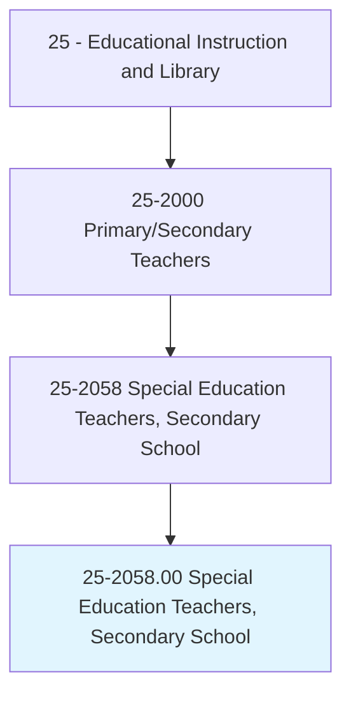
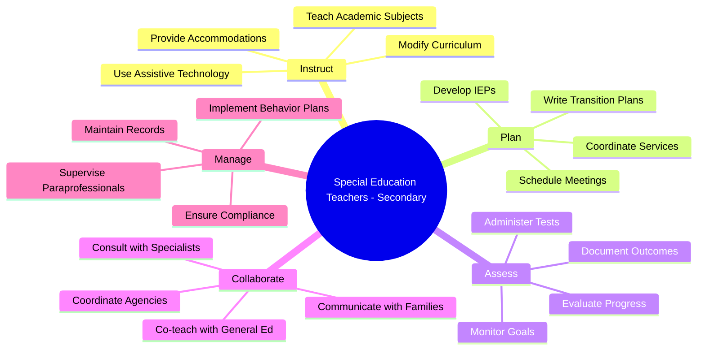
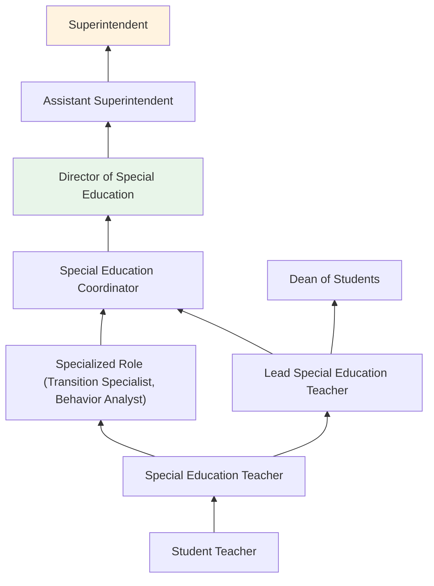
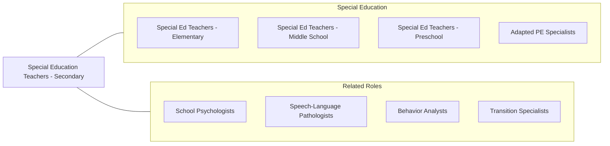

# Special Education Teachers, Secondary School

> Teach secondary school subjects to students with emotional, learning, or physical disabilities. Includes teachers who specialize and work with students who are blind or have visual impairments; students who are deaf or have hearing impairments; and students with intellectual disabilities.

## Overview

Special Education Teachers at the secondary school level work with students aged 14-21 who have disabilities ranging from learning disabilities and emotional disturbances to autism spectrum disorders, intellectual disabilities, and physical impairments. These educators develop and implement Individualized Education Programs (IEPs) that address each student's unique learning needs while ensuring access to the general education curriculum and preparation for post-secondary transitions including college, vocational training, and employment.

Secondary special education teachers face the complex challenge of helping students master grade-level academic content while simultaneously addressing skill deficits, behavioral needs, and transition planning. They collaborate extensively with general education teachers through co-teaching and consultation models, coordinate with related service providers such as speech therapists and school psychologists, and work closely with families to ensure comprehensive support for each student.

The transition planning component is particularly critical at the secondary level, as teachers must prepare students for life beyond high school. This includes developing self-advocacy skills, exploring career interests, coordinating vocational assessments, facilitating job shadowing and internship opportunities, and ensuring students understand their rights under disability law.

## Classification Hierarchy

## Key Statistics

| Metric | Value |
|--------|-------|
| SOC Code | 25-2058.00 |
| Job Zone | 4 (Considerable Preparation) |
| Category | [Educational Instruction and Library](/occupations/Education/index) |
| Median Salary | $62,000 - $72,000 |
| Employment | ~140,000 |
| Projected Growth | 4-6% (Average) |
| Source | O*NET |

## Core Tasks

### develop.IndividualizedEducationPrograms

Special Education Teachers create comprehensive education plans for each student.

**Actions:**
- `develop.IEPs.for.StudentsWithDisabilities` - Write measurable goals addressing academic, behavioral, and transition needs
- `develop.TransitionPlans.for.PostSecondaryGoals` - Create plans for college, employment, and independent living
- `coordinate.Services.with.RelatedProviders` - Align speech, occupational, and behavioral therapy with educational goals

### instruct.StudentsWithDisabilities

Special Education Teachers deliver adapted instruction across subject areas.

**Actions:**
- `instruct.Students.using.DifferentiatedMethods` - Adapt curriculum and instructional strategies to individual needs
- `instruct.Students.using.AssistiveTechnology` - Integrate technology tools to support learning access
- `instruct.Students.in.SelfAdvocacySkills` - Teach students to understand and communicate their learning needs

### assess.StudentProgress

Special Education Teachers monitor and evaluate student achievement against IEP goals.

**Actions:**
- `assess.StudentProgress.toward.IEPGoals` - Measure progress using data collection and curriculum-based assessment
- `administer.ModifiedAssessments.for.Students` - Provide accommodated testing aligned with state standards
- `document.ProgressReports.for.Families` - Communicate student achievement to parents and guardians

## Skills & Competencies

### Technical Skills
- **Special Education Law** - Expert (IDEA, Section 504, ADA compliance)
- **IEP Development** - Expert (goal writing, transition planning, progress monitoring)
- **Differentiated Instruction** - Expert (adapting content for varied disability types)
- **Behavior Management** - Advanced (FBA, BIP, PBIS, de-escalation)
- **Assistive Technology** - Advanced (AAC devices, text-to-speech, adaptive software)
- **Assessment** - Advanced (curriculum-based measurement, portfolio assessment)

### Soft Skills
- **Patience** - Critical (working with students who struggle academically)
- **Communication** - Critical (IEP meetings, family conferences, team collaboration)
- **Advocacy** - Essential (representing student needs across settings)
- **Empathy** - Essential (understanding student experiences and challenges)
- **Collaboration** - Essential (co-teaching, multidisciplinary teams)
- **Flexibility** - Essential (adapting plans based on student needs)

## Education & Certifications

| Requirement | Details |
|-------------|---------|
| Typical Education | Bachelor's degree in Special Education; Master's preferred |
| State Licensure | Required in all states; specific to special education with secondary endorsement |
| Content Endorsement | Subject-area endorsement (math, English, science) often required for co-teaching |
| Work Experience | Student teaching in special education required; practicum hours |
| Common Certifications | State special education teaching license; CPI (Crisis Prevention); CPR/First Aid; BCBA coursework |

## Career Progression

## Setting Variations

### Public High Schools
Self-contained classrooms, resource rooms, and inclusion settings. Compliance with federal and state special education mandates.

### Private Special Education Schools
Specialized programs for students with significant disabilities. Smaller class sizes and intensive therapeutic support.

### Vocational Training Centers
Transition-focused programs emphasizing job skills, community-based instruction, and vocational assessments.

### Online and Hybrid Programs
Virtual special education services including teletherapy, online IEP meetings, and accessible digital instruction.

### Post-Secondary Transition Programs (18-21)
Extended schooling programs for students with intellectual disabilities focusing on independent living and employment skills.

## Technology & Tools

| Category | Tools |
|----------|-------|
| IEP Management | Frontline IEP, SEIS, EasyIEP, Goalbook |
| Assistive Technology | Kurzweil, Read&Write, Proloquo2Go, JAWS |
| Learning Management | Google Classroom, Canvas, Schoology |
| Behavior Tracking | Kickboard, ClassDojo, ABC data sheets |
| Assessment | AIMSweb, DIBELS, Curriculum-Based Measures |
| Communication | ParentSquare, Remind, Talking Points |

## Related Occupations

## Industries

- [Educational Services - Secondary Schools](/industries/Education/index) - Primary Employment
- [Government](/industries/PublicAdministration) - Public School Districts
- Social Assistance - Residential and Day Programs
- [Healthcare](/industries/Healthcare) - Therapeutic Day Schools

## Departments

This occupation typically works in:
- Special Education Department
- Student Support Services
- Transition Services
- Related Services

---

*Source: O*NET 25-2058.00 - ONETOccupation*
