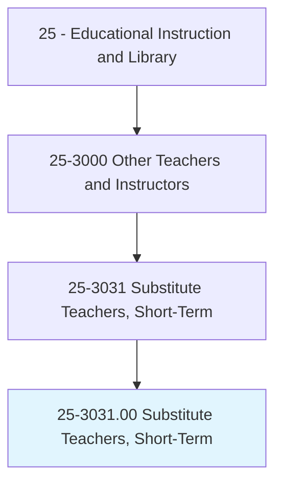
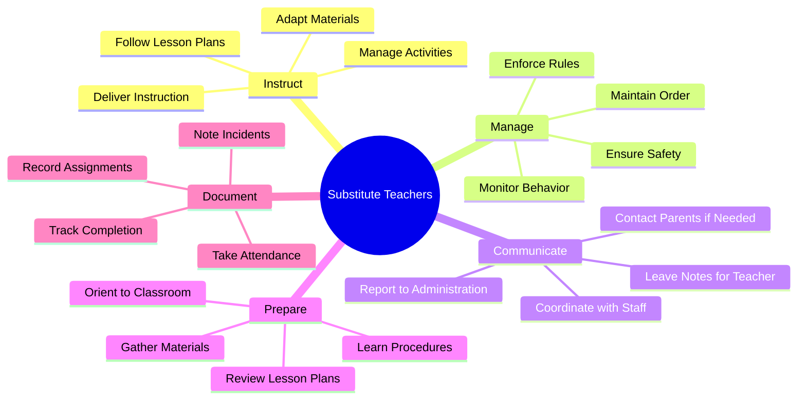
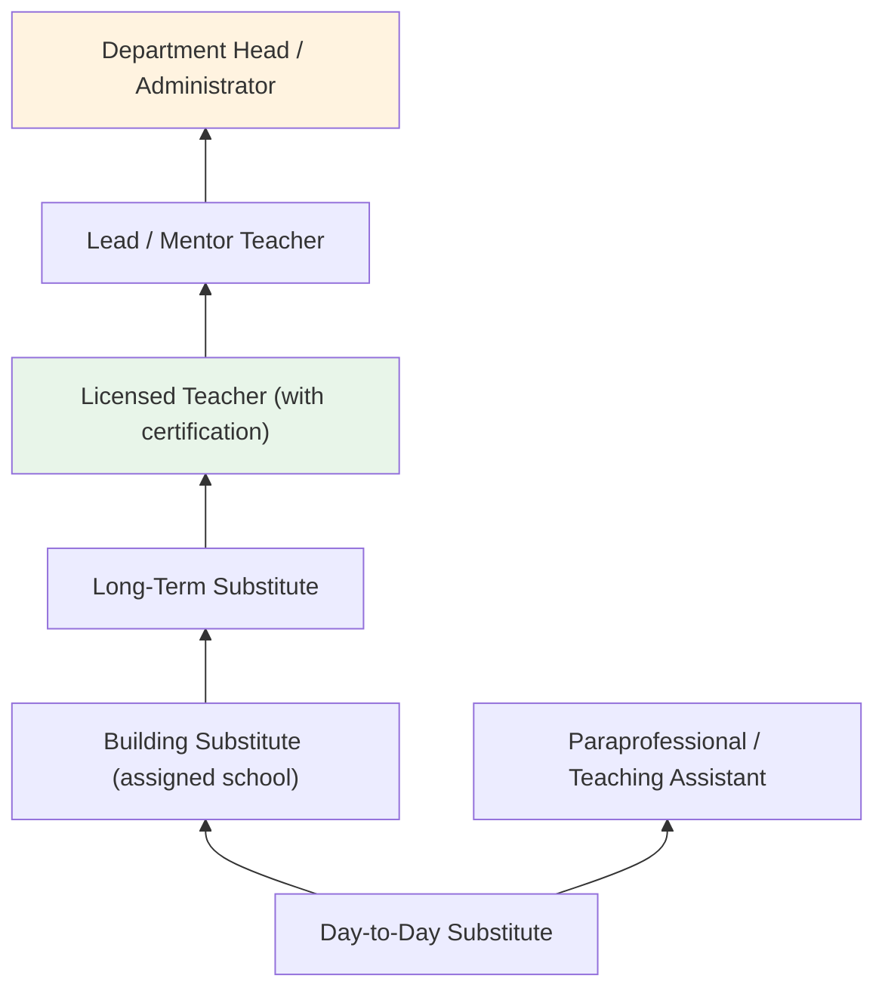
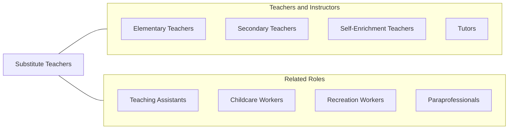

# Substitute Teachers, Short-Term

> Teach students on a short-term basis as a replacement for a regular teacher who is unavailable. Implement lesson plans as needed, or develop and implement lesson plans in the absence of plans from the regular teacher.

## Overview

Substitute Teachers serve as temporary classroom instructors who step in when regular teachers are absent due to illness, professional development, personal leave, or other reasons. They work across all grade levels and subject areas in public and private schools, implementing lesson plans left by the regular teacher or, when none are provided, creating appropriate instructional activities. Substitute teachers must quickly orient themselves to unfamiliar classrooms, manage student behavior, maintain instructional continuity, and ensure student safety throughout the school day.

The role demands exceptional adaptability, as substitute teachers may teach kindergarten art one day and high school chemistry the next. They must establish authority and rapport quickly with students who may test boundaries with an unfamiliar adult. Effective substitutes maintain the classroom routines and expectations established by the regular teacher while being flexible enough to adjust when circumstances require improvisation. Long-term substitutes may fill positions for weeks or months, taking on more comprehensive instructional responsibilities.

Substitute teaching has evolved from a purely stop-gap role to a recognized component of the educational workforce. Many school districts face chronic shortages of qualified substitutes, leading to improved compensation, professional development opportunities, and pathways from substitute to permanent teaching positions. For many aspiring educators, substitute teaching serves as valuable classroom experience before or during teacher certification programs.

## Classification Hierarchy

## Key Statistics

| Metric | Value |
|--------|-------|
| SOC Code | 25-3031.00 |
| Job Zone | 3 (Medium Preparation) |
| Category | [Educational Instruction and Library](/occupations/Education/index) |
| Median Salary | $32,000 - $42,000 (varies widely; daily rate $90-$200) |
| Employment | ~500,000 |
| Projected Growth | 5-8% (Average) |
| Source | O*NET |

## Core Tasks

### implement.LessonPlans

Substitute Teachers carry out instructional plans prepared by the regular teacher.

**Actions:**
- `implement.LessonPlans.as.Directed` - Follow the regular teacher's planned activities and schedule
- `adapt.Instruction.when.PlansUnavailable` - Create appropriate learning activities when no plans are provided
- `deliver.Instruction.across.SubjectAreas` - Teach diverse content areas depending on assignment

### manage.Classroom

Substitute Teachers maintain order and a productive learning environment.

**Actions:**
- `maintain.ClassroomOrder.using.EstablishedRules` - Follow the regular teacher's behavior management systems
- `enforce.SchoolPolicies.for.StudentSafety` - Ensure compliance with hall passes, electronic devices, and safety protocols
- `monitor.StudentBehavior.throughout.SchoolDay` - Supervise students during class, transitions, lunch, and specials

## Skills & Competencies

### Technical Skills
- **General Instruction** - Intermediate (delivering lessons across grade levels and subjects)
- **Classroom Management** - Intermediate to Advanced (maintaining order with unfamiliar students)
- **Lesson Plan Interpretation** - Intermediate (following another teacher's plans effectively)
- **Educational Technology** - Basic to Intermediate (projectors, Chromebooks, LMS basics)
- **Assessment** - Basic (collecting work, administering prepared tests)
- **Emergency Procedures** - Intermediate (lockdown, fire, medical)

### Soft Skills
- **Adaptability** - Critical (new school, grade, and subject each day)
- **Patience** - Critical (managing student behavior and testing)
- **Communication** - Essential (quick rapport building)
- **Authority** - Essential (establishing credibility quickly)
- **Flexibility** - Essential (last-minute assignments and schedule changes)
- **Reliability** - Essential (showing up consistently and on time)

## Education & Certifications

| Requirement | Details |
|-------------|---------|
| Typical Education | Varies by state: high school diploma to bachelor's degree |
| Preferred Education | Bachelor's degree; education coursework preferred |
| State Requirements | Substitute teaching permit or license (varies by state) |
| Background Check | Criminal background check and fingerprinting required |
| Common Certifications | State substitute teaching permit; CPR/First Aid; SafeSchools or similar training |

## Career Progression

## Setting Variations

### Elementary Schools
Full-day classroom management covering all subjects. Emphasis on maintaining routines and managing young students.

### Middle Schools
Subject-specific instruction across multiple class periods. Managing adolescent behavior and transitions.

### High Schools
Content-area instruction requiring more subject expertise. Monitoring independent work and test administration.

### Special Education Settings
Substituting in self-contained or resource rooms. May require managing behavioral challenges and assistive technology.

### Online/Virtual Schools
Facilitating virtual instruction using online platforms. Managing digital classroom behavior and troubleshooting technology.

## Technology & Tools

| Category | Tools |
|----------|-------|
| Classroom Technology | Projectors, Smartboards, document cameras, Chromebooks |
| Learning Management | Google Classroom, Canvas, Schoology |
| Communication | Email, phone, two-way radios |
| Substitute Platforms | Frontline (Aesop), SubFinder, Kelly Education, Swing Education |
| Student Information | PowerSchool, Infinite Campus (attendance) |
| Safety | Emergency procedures binder, walkie-talkies |

## Related Occupations

## Industries

- [Educational Services - Elementary and Secondary Schools](/industries/Education/index) - Primary Employment
- [Government](/industries/Government) - Public School Districts
- [Staffing Agencies](/industries/StaffingAgencies) - Substitute teacher placement firms
- [Religious Organizations](/industries/ReligiousOrganizations) - Private Faith-Based Schools

## Departments

This occupation typically works in:
- [All Academic Departments](/departments/Academic) (varies by assignment)
- [Human Resources / Substitute Services](/departments/HumanResources)
- [Office of the Principal](/departments/Administration)

---

*Source: O*NET 25-3031.00 - ONETOccupation*
