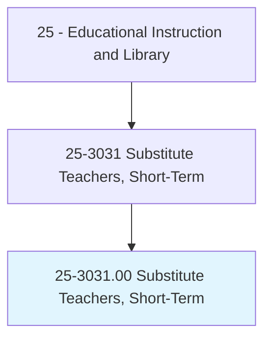
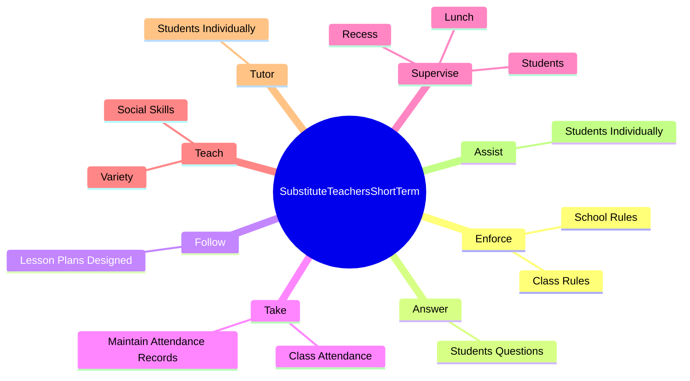
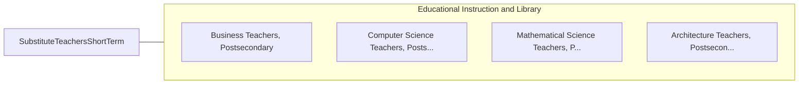

# Substitute Teachers, Short-Term

> Teach students on a short-term basis as a temporary replacement for a regular classroom teacher, typically using the regular teacher's lesson plan.

## Overview

Substitute Teachers, Short-Term is classified under Educational Instruction and Library (SOC 25). Teach students on a short-term basis as a temporary replacement for a regular classroom teacher, typically using the regular teacher's lesson plan.

## Classification Hierarchy

## Key Statistics

| Metric | Value |
|--------|-------|
| SOC Code | 25-3031.00 |
| Category | [Educational Instruction and Library](/occupations/Education/index) |
| Task Count | 41 |
| Source | O*NET |

## Core Tasks

### enforce.SchoolRules

Substitute Teachers, Short-Term enforce school rules as part of their core responsibilities.

**Actions:**
- `enforce.SchoolRules.to.maintain.OrderInClassroom`
- `enforce.ClassRules.to.maintain.OrderInClassroom`

### answer.StudentsQuestions

Substitute Teachers, Short-Term answer students questions as part of their core responsibilities.

**Actions:**
- `answer.StudentsQuestions`

### follow.LessonPlansDesigned

Substitute Teachers, Short-Term follow lesson plans designed as part of their core responsibilities.

**Actions:**
- `follow.LessonPlansDesigned.by.AbsentTeachers`

## Skills & Competencies

### Technical Skills
- **Curriculum Development** - Advanced
- **Instructional Design** - Advanced
- **Assessment** - Advanced

### Soft Skills
- **Communication** - Essential
- **Problem Solving** - Essential
- **Critical Thinking** - Important
- **Teamwork** - Important
- **Adaptability** - Important

## Related Occupations

## Industries

This occupation is found across multiple industries. See [Industries](/industries) for sector-specific employment data.

## Career Progression

---

*Source: O*NET 25-3031.00 - ONETOccupation*
