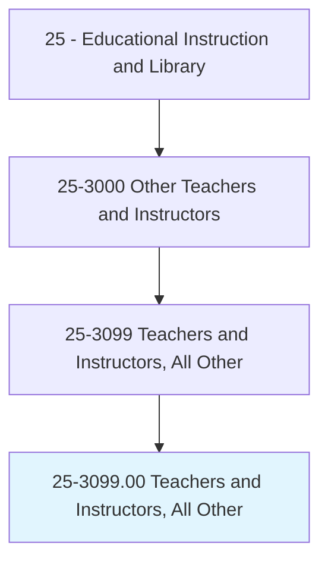
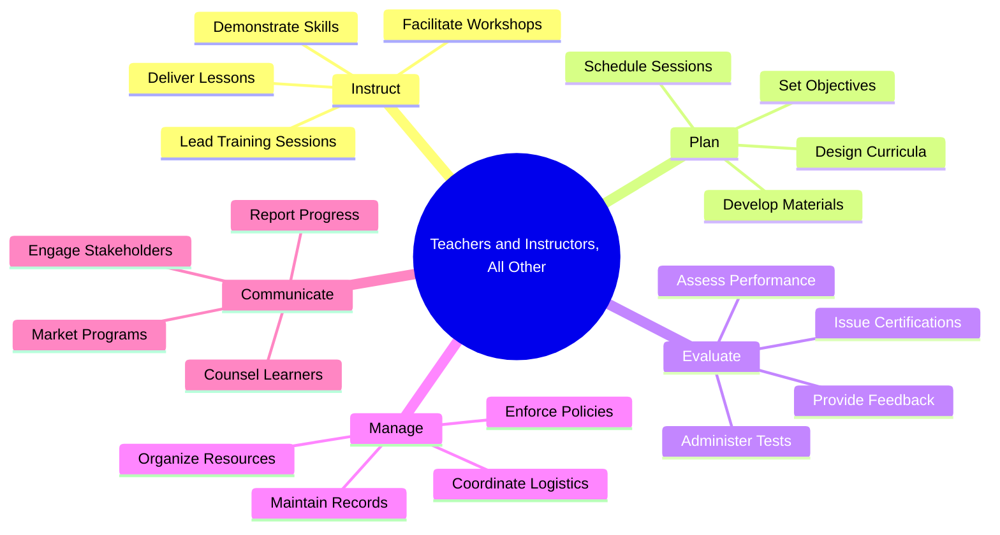
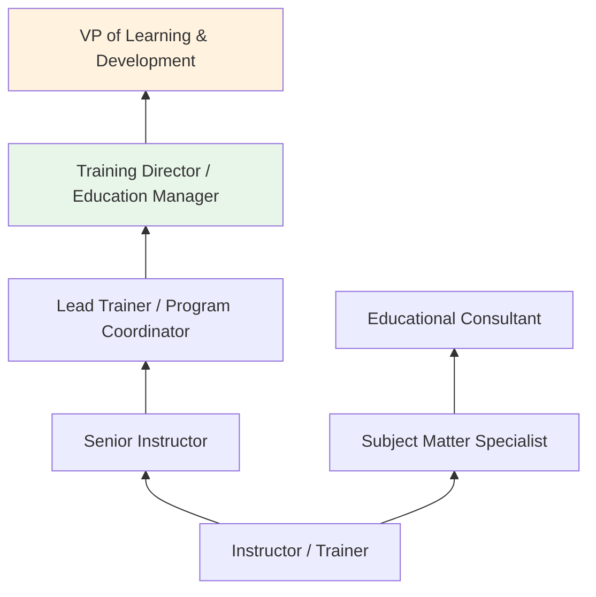
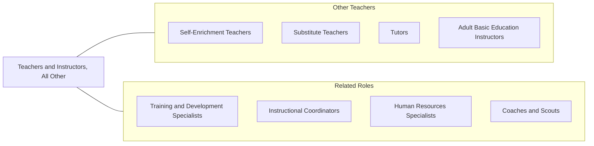

# Teachers and Instructors, All Other

> All teachers and instructors not listed separately.

## Overview

Teachers and Instructors, All Other is a broad classification encompassing educators who do not fit into the specifically defined teaching occupation categories. These professionals work across a wide spectrum of educational settings including corporate training facilities, government agencies, community organizations, religious institutions, museums, and private instruction studios. They teach subjects ranging from driver education and safety training to art workshops, language instruction, and professional development courses.

This diverse group includes corporate trainers delivering workplace skills programs, military instructors teaching specialized technical content, driving school instructors, museum educators, and community workshop facilitators. What unites them is their fundamental role in transferring knowledge and skills to learners, designing instructional experiences, assessing learning outcomes, and adapting their teaching approaches to meet the needs of varied audiences.

As the landscape of education continues to expand beyond traditional school settings, this occupation grows in importance. The rise of lifelong learning, professional development requirements, and non-traditional educational pathways means that skilled instructors are needed in an ever-widening array of contexts. These educators must be versatile, capable of working with learners of all ages, and proficient in both in-person and digital instructional delivery.

## Classification Hierarchy

## Key Statistics

| Metric | Value |
|--------|-------|
| SOC Code | 25-3099.00 |
| Job Zone | 3-4 (Medium to Considerable Preparation) |
| Category | [Educational Instruction and Library](/occupations/Education/index) |
| Median Salary | $40,000 - $55,000 |
| Employment | ~100,000 |
| Projected Growth | 5-8% (Average) |
| Source | O*NET |

## Core Tasks

### instruct.Learners

Teachers and Instructors deliver educational content across diverse contexts and subjects.

**Actions:**
- `instruct.Learners.in.SpecializedSubjects` - Teach content areas not covered by standard teaching categories
- `demonstrate.Skills.to.Students` - Model practical techniques and procedures
- `facilitate.Workshops.for.ProfessionalDevelopment` - Lead interactive learning sessions for adult learners
- `deliver.TrainingSessions.on.SafetyProcedures` - Conduct compliance and safety education

### plan.InstructionalPrograms

Teachers and Instructors design and organize learning experiences.

**Actions:**
- `design.Curricula.for.SpecializedPrograms` - Create course outlines and learning pathways
- `develop.InstructionalMaterials.for.Courses` - Produce handouts, presentations, and digital resources
- `set.LearningObjectives.for.Programs` - Define measurable outcomes for educational programs

### evaluate.LearnerPerformance

Teachers and Instructors assess student learning and provide feedback.

**Actions:**
- `assess.StudentPerformance.using.PracticalExams` - Evaluate hands-on skill demonstrations
- `administer.Tests.for.Certification` - Conduct formal assessments for credential programs
- `provide.Feedback.to.Learners` - Offer constructive guidance for improvement

## Skills & Competencies

### Technical Skills
- **Instructional Design** - Advanced (curriculum creation for non-traditional settings)
- **Subject Matter Expertise** - Advanced (domain-specific knowledge)
- **Assessment Design** - Intermediate to Advanced
- **Educational Technology** - Intermediate (online platforms, presentation tools)
- **Training Program Development** - Advanced (corporate and organizational learning)

### Soft Skills
- **Communication** - Critical (clear, engaging instruction delivery)
- **Adaptability** - Critical (varied learner populations and contexts)
- **Patience** - Essential
- **Organization** - Essential (program logistics and record keeping)
- **Interpersonal Skills** - Essential (building rapport with diverse learners)
- **Creativity** - Important (designing engaging learning experiences)

## Education & Certifications

| Requirement | Details |
|-------------|---------|
| Typical Education | Bachelor's degree; varies widely by subject and context |
| Alternative Entry | Associate degree or industry experience for vocational/technical instruction |
| Work Experience | Subject matter expertise often required; teaching experience preferred |
| On-the-Job Training | Moderate; mentorship and continuing education common |
| Common Certifications | Certified Professional in Training Management (CPTM); ATD certifications; subject-specific credentials; state teaching licenses where applicable |

## Career Progression

## Setting Variations

### Corporate Training
Deliver employee onboarding, professional development, compliance training, and leadership programs within business organizations.

### Government and Military
Teach specialized technical and procedural content for government agencies, law enforcement academies, and military installations.

### Community Education
Offer workshops and courses through community centers, libraries, and non-profit organizations on topics ranging from financial literacy to health education.

### Online Instruction
Deliver self-paced or live courses through digital platforms, reaching global audiences in specialized subjects.

### Vocational and Trade Instruction
Teach practical skills in areas such as driving, cosmetology, culinary arts, and other specialized trades outside of formal educational institutions.

## Technology & Tools

| Category | Tools |
|----------|-------|
| Learning Management Systems | Canvas, Moodle, TalentLMS, Docebo |
| Video & Communication | Zoom, Microsoft Teams, Webex, Google Meet |
| Content Creation | PowerPoint, Canva, Articulate Storyline, Camtasia |
| Assessment | Google Forms, SurveyMonkey, ProProfs Quiz Maker |
| Productivity | Microsoft Office, Google Workspace |
| Scheduling | Calendly, Doodle, SignUpGenius |

## Related Occupations

## Industries

- [Educational Services](/industries/Education/index) - Schools, Colleges, Training Centers
- [Professional, Scientific, and Technical Services](/industries/ProfessionalServices) - Corporate Training
- [Government](/industries/Government) - Public Sector Education and Training
- [Healthcare and Social Assistance](/industries/Healthcare) - Health Education
- [Other Services](/industries/OtherServices) - Community and Religious Education

## Departments

This occupation typically works in:
- [Learning & Development](/departments/LearningDevelopment)
- [Human Resources](/departments/HumanResources)
- [Community Education](/departments/CommunityEducation)
- [Continuing Education](/departments/ContinuingEducation)

---

*Source: O*NET 25-3099.00 - ONETOccupation*
