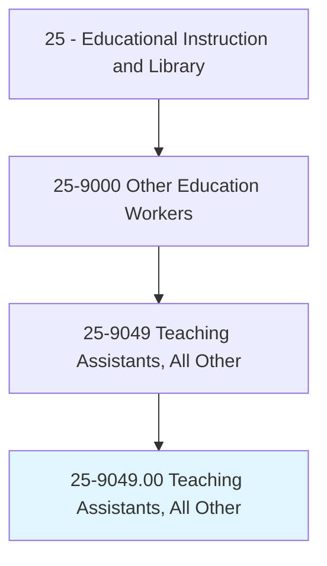
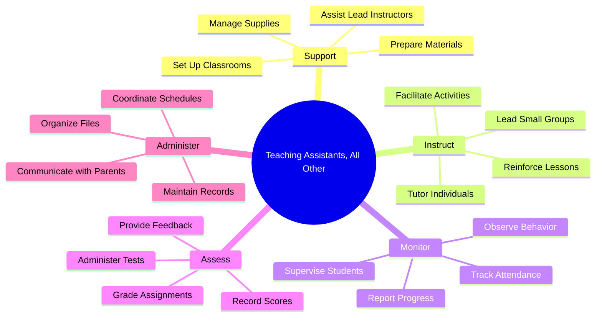
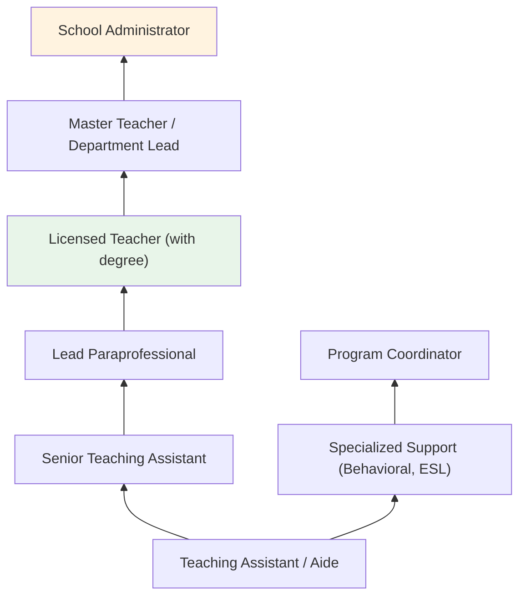
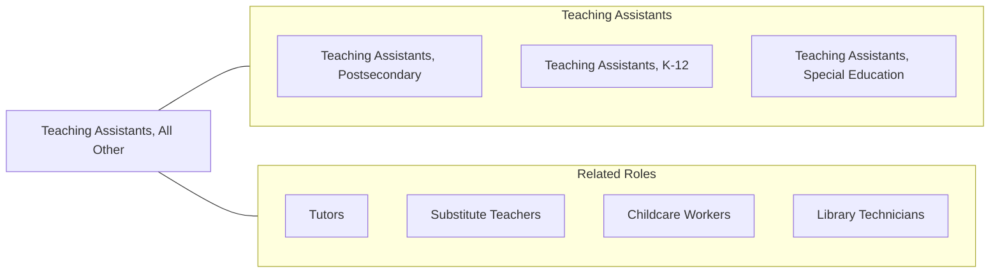

# Teaching Assistants, All Other

> All teaching assistants not listed separately.

## Overview

Teaching Assistants, All Other encompasses the diverse range of paraprofessional educators who support lead teachers and instructors across educational settings but do not fall into the specifically defined teaching assistant categories. These individuals work in K-12 schools, postsecondary institutions, vocational programs, and specialized educational environments, providing instructional support, administrative assistance, and individualized student attention that enhances the overall learning experience.

These teaching assistants may work in alternative education programs, adult learning centers, religious schools, tutoring centers, or specialized instructional environments. They assist with lesson preparation, monitor student progress, provide one-on-one or small group instruction, and help maintain an orderly learning environment. Their roles vary widely depending on the institutional context, from facilitating laboratory exercises in trade schools to supporting literacy programs in community organizations.

The flexibility of this classification reflects the many non-traditional and emerging educational contexts in which teaching support is needed. As education becomes more personalized and technology-driven, demand grows for assistants who can adapt to varied instructional models including hybrid learning, project-based education, and competency-based programs.

## Classification Hierarchy

## Key Statistics

| Metric | Value |
|--------|-------|
| SOC Code | 25-9049.00 |
| Job Zone | 3 (Medium Preparation) |
| Category | [Educational Instruction and Library](/occupations/Education/index) |
| Median Salary | $28,000 - $35,000 |
| Employment | ~50,000 |
| Projected Growth | 4-6% (Average) |
| Source | O*NET |

## Core Tasks

### support.Instructors

Teaching Assistants provide logistical and instructional support to lead educators.

**Actions:**
- `support.LeadInstructors.with.LessonPreparation` - Assist with organizing materials and setting up instructional activities
- `prepare.ClassroomMaterials.for.Instruction` - Copy, assemble, and distribute learning resources
- `maintain.ClassroomEnvironment.for.Learning` - Keep spaces organized and conducive to education

### instruct.Students

Teaching Assistants deliver supplementary instruction to individuals and small groups.

**Actions:**
- `tutor.Students.in.SubjectMatter` - Provide one-on-one academic support
- `reinforce.Lessons.for.StrugglingStudents` - Review and re-explain key concepts
- `facilitate.GroupActivities.for.CollaborativeLearning` - Lead structured learning exercises

### monitor.StudentProgress

Teaching Assistants observe and track student engagement and performance.

**Actions:**
- `monitor.StudentBehavior.during.ClassActivities` - Ensure students remain on task
- `track.Attendance.for.RecordKeeping` - Maintain accurate attendance logs
- `report.StudentProgress.to.LeadTeachers` - Communicate observations about student performance

## Skills & Competencies

### Technical Skills
- **Instructional Support** - Intermediate (reinforcing lessons, tutoring)
- **Classroom Management** - Intermediate (behavior monitoring, supervision)
- **Record Keeping** - Intermediate (attendance, grades, student files)
- **Educational Technology** - Basic to Intermediate (LMS, document cameras, tablets)
- **Assessment Assistance** - Basic (administering and scoring tests)

### Soft Skills
- **Patience** - Critical (working with diverse learners)
- **Communication** - Essential (interacting with students, teachers, parents)
- **Flexibility** - Essential (adapting to varied tasks and settings)
- **Teamwork** - Essential (collaborating with lead teachers)
- **Empathy** - Important (supporting student well-being)
- **Organization** - Important (managing materials and records)

## Education & Certifications

| Requirement | Details |
|-------------|---------|
| Typical Education | High school diploma to associate degree |
| Preferred Education | Some college coursework in education or related field |
| Work Experience | Experience working with children or adults in educational settings preferred |
| On-the-Job Training | Short-term to moderate on-the-job training |
| Common Certifications | ParaPro Assessment; CPR/First Aid; state paraprofessional credentials |

## Career Progression

## Setting Variations

### K-12 Schools
Support classroom teachers with instruction, supervision, and administrative tasks. May focus on reading groups, math intervention, or behavioral support.

### Higher Education
Assist professors with grading, lab supervision, and office hours. May proctor exams or lead discussion sections.

### Vocational and Trade Programs
Support hands-on instruction in skilled trades, technology, or healthcare training environments.

### Online and Hybrid Programs
Monitor online discussion boards, assist with technical support, and help manage virtual classroom logistics.

### Community and Adult Education
Support literacy programs, GED preparation, and workforce training in community-based settings.

## Technology & Tools

| Category | Tools |
|----------|-------|
| Learning Management Systems | Google Classroom, Canvas, Schoology |
| Communication | ClassDojo, Remind, ParentSquare, email |
| Productivity | Microsoft Office, Google Workspace |
| Assessment | Kahoot, Quizlet, Edulastic |
| Classroom Technology | Interactive whiteboards, document cameras, tablets |
| Student Information Systems | PowerSchool, Infinite Campus |

## Related Occupations

## Industries

- [Educational Services - Elementary and Secondary Schools](/industries/Education/index) - Primary Employment
- [Educational Services - Colleges and Universities](/industries/Education/index) - Postsecondary Support
- [Religious Organizations](/industries/ReligiousOrganizations) - Faith-Based Schools
- [Social Assistance](/industries/SocialAssistance) - Community Education Programs

## Departments

This occupation typically works in:
- [Academic Support Services](/departments/AcademicSupport)
- [Student Services](/departments/StudentServices)
- [Special Programs](/departments/SpecialPrograms)
- [Tutoring Center](/departments/TutoringCenter)

---

*Source: O*NET 25-9049.00 - ONETOccupation*
