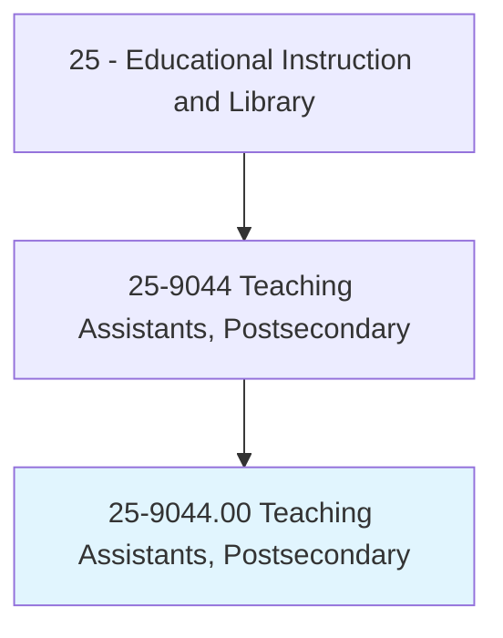
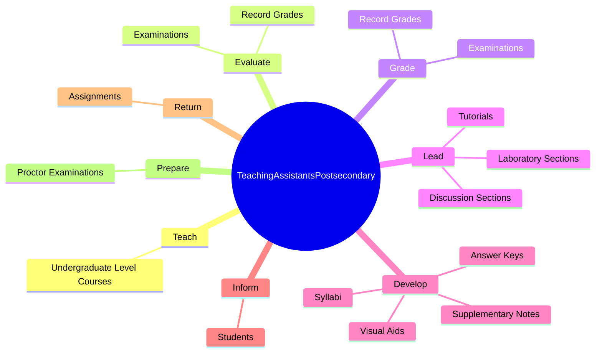
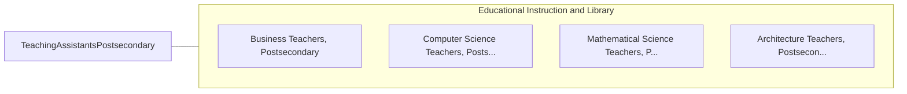

# Teaching Assistants, Postsecondary

> Assist faculty or other instructional staff in postsecondary institutions by performing instructional support activities, such as developing teaching materials, leading discussion groups, preparing and giving examinations, and grading examinations or papers.

## Overview

Teaching Assistants, Postsecondary is classified under Educational Instruction and Library (SOC 25). Assist faculty or other instructional staff in postsecondary institutions by performing instructional support activities, such as developing teaching materials, leading discussion groups, preparing and giving examinations, and grading examinations or papers.

## Classification Hierarchy

## Key Statistics

| Metric | Value |
|--------|-------|
| SOC Code | 25-9044.00 |
| Category | [Educational Instruction and Library](/occupations/Education) |
| Task Count | 36 |
| Source | O*NET |

## Core Tasks

### teach.UndergraduateLevelCourses

Teaching Assistants, Postsecondary teach undergraduate level courses as part of their core responsibilities.

**Actions:**
- `teach.UndergraduateLevelCourses`

### evaluate.Examinations

Teaching Assistants, Postsecondary evaluate examinations as part of their core responsibilities.

**Actions:**
- `evaluate.Examinations`
- `evaluate.RecordGrades`

### grade.Examinations

Teaching Assistants, Postsecondary grade examinations as part of their core responsibilities.

**Actions:**
- `grade.Examinations`
- `grade.RecordGrades`

## Skills & Competencies

### Technical Skills
- **Curriculum Development** - Advanced
- **Instructional Design** - Advanced
- **Assessment** - Advanced

### Soft Skills
- **Communication** - Essential
- **Problem Solving** - Essential
- **Critical Thinking** - Important
- **Teamwork** - Important
- **Adaptability** - Important

## Related Occupations

## Industries

This occupation is found across multiple industries. See [Industries](/industries) for sector-specific employment data.

## Career Progression

---

*Source: O*NET 25-9044.00 - ONETOccupation*
