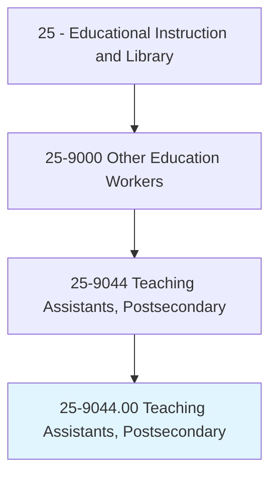
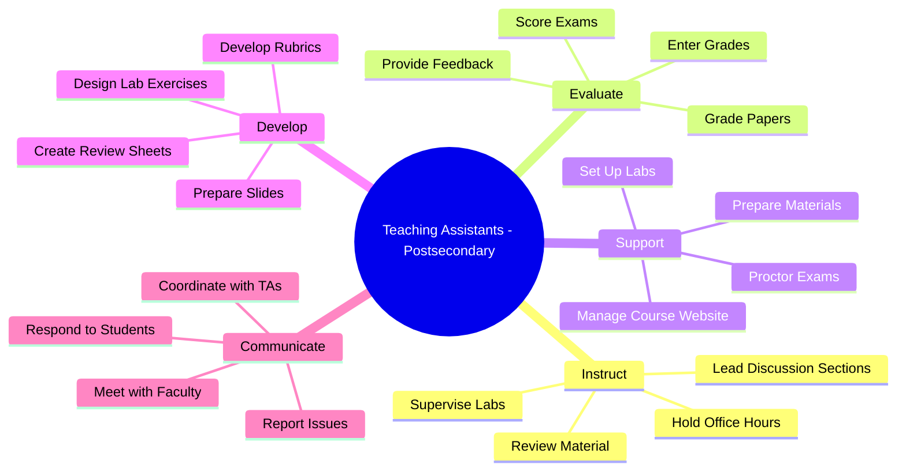
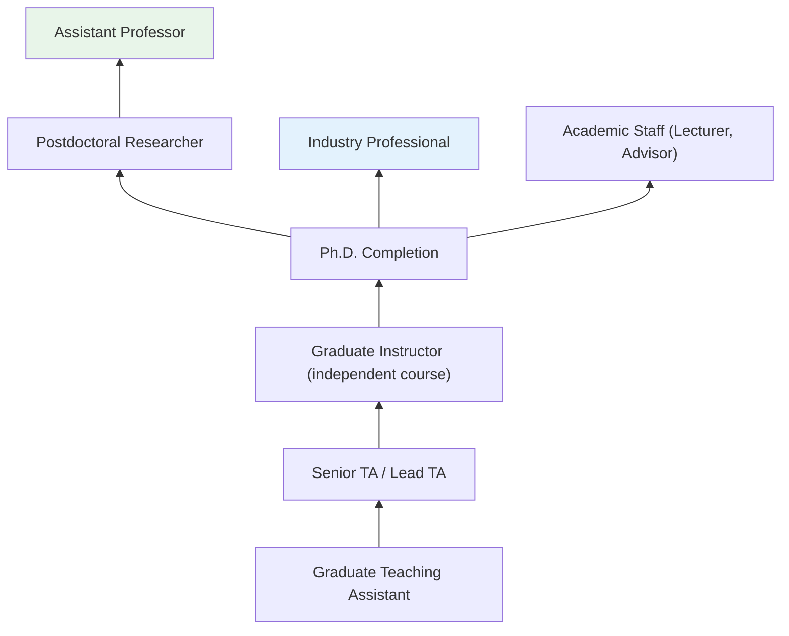
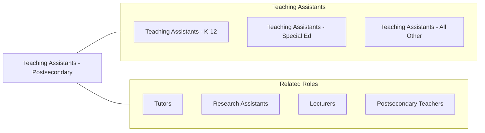

# Teaching Assistants, Postsecondary

> Assist faculty or other instructional staff in postsecondary institutions by performing instructional support activities, such as developing teaching materials, leading discussion groups, preparing and giving examinations, and grading examinations or papers.

## Overview

Teaching Assistants at the postsecondary level, commonly known as graduate teaching assistants (GTAs), support faculty members in delivering undergraduate instruction at colleges and universities. They lead discussion sections, laboratory sessions, and recitation groups; grade assignments and examinations; hold office hours; proctor tests; and assist with course administration. Most are graduate students pursuing master's or doctoral degrees who teach as part of their funding package and professional development.

The GTA role serves a dual purpose: it provides essential instructional support for large undergraduate courses while offering graduate students formative teaching experience that prepares them for academic careers. GTAs often have their first independent classroom experiences in this role, developing pedagogical skills, learning to manage student interactions, and discovering their teaching identity. In many STEM departments, GTAs are responsible for all laboratory instruction, directly supervising hands-on experiments and ensuring student safety.

The experience gained as a teaching assistant is increasingly valued across career paths, as it develops communication, leadership, mentorship, and organizational skills applicable in academia, industry, and public service. Universities typically provide GTA training through teaching centers, orientation programs, and ongoing professional development.

## Classification Hierarchy

## Key Statistics

| Metric | Value |
|--------|-------|
| SOC Code | 25-9044.00 |
| Job Zone | 4 (Considerable Preparation) |
| Category | [Educational Instruction and Library](/occupations/Education/index) |
| Median Salary | $20,000 - $30,000 (stipend; typically includes tuition waiver) |
| Employment | ~130,000 |
| Projected Growth | 4-6% (Average) |
| Source | O*NET |

## Core Tasks

### instruct.UndergraduateStudents

GTAs deliver supplementary instruction in discussion and lab settings.

**Actions:**
- `lead.DiscussionSections.for.LargeCourses` - Facilitate small-group discussions of lecture material
- `supervise.LaboratoryExperiments.for.Students` - Guide hands-on scientific and technical experiments
- `hold.OfficeHours.for.StudentSupport` - Provide individualized academic assistance

### evaluate.StudentWork

GTAs assess student assignments and provide feedback.

**Actions:**
- `grade.Papers.using.Rubrics` - Evaluate written assignments against established criteria
- `score.Examinations.for.CourseAssessment` - Grade tests and quizzes accurately and consistently
- `provide.Feedback.to.ImproveStudentLearning` - Offer constructive comments on student work

## Skills & Competencies

### Technical Skills
- **Subject Matter Knowledge** - Advanced (graduate-level expertise in discipline)
- **Instructional Methods** - Intermediate (leading discussions, lab instruction)
- **Assessment** - Intermediate (grading, rubric application, feedback)
- **Educational Technology** - Intermediate (LMS, presentation tools, lab equipment)
- **Course Administration** - Basic to Intermediate (grade books, attendance, logistics)

### Soft Skills
- **Communication** - Essential (explaining concepts, facilitating discussion)
- **Organization** - Essential (managing grading deadlines, lab prep)
- **Patience** - Essential (working with undergraduate learners)
- **Time Management** - Essential (balancing teaching with graduate studies)
- **Professionalism** - Important (maintaining appropriate student relationships)
- **Teamwork** - Important (coordinating with faculty and fellow TAs)

## Education & Certifications

| Requirement | Details |
|-------------|---------|
| Typical Education | Enrolled in master's or doctoral program |
| Prior Degree | Bachelor's degree in relevant field |
| Language Proficiency | International students may need to pass English proficiency exam (ITA test) |
| On-the-Job Training | GTA orientation; teaching center workshops; faculty mentorship |
| Common Certifications | Graduate teaching certificate programs; discipline-specific pedagogy training |

## Career Progression

## Setting Variations

### Research Universities
Large undergraduate courses with multiple TA-led sections. STEM labs with significant TA responsibility.

### Master's-Granting Universities
GTAs in programs with graduate assistantship funding. More independent teaching responsibility.

### Community Colleges
Limited GTA roles; some adjunct positions filled by graduate students from nearby universities.

### Online Courses
Virtual discussion facilitation, online grading, and digital office hours. Growing role.

## Technology & Tools

| Category | Tools |
|----------|-------|
| Learning Management Systems | Canvas, Blackboard, Moodle, Piazza |
| Grading | Gradescope, Turnitin, rubric tools |
| Laboratory | Discipline-specific lab equipment, safety gear |
| Communication | Email, Slack, Ed Discussion, office hours (Zoom) |
| Productivity | Microsoft Office, Google Workspace, LaTeX |
| Presentation | PowerPoint, Google Slides, chalk/whiteboard |

## Related Occupations

## Industries

- [Educational Services - Colleges and Universities](/industries/Education/index) - Primary Employment

## Departments

This occupation works across all academic departments offering graduate programs, including:
- [All Academic Departments](/departments/Academic)
- [Graduate School](/departments/GraduateSchool)
- [Center for Teaching and Learning](/departments/TeachingCenter)

---

*Source: O*NET 25-9044.00 - ONETOccupation*
