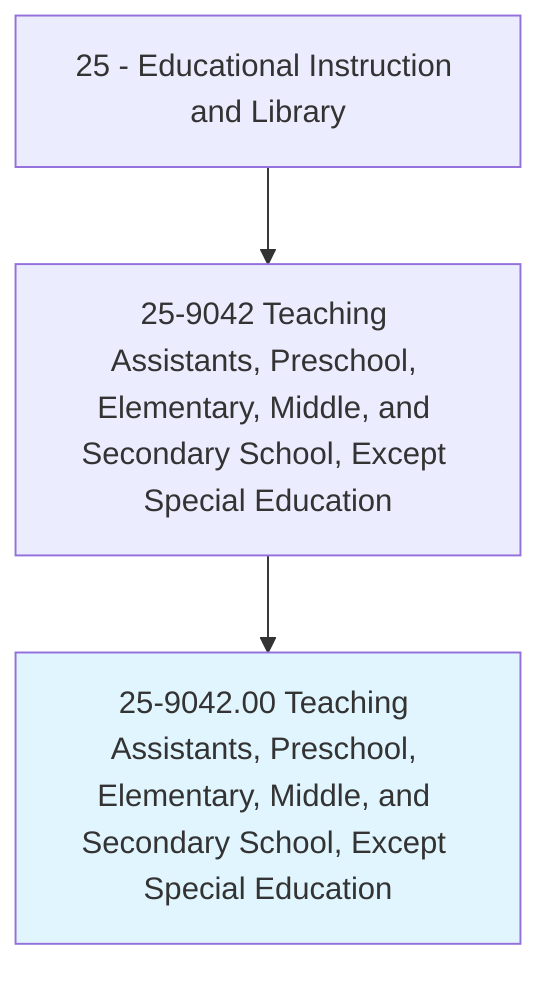
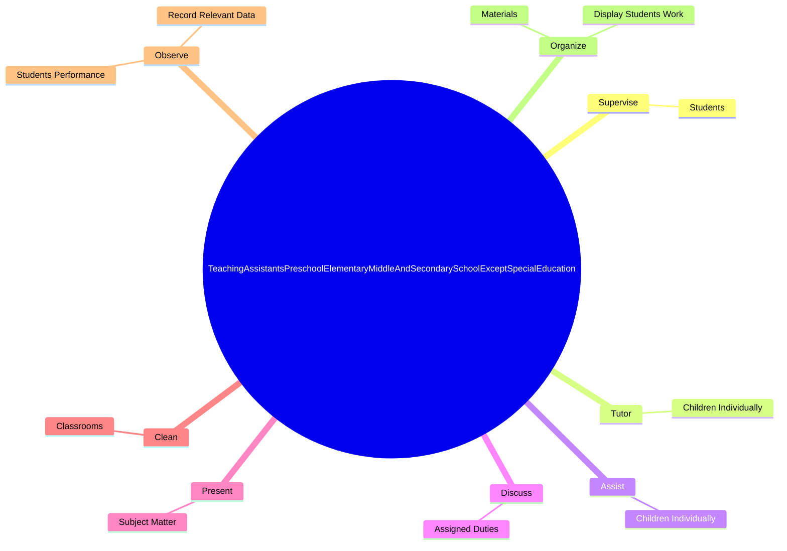
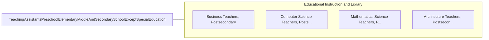

# Teaching Assistants, Preschool, Elementary, Middle, and Secondary School, Except Special Education

> Assist a preschool, elementary, middle, or secondary school teacher with instructional duties. Serve in a position for which a teacher has primary responsibility for the design and implementation of educational programs and services.

## Overview

Teaching Assistants, Preschool, Elementary, Middle, and Secondary School, Except Special Education is an occupation within the Educational Instruction and Library category. Assist a preschool, elementary, middle, or secondary school teacher with instructional duties. 

## Classification Hierarchy

## Key Statistics

| Metric | Value |
|--------|-------|
| SOC Code | 25-9042.00 |
| Category | [Educational Instruction and Library](/occupations/Education/index) |
| Task Count | 62 |
| Source | O*NET |

## Core Tasks

### supervise.Students

Teaching Assistants, Preschool, Elementary, Middle, and Secondary School, Except Special Education supervise students as part of their core responsibilities.

**Actions:**
- `supervise.Students.in.Classrooms`
- `supervise.Students.in.Halls`
- `supervise.Students.in.Cafeterias`
- `supervise.Students.in.SchoolYards`

### tutor.ChildrenIndividually

Teaching Assistants, Preschool, Elementary, Middle, and Secondary School, Except Special Education tutor children individually as part of their core responsibilities.

**Actions:**
- `tutor.ChildrenIndividually.in.SmallGroups.to.help.ThemMasterAssignmentsReinforceLearningConceptsPresentedByTeachers`
- `tutor.ChildrenIndividually.in.reinforce.LearningConceptsPresentedByTeachers`

### assist.ChildrenIndividually

Teaching Assistants, Preschool, Elementary, Middle, and Secondary School, Except Special Education assist children individually as part of their core responsibilities.

**Actions:**
- `assist.ChildrenIndividually.in.SmallGroups.to.help.ThemMasterAssignmentsReinforceLearningConceptsPresentedByTeachers`
- `assist.ChildrenIndividually.in.reinforce.LearningConceptsPresentedByTeachers`

## Skills & Competencies

### Technical Skills
- **Curriculum Development** - Advanced
- **Instructional Design** - Advanced
- **Assessment** - Advanced

### Soft Skills
- **Communication** - Essential
- **Problem Solving** - Essential
- **Critical Thinking** - Important
- **Teamwork** - Important
- **Adaptability** - Important

## Related Occupations

## Industries

This occupation is found across multiple industries. See [Industries](/industries) for sector-specific employment data.

## Career Progression

---

*Source: O*NET 25-9042.00 - ONETOccupation*
