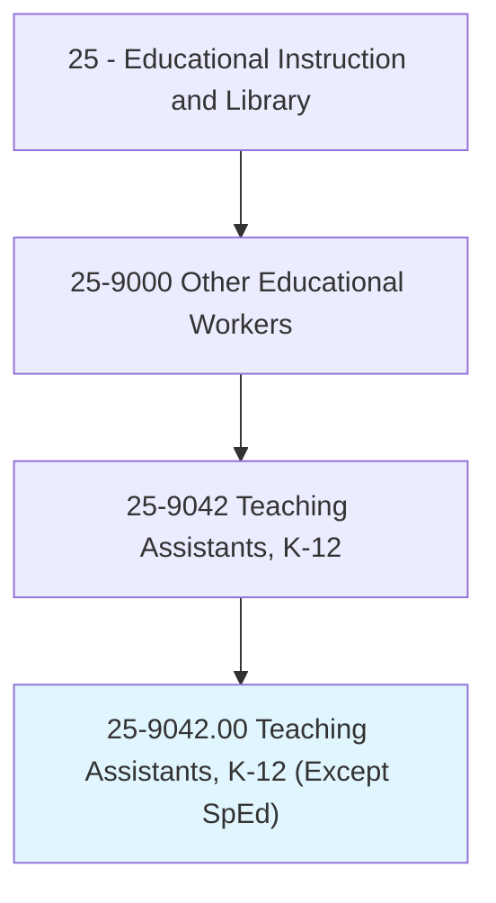
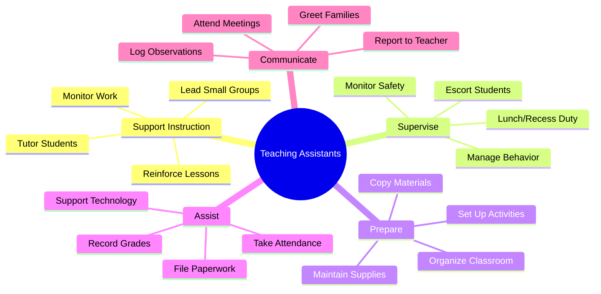
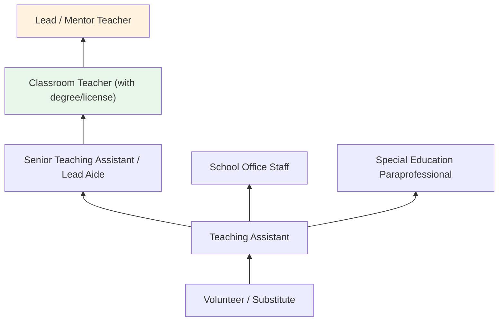
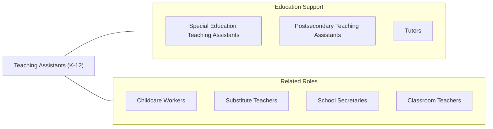

# Teaching Assistants, Preschool, Elementary, Middle, and Secondary School, Except Special Education

> Assist a preschool, elementary, middle, or secondary school teacher with instructional duties. Serve in a position for which a teacher has ultimate responsibility for the design and implementation of educational programs and services.

## Overview

Teaching Assistants (also called paraprofessionals, instructional aides, or teacher aides) support lead teachers in K-12 and preschool classrooms by assisting with instructional activities, supervising students, preparing materials, and performing clerical tasks. They work under the direction of certified teachers, reinforcing lessons with individual students or small groups, monitoring student behavior, assisting with classroom management, and helping maintain an organized learning environment.

These paraprofessionals play an essential role in schools, particularly in classrooms with large enrollments, diverse learning needs, or multilingual student populations. They may provide targeted reading or math intervention, support English language learners, assist with technology, supervise students during lunch and recess, and accompany classes on field trips. In preschool settings, they help with daily routines including meals, transitions, and toileting.

The demand for qualified teaching assistants has grown with class sizes and the increasing diversity of student needs. Many states require paraprofessionals to meet specific educational requirements under Title I, including completing at least two years of college, holding an associate's degree, or passing a state assessment. Many teaching assistants pursue the role as a pathway to becoming certified teachers.

## Classification Hierarchy

## Key Statistics

| Metric | Value |
|--------|-------|
| SOC Code | 25-9042.00 |
| Job Zone | 2-3 (Some to Medium Preparation) |
| Category | [Educational Instruction and Library](/occupations/Education/index) |
| Median Salary | $30,000 - $36,000 |
| Employment | ~900,000 |
| Projected Growth | 3-5% (Average) |
| Source | O*NET |

## Core Tasks

### support.ClassroomInstruction

Teaching Assistants reinforce teacher-led instruction.

**Actions:**
- `reinforce.Lessons.with.IndividualStudents` - Provide one-on-one practice and support for struggling learners
- `lead.SmallGroups.for.SkillPractice` - Guide targeted instruction in reading, math, or other subjects
- `supervise.Students.during.IndependentWork` - Monitor and assist students during classroom activities

### maintain.ClassroomOperations

Teaching Assistants support the organizational needs of classrooms.

**Actions:**
- `prepare.Materials.for.LessonActivities` - Copy, organize, and set up instructional materials
- `monitor.Students.during.Transitions` - Supervise hallways, lunch, recess, and bus loading
- `record.Data.for.TeacherReview` - Take attendance, log grades, and document observations

## Skills & Competencies

### Technical Skills
- **Instructional Support** - Intermediate (reinforcing lessons, tutoring, guided practice)
- **Classroom Management** - Intermediate (behavior monitoring, supervision)
- **Basic Academics** - Intermediate (reading, math, writing at assigned grade level)
- **Technology** - Intermediate (computers, printers, educational software)
- **Organization** - Advanced (materials preparation, filing, scheduling)
- **Child Development** - Intermediate (age-appropriate expectations and interactions)

### Soft Skills
- **Patience** - Critical (working with students of varying abilities)
- **Reliability** - Critical (consistent support for teacher and students)
- **Communication** - Essential (working with teachers, students, and families)
- **Flexibility** - Essential (shifting between tasks and roles throughout the day)
- **Warmth** - Important (building rapport with students)
- **Teamwork** - Essential (supporting the lead teacher's goals)

## Education & Certifications

| Requirement | Details |
|-------------|---------|
| Typical Education | High school diploma; Title I schools require 2 years college, associate's degree, or passing state assessment |
| Alternative Entry | High school diploma with district training for non-Title I schools |
| Work Experience | Experience with children helpful; entry-level position |
| On-the-Job Training | Moderate; school-specific procedures and curriculum |
| Common Certifications | ParaPro Assessment; state paraprofessional certificate; CPR/First Aid; district-specific training |

## Career Progression

## Setting Variations

### Elementary Schools
Supporting classroom teachers across subjects. Literacy and math intervention groups. Playground supervision.

### Preschool Programs
Daily routine assistance including meals, naps, and toileting. Play-based learning support.

### Middle and High Schools
Subject-specific support in departmentalized settings. Study hall and test proctoring.

### Title I Schools
Higher qualification requirements. Targeted intervention support for low-performing students.

### Multilingual Classrooms
Bilingual aides supporting English language learners and family communication.

## Technology & Tools

| Category | Tools |
|----------|-------|
| Office | Copiers, laminators, die-cut machines, binding machines |
| Classroom | Interactive whiteboards, document cameras, projectors |
| Software | Google Classroom, Seesaw, educational apps |
| Communication | Email, ParentSquare, Remind |
| Student Information | PowerSchool, attendance systems |
| Instructional | Reading programs, math manipulatives, learning games |

## Related Occupations

## Industries

- [Educational Services - K-12](/industries/Education/index) - Primary Employment
- [Government](/industries/PublicAdministration) - Public School Districts
- Social Assistance - Head Start, Preschool Programs
- [Religious Organizations](/industries/ReligiousOrganizations) - Private Schools

## Departments

This occupation typically works in:
- Grade-Level Teams
- Classroom Support
- Student Services

---

*Source: O*NET 25-9042.00 - ONETOccupation*
