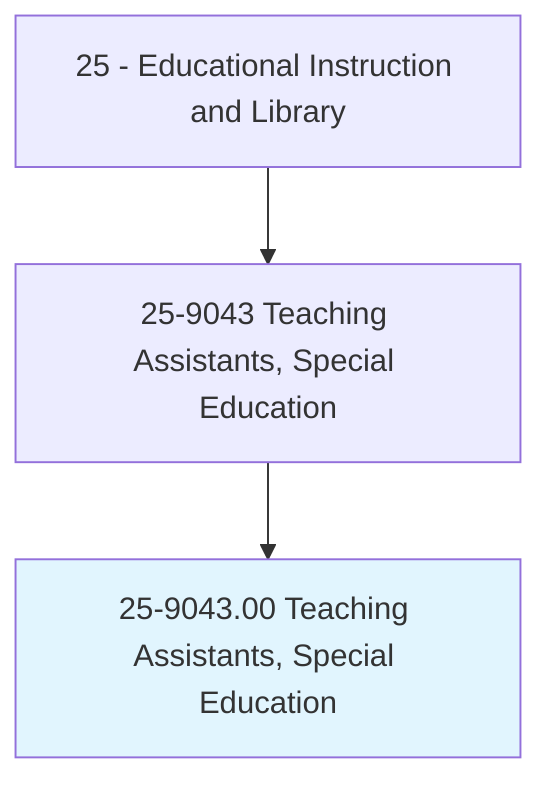
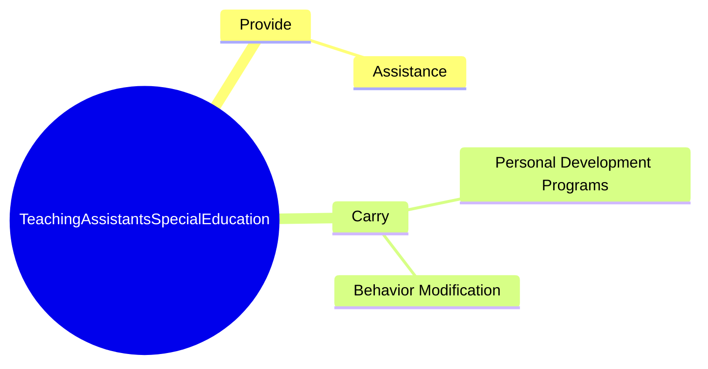
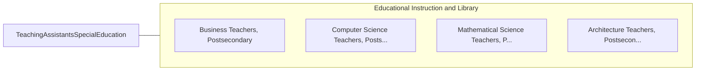

# Teaching Assistants, Special Education

> Assist a preschool, elementary, middle, or secondary school teacher to provide academic, social, or life skills to students who have learning, emotional, or physical disabilities. Serve in a position for which a teacher has primary responsibility for the design and implementation of educational programs and services.

## Overview

Teaching Assistants, Special Education is an occupation within the Educational Instruction and Library category. Assist a preschool, elementary, middle, or secondary school teacher to provide academic, social, or life skills to students who have learning, emotional, or physical disabilities. 

## Classification Hierarchy

## Key Statistics

| Metric | Value |
|--------|-------|
| SOC Code | 25-9043.00 |
| Category | [Educational Instruction and Library](/occupations/Education) |
| Task Count | 12 |
| Source | O*NET |

## Core Tasks

### provide.Assistance

Teaching Assistants, Special Education provide assistance as part of their core responsibilities.

**Actions:**
- `provide.Assistance.to.StudentsWithSpecialNeeds`

### carry.BehaviorModification

Teaching Assistants, Special Education carry behavior modification as part of their core responsibilities.

**Actions:**
- `carry.BehaviorModification.of.SpecialEducationInstructors`
- `carry.BehaviorModification.of.Psychologists`
- `carry.BehaviorModification.of.SpeechLanguagePathologists`
- `carry.PersonalDevelopmentPrograms.of.SpecialEducationInstructors`

## Skills & Competencies

### Technical Skills
- **Curriculum Development** - Advanced
- **Instructional Design** - Advanced
- **Assessment** - Advanced

### Soft Skills
- **Communication** - Essential
- **Problem Solving** - Essential
- **Critical Thinking** - Important
- **Teamwork** - Important
- **Adaptability** - Important

## Related Occupations

## Industries

This occupation is found across multiple industries. See [Industries](/industries) for sector-specific employment data.

## Career Progression

---

*Source: O*NET 25-9043.00 - ONETOccupation*
