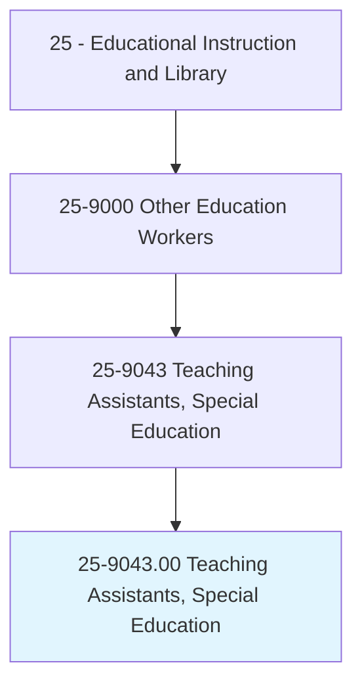
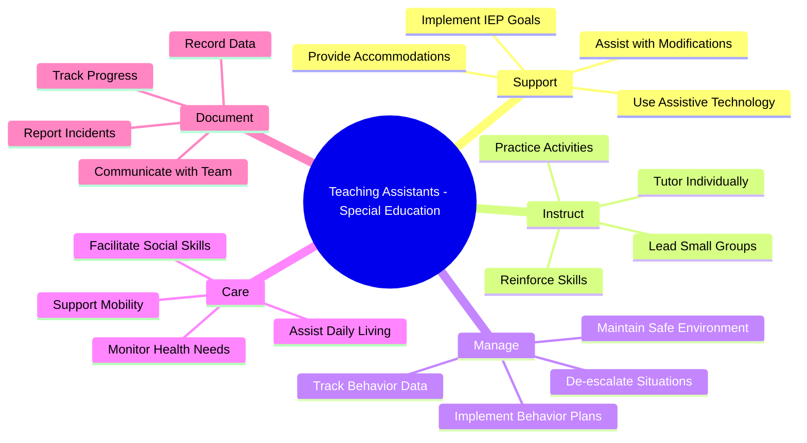
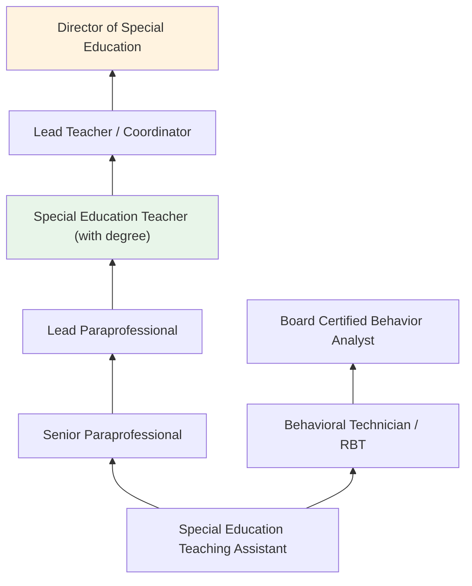
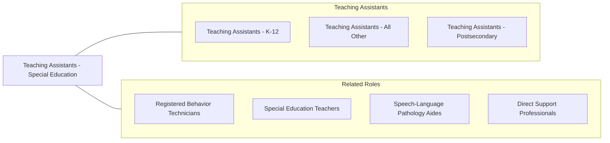

# Teaching Assistants, Special Education

> Assist a preschool, elementary, middle, or secondary school teacher to provide academic, social, or life skills to students who have learning, emotional, or physical disabilities.

## Overview

Teaching Assistants in Special Education, also known as special education paraprofessionals, provide direct support to students with disabilities under the supervision of licensed special education teachers. They work with students who have a range of disabilities including learning disabilities, autism spectrum disorder, emotional and behavioral disorders, intellectual disabilities, and physical impairments. These paraprofessionals implement portions of Individualized Education Programs (IEPs), provide one-on-one and small group instruction, assist with behavioral management, and help students participate in general education settings.

Special education teaching assistants play a vital role in the inclusive education model, often serving as the primary support person for individual students throughout the school day. They help students access the curriculum by modifying materials, providing accommodations, assisting with assistive technology, and facilitating social interactions with peers. In more restrictive settings, they may help manage self-contained classrooms, implement behavior intervention plans, and assist with daily living skills such as feeding, toileting, and mobility.

The demand for qualified special education paraprofessionals continues to grow as schools expand inclusive practices and serve increasing numbers of students with complex needs. These workers must balance patience, firmness, and compassion while maintaining professional boundaries and following the direction of supervising teachers and related service providers.

## Classification Hierarchy

## Key Statistics

| Metric | Value |
|--------|-------|
| SOC Code | 25-9043.00 |
| Job Zone | 3 (Medium Preparation) |
| Category | [Educational Instruction and Library](/occupations/Education/index) |
| Median Salary | $30,000 - $38,000 |
| Employment | ~350,000 |
| Projected Growth | 4-6% (Average) |
| Source | O*NET |

## Core Tasks

### implement.IEPGoals

Special Education TAs carry out instructional activities outlined in student IEPs.

**Actions:**
- `implement.IEPGoals.through.IndividualizedInstruction` - Deliver lessons targeting specific learning objectives
- `provide.Accommodations.during.ClassActivities` - Ensure students have required supports during instruction
- `use.AssistiveTechnology.for.StudentAccess` - Operate AAC devices, text-to-speech tools, and adaptive equipment

### manage.StudentBehavior

Special Education TAs implement behavior management strategies.

**Actions:**
- `implement.BehaviorInterventionPlans.for.Students` - Follow prescribed behavioral strategies consistently
- `deescalate.BehavioralCrises.using.TrainedTechniques` - Apply CPI or similar crisis intervention methods
- `track.BehaviorData.for.ProgressMonitoring` - Collect ABC data, frequency counts, and interval data

### assist.DailyLivingSkills

Special Education TAs support students with personal care and independence.

**Actions:**
- `assist.Students.with.PersonalCare` - Help with feeding, toileting, dressing, and hygiene as needed
- `support.Mobility.for.PhysicallyDisabledStudents` - Assist with wheelchair transfers, positioning, and movement
- `facilitate.SocialInteractions.with.Peers` - Support inclusion and peer relationship development

## Skills & Competencies

### Technical Skills
- **IEP Implementation** - Intermediate (carrying out prescribed goals and activities)
- **Behavior Management** - Intermediate to Advanced (BIP implementation, data collection)
- **Assistive Technology** - Intermediate (AAC devices, adaptive tools, switches)
- **Data Collection** - Intermediate (behavioral and academic data recording)
- **First Aid** - Intermediate (seizure response, medical needs awareness)
- **Instructional Support** - Intermediate (tutoring, guided practice, reinforcement)

### Soft Skills
- **Patience** - Critical (working with challenging behaviors and slow progress)
- **Empathy** - Critical (understanding student needs and frustrations)
- **Communication** - Essential (team collaboration, parent interaction)
- **Flexibility** - Essential (changing student needs and schedules)
- **Physical Stamina** - Essential (lifting, positioning, active supervision)
- **Confidentiality** - Essential (protecting student information)

## Education & Certifications

| Requirement | Details |
|-------------|---------|
| Typical Education | High school diploma plus additional training; associate degree preferred |
| Federal Requirement | NCLB/ESSA requirements (60 college credits, associate degree, or ParaPro Assessment) |
| Work Experience | Experience with individuals with disabilities preferred |
| On-the-Job Training | Extensive training in behavior management, disability awareness, assistive technology |
| Common Certifications | CPI (Nonviolent Crisis Intervention); CPR/First Aid; ParaPro Assessment; state paraprofessional credentials |

## Career Progression

## Setting Variations

### Inclusive Classrooms
One-on-one or small group support within general education settings. Focus on access and participation alongside non-disabled peers.

### Self-Contained Classrooms
Support in classrooms serving only students with disabilities. More intensive academic and behavioral support.

### Life Skills Programs
Assistance with functional academics, vocational training, community-based instruction, and daily living skills for students with significant disabilities.

### Early Intervention (Preschool)
Support for young children with developmental delays in early childhood special education settings.

### Transition Programs (18-21)
Assistance in post-secondary transition programs focused on job training, independent living, and community participation.

## Technology & Tools

| Category | Tools |
|----------|-------|
| Assistive Technology | Proloquo2Go, TouchChat, LAMP, switches, adapted keyboards |
| Behavior Tracking | Catalyst, Rethink Ed, ABC data sheets, interval recording apps |
| Communication | ClassDojo, Remind, ParentSquare |
| Learning Management | Google Classroom, Seesaw |
| Sensory Tools | Weighted vests, fidgets, noise-canceling headphones, sensory rooms |
| Student Information Systems | PowerSchool, Frontline IEP |

## Related Occupations

## Industries

- [Educational Services - K-12 Schools](/industries/Education/index) - Primary Employment
- [Social Assistance](/industries/SocialAssistance) - Residential Programs
- [Healthcare](/industries/Healthcare) - Therapeutic Day Schools
- [Government](/industries/Government) - Public School Districts

## Departments

This occupation typically works in:
- [Special Education Department](/departments/SpecialEducation)
- [Student Support Services](/departments/StudentSupport)
- [Behavioral Support Team](/departments/BehavioralSupport)
- [Related Services](/departments/RelatedServices)

---

*Source: O*NET 25-9043.00 - ONETOccupation*
