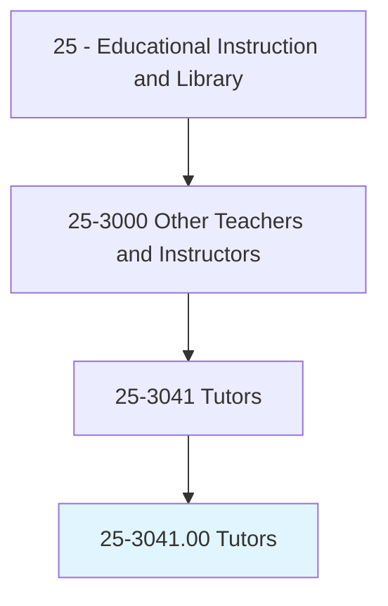
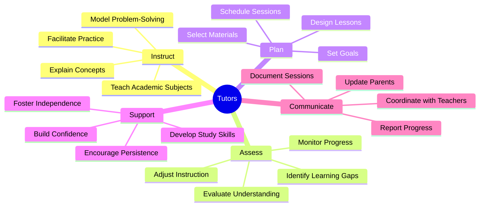
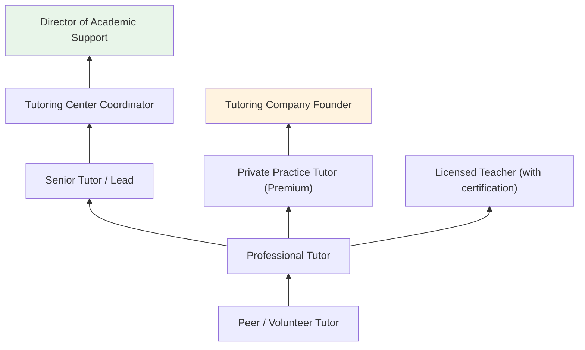
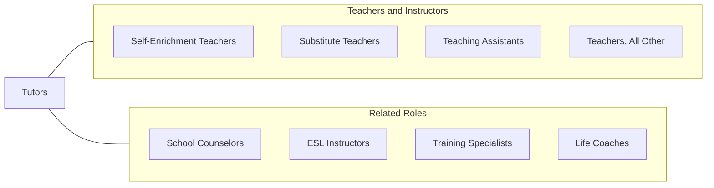

# Tutors

> Instruct individual students or small groups of students in academic subjects to support and expand on material taught in a corresponding class. May set up lessons, mentor students, and provide individualized feedback on academic performance.

## Overview

Tutors provide individualized and small-group academic instruction to students of all ages, supplementing the instruction received in formal classroom settings. They work across subjects including mathematics, reading, writing, science, foreign languages, test preparation, and specialized academic skills. Tutors assess individual learning needs, develop tailored instructional approaches, and track student progress toward specific academic goals. They may work in schools, learning centers, colleges, private practice, or online platforms.

The tutoring profession has expanded significantly with growing recognition of the value of personalized instruction and the rise of digital tutoring platforms. Tutors serve diverse student populations including K-12 students struggling academically, college students seeking course support, test preparation candidates, English language learners, and adults pursuing continuing education. The one-on-one or small-group format allows tutors to adapt instruction in real time, address misconceptions immediately, and build student confidence and self-efficacy.

High-dosage tutoring has emerged as one of the most evidence-based educational interventions, with research demonstrating significant learning gains when students receive consistent, frequent tutoring from well-trained providers. This has driven expansion of school-based tutoring programs, federally funded tutoring initiatives, and private tutoring services that collectively create growing demand for skilled tutors.

## Classification Hierarchy

## Key Statistics

| Metric | Value |
|--------|-------|
| SOC Code | 25-3041.00 |
| Job Zone | 3-4 (Medium to Considerable Preparation) |
| Category | [Educational Instruction and Library](/occupations/Education/index) |
| Median Salary | $36,000 - $48,000 (varies widely; private tutors may earn significantly more) |
| Employment | ~90,000 |
| Projected Growth | 8-12% (Faster than average) |
| Source | O*NET |

## Core Tasks

### instruct.Students

Tutors deliver personalized academic instruction.

**Actions:**
- `instruct.Students.in.AcademicSubjects` - Teach content aligned with student coursework and learning needs
- `explain.Concepts.using.MultipleApproaches` - Present material through varied strategies until understanding is achieved
- `model.ProblemSolving.for.StudentLearning` - Demonstrate step-by-step reasoning and strategy application

### assess.LearningNeeds

Tutors evaluate and adapt to individual student needs.

**Actions:**
- `assess.StudentKnowledge.to.IdentifyGaps` - Diagnose areas of difficulty through questioning and observation
- `monitor.Progress.toward.AcademicGoals` - Track improvement over time using formative assessments
- `adjust.Instruction.based.on.StudentResponse` - Modify teaching approach in real time based on understanding

## Skills & Competencies

### Technical Skills
- **Subject Matter Knowledge** - Advanced (depth in tutored subject areas)
- **Instructional Methods** - Advanced (scaffolding, questioning, modeling, guided practice)
- **Assessment** - Intermediate (diagnostic, formative, progress monitoring)
- **Study Skills Coaching** - Intermediate (note-taking, test preparation, time management)
- **Educational Technology** - Intermediate (online platforms, digital whiteboards, apps)
- **Test Preparation** - Intermediate to Advanced (SAT, ACT, GRE, AP exams)

### Soft Skills
- **Patience** - Critical (working with struggling students)
- **Communication** - Critical (clear explanation, active listening)
- **Empathy** - Essential (understanding student frustration and anxiety)
- **Adaptability** - Essential (adjusting to individual learning styles)
- **Encouragement** - Essential (building academic confidence)
- **Reliability** - Important (consistent scheduling and follow-through)

## Education & Certifications

| Requirement | Details |
|-------------|---------|
| Typical Education | Bachelor's degree in education or subject area; varies widely |
| Alternative Entry | College students, subject experts, or individuals with demonstrated mastery |
| Work Experience | Teaching or tutoring experience preferred |
| On-the-Job Training | Short-term; platform-specific training for online tutoring |
| Common Certifications | NTA (National Tutoring Association) certification; ATP (Association for the Tutoring Profession); subject-specific credentials |

## Career Progression

## Setting Variations

### School-Based Tutoring
High-dosage tutoring programs within K-12 schools. Often funded by Title I or ESSER funds. Structured schedules during or after school.

### College Tutoring Centers
Peer and professional tutoring for postsecondary students. Drop-in and appointment-based services across subjects.

### Private Tutoring
One-on-one instruction arranged privately. Premium rates for test preparation and specialized subjects. Flexible scheduling.

### Online Tutoring Platforms
Digital tutoring through platforms such as Wyzant, Varsity Tutors, and Chegg. Video-based sessions with screen sharing and digital whiteboards.

### Learning Centers
Franchise and independent tutoring businesses (Kumon, Sylvan, Mathnasium) offering structured programs.

## Technology & Tools

| Category | Tools |
|----------|-------|
| Online Platforms | Zoom, Google Meet, Wyzant, Varsity Tutors, TutorMe |
| Digital Whiteboards | Miro, Jamboard, Bitpaper, Explain Everything |
| Practice & Assessment | Khan Academy, IXL, Quizlet, Mathway |
| Test Prep | Official SAT/ACT practice, Kaplan, Princeton Review materials |
| Scheduling | Calendly, Acuity, TutorCruncher |
| Communication | Email, text messaging, parent communication apps |

## Related Occupations

## Industries

- [Educational Services - K-12 and Postsecondary](/industries/Education/index) - Primary Employment
- [Other Services](/industries/OtherServices) - Private Tutoring and Learning Centers
- [Professional Services](/industries/ProfessionalServices) - Test Preparation Companies
- [Information](/industries/Information) - Online Tutoring Platforms

## Departments

This occupation typically works in:
- [Academic Support Center](/departments/AcademicSupport)
- [Writing Center](/departments/WritingCenter)
- [Math Lab](/departments/MathLab)
- [Student Success / Retention](/departments/StudentSuccess)

---

*Source: O*NET 25-3041.00 - ONETOccupation*
