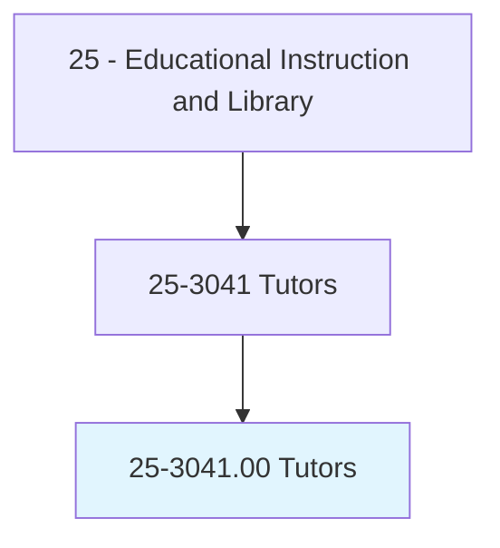
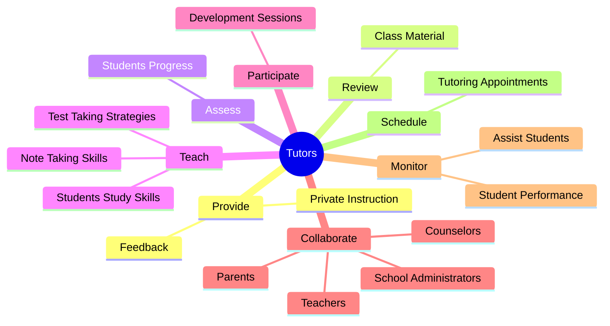
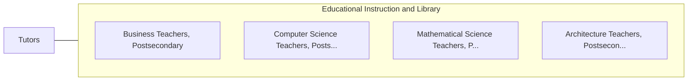

# Tutors

> Instruct individual students or small groups of students in academic subjects to support formal class instruction or to prepare students for standardized or admissions tests.

## Overview

Tutors is classified under Educational Instruction and Library (SOC 25). Instruct individual students or small groups of students in academic subjects to support formal class instruction or to prepare students for standardized or admissions tests.

## Classification Hierarchy

## Key Statistics

| Metric | Value |
|--------|-------|
| SOC Code | 25-3041.00 |
| Category | [Educational Instruction and Library](/occupations/Education/index) |
| Task Count | 92 |
| Source | O*NET |

## Core Tasks

### provide.Feedback

Tutors provide feedback as part of their core responsibilities.

**Actions:**
- `provide.Feedback.to.Students`
- `provide.Feedback.to.UsingPositiveReinforcementTechniquesToEncourage`
- `provide.Feedback.to.motivate`
- `provide.Feedback.to.build.ConfidenceInStudents`

### review.ClassMaterial

Tutors review class material as part of their core responsibilities.

**Actions:**
- `review.ClassMaterial.with.Students.by.DiscussingText`
- `review.ClassMaterial.with.WorkingSolutions.to.Problems`
- `review.ClassMaterial.with.ReviewingWorksheetsAssignments`
- `review.ClassMaterial.with.OtherAssignments`

### assess.StudentsProgress

Tutors assess students progress as part of their core responsibilities.

**Actions:**
- `assess.StudentsProgress.throughout.TutoringSessions`

## Skills & Competencies

### Technical Skills
- **Curriculum Development** - Advanced
- **Instructional Design** - Advanced
- **Assessment** - Advanced

### Soft Skills
- **Communication** - Essential
- **Problem Solving** - Essential
- **Critical Thinking** - Important
- **Teamwork** - Important
- **Adaptability** - Important

## Related Occupations

## Industries

This occupation is found across multiple industries. See [Industries](/industries) for sector-specific employment data.

## Career Progression

---

*Source: O*NET 25-3041.00 - ONETOccupation*
