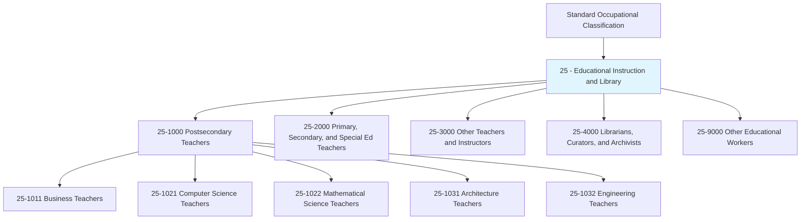
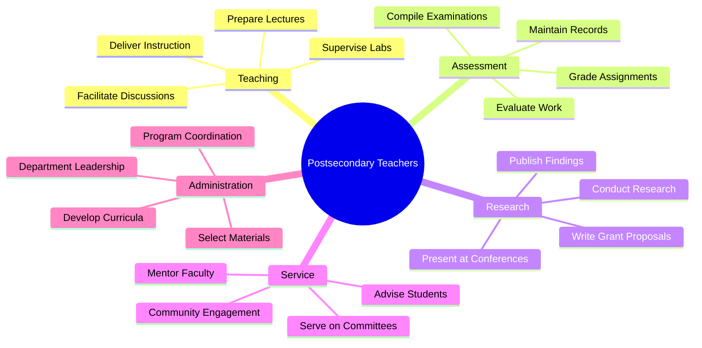
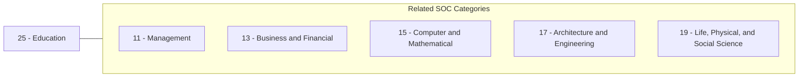
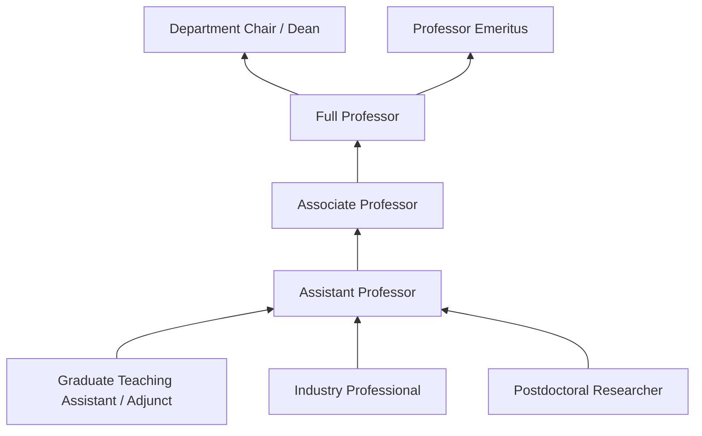

# Educational Instruction and Library

> Category 25 occupations encompass postsecondary educators, librarians, archivists, and other instructional professionals who teach, research, and support learning across diverse disciplines in colleges, universities, and professional schools.

## Overview

Educational Instruction and Library occupations represent a critical sector of the knowledge economy, responsible for training the next generation of professionals, advancing research in specialized fields, and preserving and organizing information resources. These occupations combine deep subject matter expertise with pedagogical skills, research capabilities, and academic service responsibilities. Postsecondary teachers in this category work across STEM, business, humanities, arts, and professional fields, typically requiring doctoral degrees or significant professional experience in their disciplines.

## Classification Hierarchy

## Key Statistics

| Metric | Value |
|--------|-------|
| SOC Code | 25-xxxx |
| Category | Educational Instruction and Library |
| Major Groups | 5 |
| Occupations (Postsecondary) | 35+ |

## Occupations in this Category

### Business and Technology

- [Business Teachers, Postsecondary](./BusinessTeachers.mdx) - 25-1011.00
- [Computer Science Teachers, Postsecondary](./ComputerScienceTeachers.mdx) - 25-1021.00
- [Mathematical Science Teachers, Postsecondary](./MathTeachers.mdx) - 25-1022.00

### Architecture and Engineering

- [Architecture Teachers, Postsecondary](./ArchitectureTeachers.mdx) - 25-1031.00
- [Engineering Teachers, Postsecondary](./EngineeringTeachers.mdx) - 25-1032.00

## Core Task Categories

## Skills & Competencies

### Technical Skills
- **Subject Matter Expertise** - Expert (Doctoral-level knowledge in specialty)
- **Research Methods** - Advanced
- **Curriculum Development** - Advanced
- **Educational Technology** - Intermediate to Advanced
- **Academic Writing** - Expert

### Soft Skills
- **Communication** - Critical (presenting complex ideas clearly)
- **Critical Thinking** - Critical
- **Mentorship** - Essential
- **Collaboration** - Essential
- **Time Management** - Essential

## Related Categories

## Industries

- [Educational Services](/industries/Education/index) - Primary Employment
- [Professional, Scientific, and Technical Services](/industries/ProfessionalServices) - Consulting/Research
- [Government](/industries/Government) - Public Universities
- [Healthcare and Social Assistance](/industries/Healthcare/index) - Medical Education

## Career Progression

## Education & Training

| Requirement | Details |
|-------------|---------|
| Typical Education | Doctoral degree (Ph.D., Ed.D., or terminal degree in field) |
| Work Experience | Research experience; industry experience valued in applied fields |
| On-the-Job Training | Faculty development programs, teaching workshops |
| Common Certifications | Teaching certifications vary by institution |

## Departments

This category typically works in:
- [Academic Affairs](/departments/AcademicAffairs)
- [Research Administration](/departments/Research/index)
- [Academic Departments](/departments/AcademicDepartments)
- [Libraries and Archives](/departments/Library)

---

*Source: O*NET Category 25 - Educational Instruction and Library*
