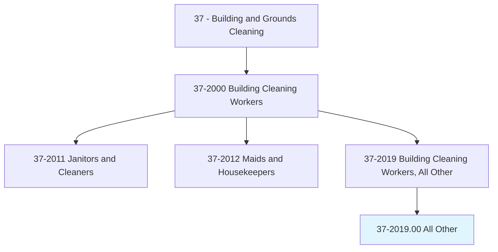
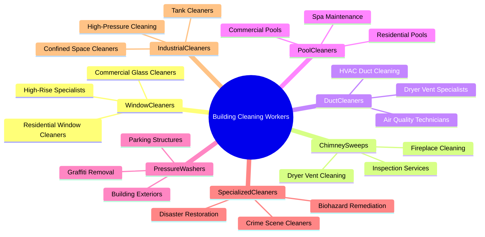
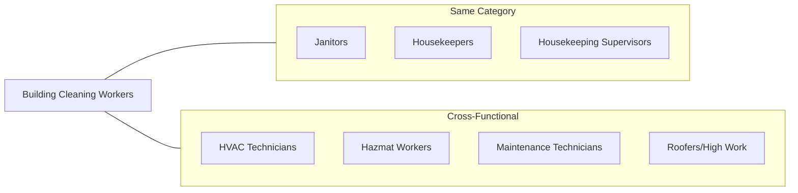
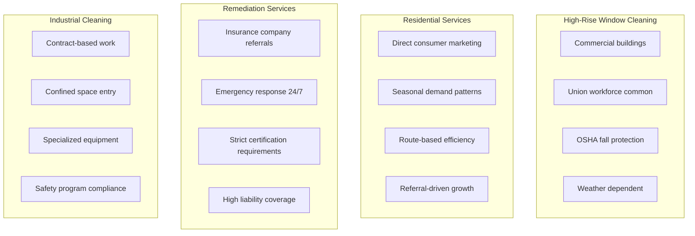
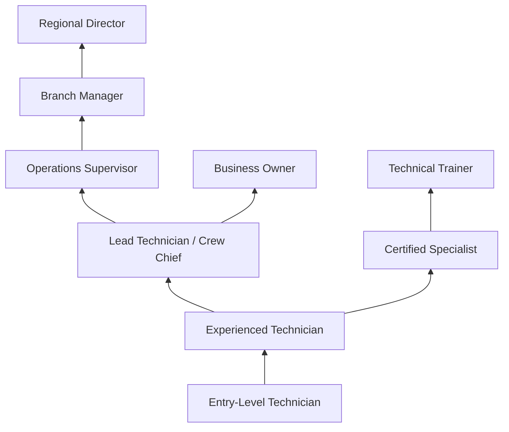
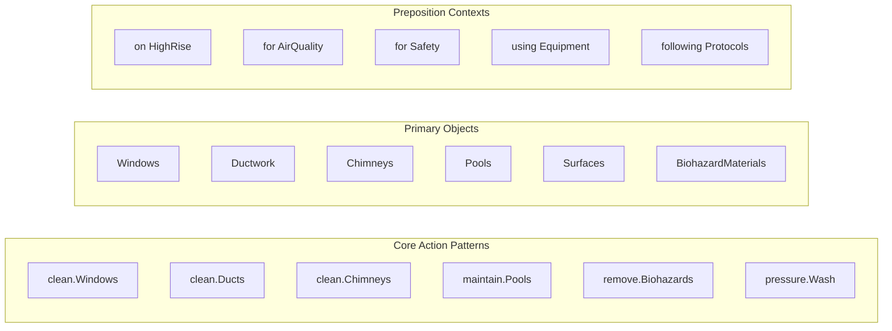
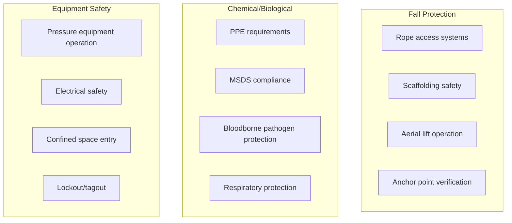

# Building Cleaning Workers, All Other

> All building cleaning workers not listed separately.

## Overview

Building Cleaning Workers, All Other is a residual category that encompasses specialized cleaning occupations not classified elsewhere in the Standard Occupational Classification system. This includes window cleaners, chimney sweeps, duct cleaners, pool cleaners, pressure washing specialists, crime scene cleaners, and other specialized cleaning professionals. These workers often possess unique technical skills, specialized equipment training, or certifications required for their specific cleaning niche. The category represents the diverse and evolving nature of the cleaning industry as new specializations emerge to meet specific facility and safety needs.

## Classification Hierarchy

## Key Statistics

| Metric | Value |
|--------|-------|
| SOC Code | 37-2019.00 |
| Job Zone | 2 (Some Preparation) |
| Category | [Building and Grounds](/occupations/Facilities/index) |
| Core Tasks | Varies by Specialization |
| Source | O*NET |

## Specialization Categories

## Core Specializations

### Window Cleaning

Window cleaners specialize in cleaning glass surfaces on buildings ranging from residential homes to high-rise commercial structures.

**Actions:**
- `clean.Windows.on.HighRiseBuildings` - Clean exterior glass on tall buildings using scaffolding or suspended platforms
- `clean.Windows.using.WaterFedPoles` - Use purified water pole systems for reach
- `clean.Windows.with.TraditionalMethods` - Apply squeegee techniques for professional results
- `inspect.Glass.for.Damage` - Identify cracks, seals, and coating issues

### Chimney and Vent Cleaning

Chimney sweeps and vent cleaners maintain fireplace systems and ventilation for safety and efficiency.

**Actions:**
- `clean.Chimneys.to.remove.Creosote` - Remove fire-hazard buildup from flues
- `clean.DryerVents.to.prevent.Fires` - Clear lint accumulation from dryer systems
- `inspect.Chimneys.for.Damage` - Assess structural integrity and safety
- `install.ChimneyCaps.for.Protection` - Add protective devices to prevent intrusion

### HVAC Duct Cleaning

Duct cleaners specialize in cleaning air distribution systems to improve indoor air quality.

**Actions:**
- `clean.AirDucts.to.improve.AirQuality` - Remove dust and contaminants from duct systems
- `clean.HVACComponents.for.Efficiency` - Clean coils, blowers, and air handlers
- `sanitize.DuctSystems.with.Treatments` - Apply antimicrobial treatments
- `inspect.Ductwork.for.Damage` - Identify leaks and deterioration

### Pool and Spa Cleaning

Pool service technicians maintain swimming pools and spas for cleanliness and safety.

**Actions:**
- `clean.Pools.to.maintain.WaterQuality` - Skim, vacuum, and brush pool surfaces
- `balance.Chemicals.in.Pools` - Test and adjust water chemistry
- `maintain.PoolEquipment.for.Operation` - Service pumps, filters, and heaters
- `inspect.Pools.for.Safety` - Check drains, fencing, and equipment compliance

### Pressure Washing

Pressure washing specialists clean exterior surfaces using high-pressure water equipment.

**Actions:**
- `clean.BuildingExteriors.using.PressureWashers` - Remove dirt, mold, and stains from facades
- `clean.ParkingStructures.for.Maintenance` - Clean concrete surfaces and ramps
- `remove.Graffiti.from.Surfaces` - Eliminate vandalism from buildings
- `clean.Sidewalks.for.Safety` - Remove grime and improve traction

### Biohazard and Crime Scene Cleaning

Specialized cleaners handle dangerous biological materials requiring specific training and certification.

**Actions:**
- `clean.CrimeScenes.following.Protocols` - Remediate scenes after law enforcement clearance
- `remove.BiohazardousMaterials.safely` - Handle blood, bodily fluids, and pathogens
- `decontaminate.Spaces.after.Events` - Clean after unattended deaths or trauma
- `dispose.HazardousMaterials.properly` - Follow regulated disposal procedures

## Skills & Competencies

### Technical Skills (Varies by Specialization)

**Window Cleaners:**
- Rope access and aerial platform operation
- Water-fed pole systems
- Safety harness and equipment use
- Glass identification and care

**Chimney/Duct Cleaners:**
- Combustion system knowledge
- Video inspection equipment
- Rotary brush systems
- HVAC fundamentals

**Pool Technicians:**
- Water chemistry and testing
- Pool equipment repair
- Filtration systems
- Health code compliance

**Biohazard Cleaners:**
- Bloodborne pathogen certification
- Personal protective equipment
- Decontamination procedures
- Hazmat disposal regulations

### Soft Skills
- **Safety Awareness** - Critical for high-risk specializations
- **Attention to Detail** - Essential for quality outcomes
- **Customer Service** - Important for client relationships
- **Problem Solving** - Necessary for unique situation handling
- **Physical Fitness** - Required for demanding work conditions

## Related Occupations

## Industries

- [Building Services](/industries/BuildingServices) - Highest Employment (specialized cleaning companies)
- [Real Estate](/industries/RealEstate/index) - High Employment (property management)
- [Construction](/industries/Construction/index) - High Employment (post-construction cleanup)
- [Healthcare](/industries/Healthcare/index) - Moderate Employment (specialized sanitation)
- [Manufacturing](/industries/Manufacturing/index) - Moderate Employment (industrial cleaning)
- [Remediation Services](/industries/Remediation) - Growing Employment (biohazard, mold)

## Industry Variations by Specialization

### High-Rise Window Cleaning Focus
- Rope descent systems (SPRAT, IRATA certification)
- Suspended scaffolding operation
- Weather monitoring and work restrictions
- Union membership in major cities

### Residential Service Focus
- Multiple service offerings (windows, gutters, pressure washing)
- Seasonal marketing strategies
- Customer retention programs
- Small business operations

### Remediation Focus
- Insurance carrier relationships
- 24/7 emergency response capability
- Extensive certification requirements (IICRC, OSHA)
- High insurance and bonding requirements

### Industrial Cleaning Focus
- Plant shutdown cleaning contracts
- Tank and vessel cleaning
- Hazardous material handling
- Confined space entry certification

## Career Progression

## Certifications by Specialization

| Specialization | Key Certifications |
|----------------|-------------------|
| Window Cleaning | SPRAT/IRATA (rope access), IWCA Safety Certification |
| Chimney Sweeps | CSIA Certified Chimney Sweep, NFI Certified |
| Duct Cleaning | NADCA Air Systems Cleaning Specialist (ASCS) |
| Pool Service | CPO (Certified Pool Operator), AFO |
| Pressure Washing | PWNA Certification, UAMCC |
| Biohazard | OSHA 40-Hour HAZWOPER, IICRC Biohazard |
| Disaster Restoration | IICRC WRT, FSRT, AMRT |

## Education & Training

| Requirement | Details |
|-------------|---------|
| Typical Education | High school diploma; specialized training varies |
| Work Experience | Entry-level to specialized (varies by niche) |
| On-the-Job Training | Moderate to extensive depending on specialty |
| Common Certifications | See specialization-specific certifications above |

## Departments

This occupation typically works in:
- [Specialized Services](/departments/SpecializedServices)
- [Facilities Management](/departments/FacilitiesManagement)
- [Environmental Services](/departments/EnvironmentalServices)
- [Maintenance Operations](/departments/Maintenance)

## GraphDL Semantic Structure

## Safety Considerations

## Physical Requirements

| Requirement | Level |
|-------------|-------|
| Physical Fitness | High (especially window, pressure washing) |
| Heights Tolerance | Required for window cleaning |
| Lifting | Moderate to Heavy (equipment transport) |
| Weather Exposure | Frequent (outdoor specializations) |
| Chemical Exposure | Managed through PPE |

## Compensation Factors

| Factor | Impact on Pay |
|--------|---------------|
| Specialization | Biohazard, high-rise pay premiums |
| Certifications | Certified specialists earn 15-30% more |
| Risk Level | Hazardous work commands higher rates |
| Geographic Area | Urban areas typically higher |
| Experience | Significant progression with skill development |

## Key Performance Indicators

| KPI | Description |
|-----|-------------|
| Safety Record | Incident-free work periods |
| Customer Satisfaction | Ratings and repeat business |
| Certification Status | Current certifications maintained |
| Job Completion Rate | Projects completed on schedule |
| Quality Scores | Inspection and callback rates |
| Revenue per Technician | Productivity measurement |

---

*Source: O*NET 37-2019.00 - OccupationCategory*
