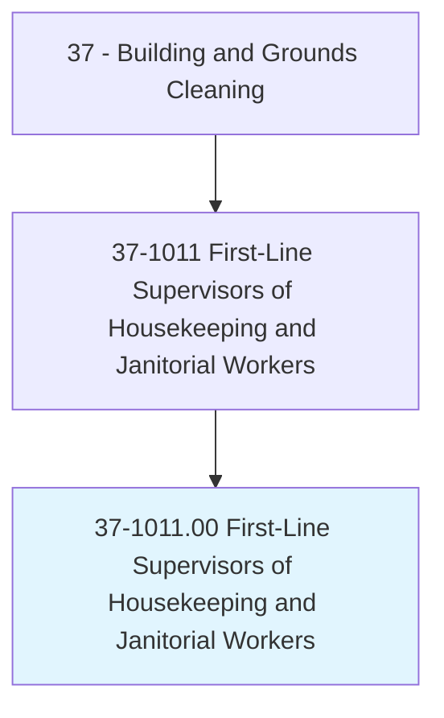
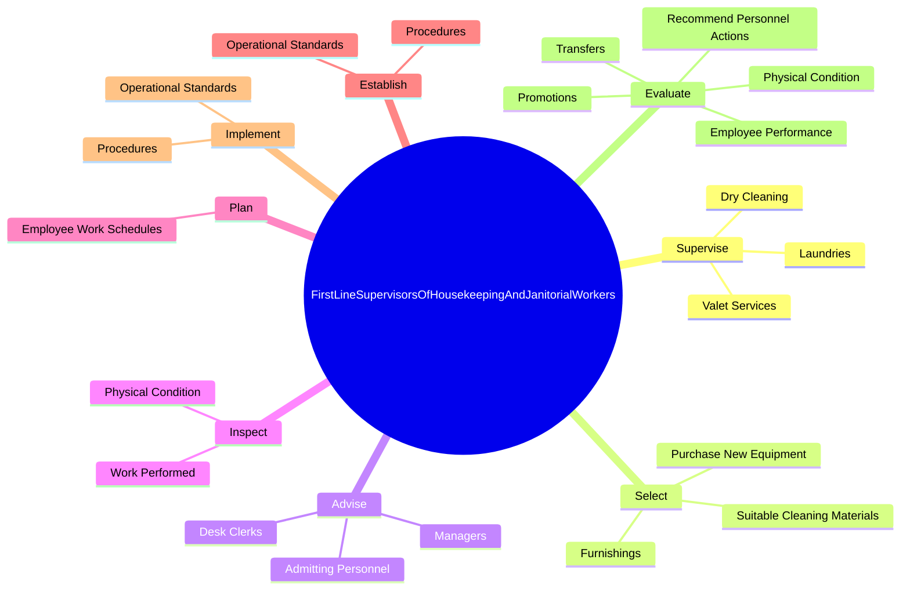
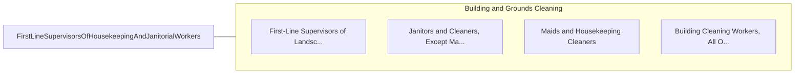

# First-Line Supervisors of Housekeeping and Janitorial Workers

> Directly supervise and coordinate work activities of cleaning personnel in hotels, hospitals, offices, and other establishments.

## Overview

First-Line Supervisors of Housekeeping and Janitorial Workers is classified under Building and Grounds Cleaning (SOC 37). Directly supervise and coordinate work activities of cleaning personnel in hotels, hospitals, offices, and other establishments.

## Classification Hierarchy

## Key Statistics

| Metric | Value |
|--------|-------|
| SOC Code | 37-1011.00 |
| Category | [Building and Grounds Cleaning](/occupations/Facilities) |
| Task Count | 87 |
| Source | O*NET |

## Core Tasks

### supervise.Laundries

First-Line Supervisors of Housekeeping and Janitorial Workers supervise laundries as part of their core responsibilities.

**Actions:**
- `supervise.Laundries`
- `supervise.DryCleaning`
- `supervise.ValetServices`

### select.SuitableCleaningMaterials

First-Line Supervisors of Housekeeping and Janitorial Workers select suitable cleaning materials as part of their core responsibilities.

**Actions:**
- `select.SuitableCleaningMaterials.for.DifferentTypes.of.Linens`
- `select.SuitableCleaningMaterials.for.Furniture`
- `select.SuitableCleaningMaterials.for.Flooring`
- `select.SuitableCleaningMaterials.for.Surfaces`

### advise.Managers

First-Line Supervisors of Housekeeping and Janitorial Workers advise managers as part of their core responsibilities.

**Actions:**
- `advise.Managers.of.RoomsReady.for.Occupancy`
- `advise.DeskClerks.of.RoomsReady.for.Occupancy`
- `advise.AdmittingPersonnel.of.RoomsReady.for.Occupancy`

## Skills & Competencies

### Technical Skills
- **Facilities Maintenance** - Advanced
- **Equipment Operation** - Advanced
- **Safety Procedures** - Advanced

### Soft Skills
- **Communication** - Essential
- **Problem Solving** - Essential
- **Critical Thinking** - Important
- **Teamwork** - Important
- **Adaptability** - Important

## Related Occupations

## Industries

This occupation is found across multiple industries. See [Industries](/industries) for sector-specific employment data.

## Career Progression

---

*Source: O*NET 37-1011.00 - ONETOccupation*
