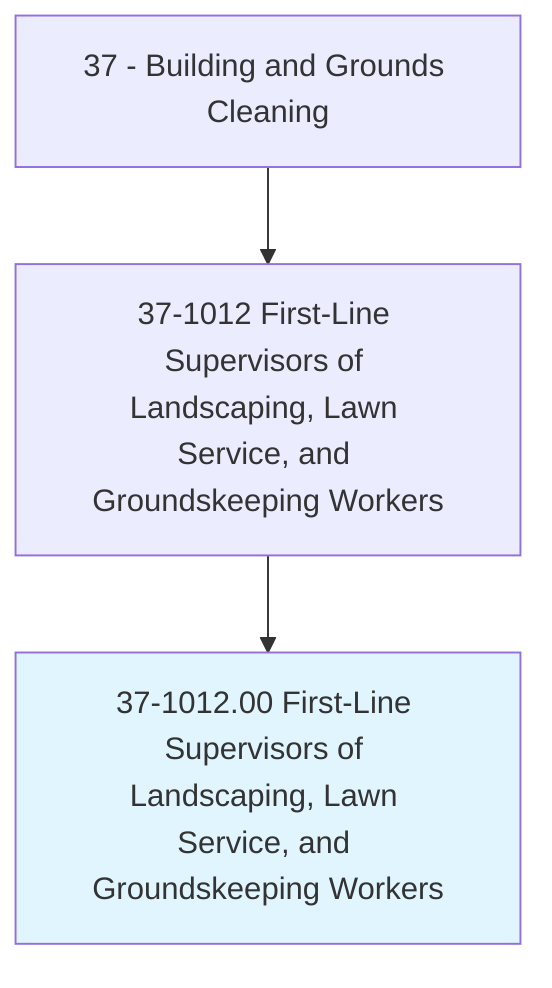
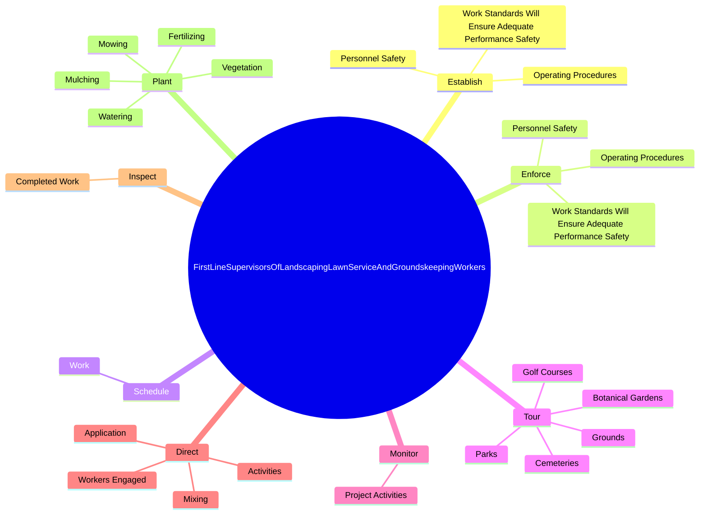
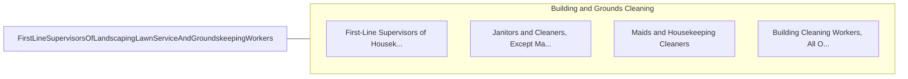

# First-Line Supervisors of Landscaping, Lawn Service, and Groundskeeping Workers

> Directly supervise and coordinate activities of workers engaged in landscaping or groundskeeping activities. Work may involve reviewing contracts to ascertain service, machine, and workforce requirements; answering inquiries from potential customers regarding methods, material, and price ranges; and preparing estimates according to labor, material, and machine costs.

## Overview

First-Line Supervisors of Landscaping, Lawn Service, and Groundskeeping Workers is an occupation within the Building and Grounds Cleaning category. Directly supervise and coordinate activities of workers engaged in landscaping or groundskeeping activities. 

## Classification Hierarchy

## Key Statistics

| Metric | Value |
|--------|-------|
| SOC Code | 37-1012.00 |
| Category | [Building and Grounds Cleaning](/occupations/Facilities/index) |
| Task Count | 140 |
| Source | O*NET |

## Core Tasks

### establish.OperatingProcedures

First-Line Supervisors of Landscaping, Lawn Service, and Groundskeeping Workers establish operating procedures as part of their core responsibilities.

**Actions:**
- `establish.OperatingProcedures`
- `establish.WorkStandardsWillEnsureAdequatePerformanceSafety`
- `establish.PersonnelSafety`

### enforce.OperatingProcedures

First-Line Supervisors of Landscaping, Lawn Service, and Groundskeeping Workers enforce operating procedures as part of their core responsibilities.

**Actions:**
- `enforce.OperatingProcedures`
- `enforce.WorkStandardsWillEnsureAdequatePerformanceSafety`
- `enforce.PersonnelSafety`

### schedule.Work

First-Line Supervisors of Landscaping, Lawn Service, and Groundskeeping Workers schedule work as part of their core responsibilities.

**Actions:**
- `schedule.Work.for.Crews`
- `schedule.Work.for.Depending.on.WorkPriorities`
- `schedule.Work.for.Crew`
- `schedule.Work.for.EquipmentAvailability`

## Skills & Competencies

### Technical Skills
- **Facilities Maintenance** - Advanced
- **Equipment Operation** - Advanced
- **Safety Procedures** - Advanced

### Soft Skills
- **Communication** - Essential
- **Problem Solving** - Essential
- **Critical Thinking** - Important
- **Teamwork** - Important
- **Adaptability** - Important

## Related Occupations

## Industries

This occupation is found across multiple industries. See [Industries](/industries) for sector-specific employment data.

## Career Progression

---

*Source: O*NET 37-1012.00 - ONETOccupation*
